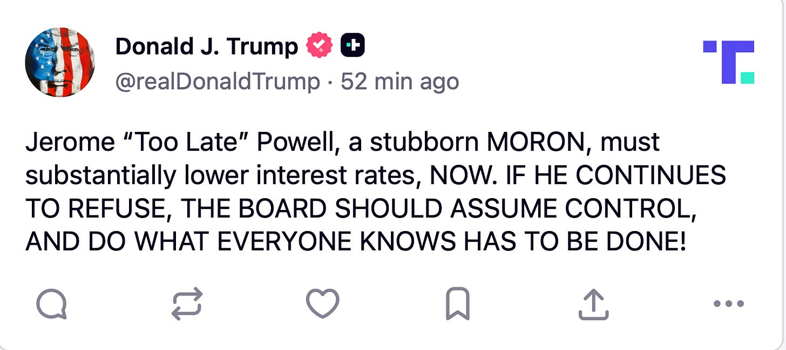

# Tariff Man Strikes. Again. 

*Daily Plan 8.1.25*
*Tic Toc Trading — Aug 01, 2025*

To the extent these new higher tariffs announced overnight damage the market further depends on if there is any sort of guidance from the man himself about stock market in next day or two. 

On surface, these tariffs do look randomly chosen— you have a 40% on Iraq, another 40% on Syria, 35% on Canada, a 40% on Laos, similar sprinkling of randomly selected tariff rates on several other countries. 

**Technically, **you have 6220 right below us, about 80 handles lower which is an extremely important orderflow support level. Furthermore, we broke the 6330 key weekly support overnight without much fight. Then to make it more complicated these technical breaks overnight on low volume can be tricky and many times these gaps do tend to fill in the cash session. 

**Fundamentally,** the real story is building wage pressure in the US economy. With a complete stop in net migration to the US, the domestic workers are now able to secure higher rates for their work, and is thus causing an upward pressure on wage component of the inflation math. 

So you have below forces acting on this market at the moment and this is why it has been reluctant to respect technical levels over last 10 hours or so. 

1. Yesterday’s Econ data confirmed wage pressure is building up in the jobs market.
2. Powell has dug his heels in, refusing to budge.
3. Trump and his beloved tariffs have resurfaced. Also, a lack of guidance from Trump about his current mood on stocks.

Non farm payrolls this morning will confirm if wage inflation is going to be sticky next few months or so, and I think if this is a stronger jobs report than expected, this will add fuel to the “Higher for longer” narrative and further diminish any chances of a rate cut next month. 

Some sort of messaging from the President about “stocks” could be a plus for the risk on assets. Yes I know but this is 2025 and monitoring President’s posts needs to be part of a serious trader’s toolkit. 

**Levels for the session **

Since we broke down below 6330 weekly support, I will like to see market interaction around this level. 

> Scenario 1: 6350 if tested, could be resistance for a move down towards overnight lows at 6300.

> Scenario 2: Edge case for me today will be below 6300 or above 6350. Staying below 6300 in the session could add more fuel to the fire and we could head towards that 6220 key level in next session or two. Conversely, if we are able to take out 6350 on the upside, this could calm the melee.

Longer term, I do not think this finishes the bull market yet, instead of a raging bull market, this could be a ranging bull market. See my thoughts about 6500 as a key long term market level shared earlier. I will lean on key levels like 6330 and 6220 to see if they are broken without much fight, as this could indicate a deeper pullback. 

~ tic 

**Disclaimer:** This newsletter is not intended to provide trading or investment advice but solely for general informational & educational purposes. It represents the personal opinions of the author, shared publicly with you as a personal blog. Engaging in futures, stocks, or bonds trading involves significant risk, and there is no guarantee of profit. In fact, there is a possibility of losing one's entire investment. Utmost caution is advised. Your account can go to zero. The author does not guarantee any profit whatsoever, and the reader assumes the entire cost and risk of any trading or investing activities undertaken. The reader is solely responsible for making informed investment decisions. The owners/authors of this newsletter, its representatives, principals, moderators, and members are not registered as securities broker-dealers or investment advisors with the U.S. Securities and Exchange Commission, CFTC, or any other securities/regulatory authority. Consultation with a registered investment advisor, broker-dealer, and/or financial advisor is recommended. By accessing and utilizing this newsletter or any of its publications, the reader agrees to the terms set forth herein. Any screenshots used are courtesy of Ninja Trader, FinViz, Think or Swim, and/or Jigsaw, with whom the author has no affiliations. The information and quotes shared in this blog may contain inaccuracies, as markets are inherently risky and subject to unpredictable fluctuations. Additionally, the content of this blog is the intellectual property of the author, and its sharing or copying is strictly prohibited. By reading this blog, the reader accepts these terms and conditions and acknowledges that it is intended solely as a personal trading journal and nothing more.