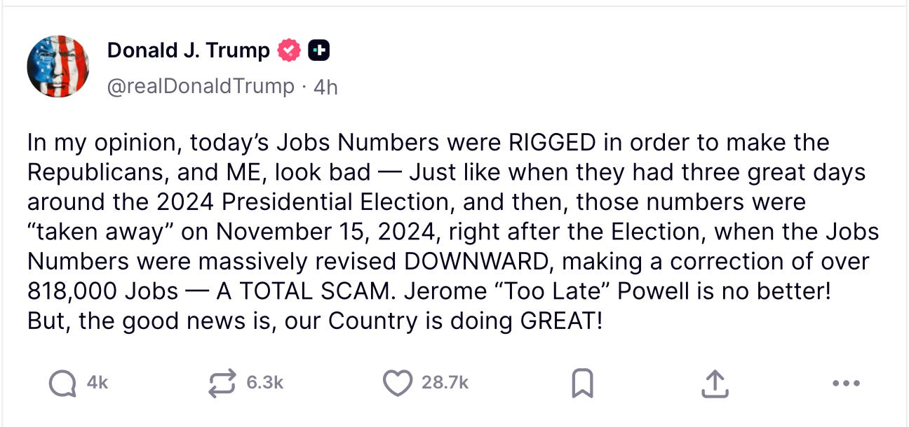

# Shoot the Messenger? Who's Next. 

*Weekly Plan 8.2.25*
*Tic Toc Trading — Aug 03, 2025*

Hey traders- 

The markets sold off quite aggressively last week and we are now down about two and half percent points from all time highs set earlier in the week. This has led to a mushrooming of so called furu “experts” to call the bull market dead, the top is in and the recession is here. What is it about these 2-3 percent point sell offs that lead our furu community to come out in full force and declare such earth shattering proclamations? Do they have some insider information which we are not all privy to? Do they have mastered the art of the charts that now is foretelling some major crash in not so distant future? 

Never underestimate the furu-industrial complex. They’re always ready to declare the financial equivalent of the apocalypse at the first sign of turbulence. Why? Because fear sells. Nuance doesn’t. We as traders are in a business of nuance and context, not fear mongering. 

In this post, we will explore some actual real forces acting on this market at this point in time.  Know that these 2-3% moves in my experience are statistical noise, we need to see contextual weaknesses in the markets to form a longer term opinion. 

There are 3 very distinct themes emerging across growth as measured by GDP, labor market conditions and inflation. These 3 are very tightly interrelaetd 

This is all brand new context that came to light this week so it adds a lot more weight to this macro Cioppino. 

**GDP**

Through the first half of 2025, average GDP growth stands at 1.2%, a pace well below the 2.8% achieved in 2024. Is this due to tariffs ? 

Well, yes and no.

Imports to the US fell by a 30% annualized rate due to the tariffs. 

So, the way US GDP is calculated, on surface it recorded one of the highest reads since World war 2 at almost 5%. But this is not as straightforward as it sounds. This bounce came from shrinking Imports. 

**Here is the formula how GDP is calculated- **

GDP = Exports + consumer spending + private investment + government spending - Imports. 

So when imports drop by over 30%, this gives an artificially large bounce to the GDP. Think of it this way, goods produced by foreigners are not coming in, so it must mean that the local production is surging. Sounds right on paper, but means nothing in reality. This is fake growth. Just don’t ask me why they do it this way, perhaps made much more sense to do it this way a 100 years ago. 

**What matters much more in this equation is the consumer spending as well as business investment. **

Consumer spend rose by barely 1.2 % , when annualized, and business investment  which includes things like CAPEX was also very sluggish at 1.4%. Even as the imports collapsed, the value of US Exports declined sharply too. So if you look at the GDP figures, the first quarter was actually negative and the second quarter was up but mostly up due to collapse in imports, a mathematical fugazzi. This appears to signal that there is more pain ahead for growth unless something drastic is done. 

**Now let us take a look at our favorite inflation trends. **

So, June CPI rose by 2.7% which is again higher than 2.4% recorded just a month ago. Inflation is on the rise again. In fact core CPI when you exclude energy and food prices is up almost 3% on the year. 

Is most of this inflation coming from tariffs? 

Well, no. 

What is adding most pressure to the inflation picture is rent and wages. I have shared earlier in this publication the way they calculate rent is not real. It is not scientific and is instead based on a survey in which the landlords simply share their opinion on how much rent they expect to get from their property. So I take the rent inflation with a pinch of salt. 

What is much more real and potentially dangerous for CPI trends is the wage inflation component. Wages are growing almost at a rate of 4% when annualized and hourly wages now stand at almost $37 an hour nationwide. A lot of this is being driven by a steep drop in labor participation rate and on top of that a decimation of jobs held by foreign born workers. So in most recent report, foreign born workers lost about 1.5 million jobs! 

In the US, 170 million folks are actively employed and working in some capacity, so this is a pretty large figure and if wage pressures at 4% continue, you can see how quickly this can escalate. 

**So all these jobs lost by foreign born workers should mean an explosion in job growth, right? **

Wrong. With the most recent job numbers revisions today, the economy added only 35000 jobs per month on average for last quarter! 35000 jobs a month in a country of 350 million people! Let this sink in. 

This is the slowest pace of jobs added going back atleast 15 years when we were in throes of 2008 Great Recession. 

So clearly this does not paint a very healthy picture of underlying conditions. This is actually extremely bad set of data. 

So much so that the President fired the Bureau of Labor Statistics Chief within a few hours of non farm payrolls today! 

The accusations are that she was a Biden hire, that she is purposefully tweaking these numbers to make the President look bad and so on. Refer to the post below. 

**Let us for a second assume these accusations are true** — if so, this is a huge deal! I mean if you cannot trust the official US Econ data then what else can you trust? 

You’re investing all this money in the US stocks, assuming the data about employment and GDP, and inflation is correct. Now you are telling me all this data is doctored? 

There has to be a significant risk premium paid to own US assets if the data coming out of US government agencies is not real. 

So, these are the times we live-in circa 2025. 

Normally I do not pay much attention to these figures as an order flow trader. I have all the data and information I need in time and sales on the tape, which is quite hard if not impossible to doctor, but the trifecta of these 3 data points is important. 

**Below broad conclusions can be drawn from this- **

1. US growth is stalling. CAPEX and business activity is slowing to a halt.
2. Imports have dropped sharply, and exports have not picked up the slack. US consumers are simply spending less, else there will not be a sharp drop in manufacturing jobs. In fact, all the jobs created this month came mostly from the healthcare sector.
3. Wage growth is strong, unemployment rates are still low, but the underlying reasons for wage growth are not good sign for a consumption based economy to start with.

So these conclusions mean only one thing — sooner or later, this will spread to all sectors and industries. This truly means stagnating growth and a surge in inflation driven mostly by wage pressure, and higher energy costs. 

**Against such a backdrop, there is one person, one organization of last resort who needs to act. And act quick. **

The Federal Reserve has to stop dilly dallying and cut rates as early as September. In fact, the odds of a rate cut in September have surged to 80% today. They were at 40% only yesterday. 

Now, the oddity of all of this is that the FED will begin cutting rates when annualized inflation is closer to 3%. On paper, the current FED rate of 4-4.25% is actually very accommodative for a 3% inflation rate. In fact, we are seeing this trend take shape elsewhere too. For instance, both Bank of England and Bank of Japan are on an easing course even as inflation in those countries heads higher. Bank of Canada has been cutting rates, even as growth stalls and inflation takes hold. This is a global thing. 

**My take: **

1. FED will start to cut rates in September.

**What I do not know yet (nor does anyone else): **

1. Will this be enough to save the labor market?
2. Will this be enough to kickstart the slowing growth?

**If I am a betting man, which I am, this is I think how it will go down: **

1. I think slower growth and persistently high inflation in areas like energy, food prices, goods is here to stay.
2. I am a little iffy on the wage inflation which I tend to think should begin dropping off as unemployment rises. As native born population replaces a lot of jobs lost due to policy action on foreign born workers, an initial wage surge will at some point stabilize. Remember, foreign workers help moderate the wage pressure. Despite being a tiny majority in overall scheme of things when compared to a total pool of 170 million workers. Not only they moderate wage inflation, they help support local economies, housing markets as well as play a role in keeping deficits lower by contribution to tax receipts. As they take a back seat, it becomes a double edged sword— higher wages, lower growth, less tax receipts from falling home prices.

**Now what does this mean for the stocks? **

This is the part where I do not allow myself any sort of opinions or armchair economist talk. I like to validate this with cold, hard battle tested orderflow levels. And as far as the levels go, you closed firmly here below 6350 last week. 

On top of that, you have potentially a major support near 6220 which held, atleast today. 

Come Sunday evening, Trump will soften his stance on a lot of these issues considerably as this admin watches stock market like a hawk. They will try all they can to prevent a systemic collapse in stocks, until and unless they lose control of the narrative which I think we are not there yet. 

**With this macro context and backdrop  out of the way, let us look at some fair risk to reward levels for the week ahead: **

From a news perspective, there really is not much ahead. As far as mega cap earnings go, most consequential of them are behind us with the exception of a couple few. The key thing to watch out for the next week is if this is a market in price discovery mode or if this is actually dip buying going on at these levels. 

***If this market is indeed in price discovery mode, you could see this market remain offered below 6300 first half of the next week. ***

In case this is a dip buyer’s market, I will expect this market to begin closing above 6300 at some point. At time of this post, we last traded 6260. 

My levels for the week will be **6220 **and** 6350**. 

> **Scenario 1:** Generally if **6220** holds, I think this is a decent sign that we could test **6300** at some point in the week and a daily close above **6300** could set its sights on **6350**.

> **Scenario 2: **If we begin to lose **6220** early on in the week, this may not be end of the world but it could mean we can shed another **100** points or so to explore some bids near **6140** area. My view at this point is that the bull market remains intact; if you are in the camp that sees 20-30% declines ahead, you need to see some daily/weekly level closes here below **6220**.

**To summarize: **Unless we begin to collapse here right below 6220, I think we could see some support come in for the week for these markets. In absence of any immediate major news, until the September 5 jobs report, I think this market could remain range bound forming **dip opportunities at range low** and **rip selling opportunities at the range highs. Now remember, **the whole bullish thesis is based on one key phenomenon- Global trade. The reason we have rallied more than 30% from lows set 3 months ago is based on only one thing— Trump does not want global trade to end. This is very important to understand. If the market senses this is not true, then there is no way to price this in. The stocks are not cheap even at a 50% sell off in case global trade is truly dead. 

**Other ideas **

So this is the section that has been giving me some headache in last several weeks as we struggle to find decent risk to reward ideas for folks. Now know that we have regular readers who have been with the publication now for a year or longer. For them, at a basic level they understand that the market does not move predictably like a 9-5 clock churning out great stocks every day or every week. It is very easy to forget 5-10X trades we shared in last few months alone, because they were a few months ago. It is far easier to mentally dwell on those who have dropped 20-50% in recent days— from my perspective, 20, 30% declines are not unnatural. In fact, in my view, even a 50% drawdown at some point is possible in a growth stock which at one day is going to become a 500% winner. This is what we mean by taking risk. I cannot enjoy rewards of 500% gains of my money, when I can’t even sit through a 20% drawdown. There are no free lunches. 

During the whole year, there will be may be 6-12 weeks when we have tremendous setups. These 12 weeks out of 52 weeks will give us the BEST ideas. Rest of the year we will have to either wait or nurse bad trades. I am putting this out not to discourage anyone but simply share a fundamental reality of these markets. Now someone super new expects banger traders every week. When you see furus post screenshots on discords and X, know that they are cherry picking 1 or 2 trades that worked out but a vast majority of times we have to wait. 

There are really only 2 ways to find winning trades in this market- 

1. Either great stocks appear on our radar which are just starting a large move. They are in infancy.
2. Or Great stocks who already have had solid moves in past, sell off to make them attractive.

There is no 3rd way.  Most of the times, most of the folks are buying stocks which are already super expensive. When they are cheap, because they are selling off, normally most people due to conditioning will not buy it. 

*Via Fortune*

**Is UNH one such stock? **

Yes. But with some caveats. 

To understand if UNH is cheap here at 237, we need to understand why UNH is selling at such “low” valuations to start with. 

1. Their main profit driver, Medicare Advantage is under attack by the US Medicare and Medicaid Administrators. This was a cash cow in prior years but with this new admin, there is an increasing oversight and lots of cuts to the payments in short killing the goose that laid golden eggs for UNH shareholders. This could in theory remain under attack for several more months to come.
2. The 2nd Biggest headwind for UNH is the DOJ investigation as far as anti-trust practices go. This is a major issue and worst case, this company can be broken up. While the first scenario above can be priced in, it is almost impossible to price the case if UNH were to be broken apart.

So it is natural to assume that this stock is finished and earnings will never rise again, and the main business is dead. I agree that is what this market is assuming about UNH, but I also tend to think a lot of this is priced in where this stock right now is. 

However due to momentum taking on a life of its own, this stock has been selling extremely aggressively throughout last week. 

I recently shared a 250 dollar support level on this stock which was broken to trade 235 at time of this post. Based on my worst case analysis, this is still a 300 dollar stock (based on worst case scenarios of growth) but it is almost impossible to predict where the negative momentum crests. 

In meanwhile, if the general markets takes a turn south next week, I will not be surprised at more selling in UNH. 

However, as we start approaching 200 dollar area, I think this is an extreme case of deep value and could represent atleast 50% upside in next couple of years. 

Now, personally I do not like going in all in at one price. I have lived through more market cycles than most of these furus have lived years so I have a lots of lessons learned along the way. I will probably add more to this stock if this were to sell lower into 210s, may be 220s but I cannot rule out some more further selling off in this stock. 

Look, a lot of guys think that one trade can make them super rich which may be true but in my personal view that trade is not UNH. In my view, UNH is not an AMD or even a Carvana. This is a not sexy, slow growth behemoth, I do not expect it to quadruple or go 10 fold up in one year. 

If I were to sum this argument for UNH up, I will say this is a stock that thrived on government largesse and spend. Under this admin, the government as a benefactor entity, is under attack. The focus is on cutting down the government and to make it as small and efficient as possible, and at the same time, let the private sector take care of day to day administration of healthcare and other similar services. 

This inherently means a more efficient system and cutting of waste which ironically benefitted the likes of UNH and enabled it to trade 500 only a year or so ago.

Now all that is gone. This does not mean this is the end of this stock, it will still grow but it won’t be like before. This may all change with political changes in years ahead but that is not today. In the meantime, I think as this nears 200, UNH presents a compelling value opportunity but I do not expect this to be a 10 bagger or even a 4 bagger but I think, a 40-50% return from this is in realm of possibility in near future. 

**Earnings **

So some key earnings next week, including PLTR. This is a tremendous orderflow stock which has like 30X from when I shared this as a bottom call here in Subsatck way back when. 

So the stock is now trading 154, but in my most recent post, I have reiterated my bullish bias on the stock. 

I think this could be 180-200 dollar stock, if not more, and I further think that this stock could remain supported, on dips into 130s, if any. 

In the short term, if we see market movement to the downside on Monday at the open, before earnings, or if the stock dips after earnings, let us say the stock is now trading 140s or upper 130s, I am interested in these monthly 165 Dollar calls on PLTR, if this scenario plays out. These are $5 and change at the moment, but I am not comfortable with the general market dynamics at the moment, but if this were a 1 dollar, a 1.5 dollar call, worst it can do is go to 0. 

**HIMS**

HIMS has been a pretty great orderflow stock which I first shared here when it was in 20s. 

It is 63 now and report next week. 

With HIMS, I do not have a short term technical thesis but a longer term fundamental view. The kind of stuff they offer— fat loss pills, male baldness products, male libido products— they all kind of cater to a growing market of younger generation which so desperately needs all this. Couple this with decentralization of healthcare here in the US, I think this market could grow more. HIMS paradoxically is a similar story as Roblox. It is a Generation Z thing. I shared RBLX at 30 dollars, and is now pushing past 120. I think HIMS could also push higher above 100 dollars at some point. It is 63 now and I think a 35-40 level is a major support on this stock. If this holds, I think we are headed much higher in HIMS. But please note this is not a short term thesis but may play out over 1-2 years. 

**GOLD**

So if slower growth takes hold, along with persistent inflation and a FED willing to ease to save jobs, I think we could see a surge in Gold. I think GLD can trade 400 dollar, and dips may be supported if any into 270 area. GLD is 309 at the moment. 

**OPEN**

As a lotto, like the January monthly expiry $2.5 CALLS which are now like 50-60 cents. 

**COIN**

So COINBASE had an exceptionally bad quarter, but you have to look at these things relatively, there are really no absolute goalposts in these type of stocks. 

I think this can be a 500-600 dollar stock, I think as we approach these 300 prints, may be a 280, I think Coinbase looks nice. 

These January 590 CALL for $3-$4 look nice to me, they are now $ 5 and change. 

**CVNA**

Interesting technical pattern. I think if there are any rallies in CVNA into 380 or even a 400, I think these could be sold to push lower to fill some gaps near 320. 

~ tic toc 

**Disclaimer:** This newsletter is not intended to provide trading or investment advice but solely for general informational & educational purposes. It represents the personal opinions of the author, shared publicly with you as a personal blog. Engaging in futures, stocks, or bonds trading involves significant risk, and there is no guarantee of profit. In fact, there is a possibility of losing one's entire investment. Utmost caution is advised. Your account can go to zero. The author does not guarantee any profit whatsoever, and the reader assumes the entire cost and risk of any trading or investing activities undertaken. The reader is solely responsible for making informed investment decisions. The owners/authors of this newsletter, its representatives, principals, moderators, and members are not registered as securities broker-dealers or investment advisors with the U.S. Securities and Exchange Commission, CFTC, or any other securities/regulatory authority. Consultation with a registered investment advisor, broker-dealer, and/or financial advisor is recommended. By accessing and utilizing this newsletter or any of its publications, the reader agrees to the terms set forth herein. Any screenshots used are courtesy of Ninja Trader, FinViz, Think or Swim, and/or Jigsaw, with whom the author has no affiliations. The information and quotes shared in this blog may contain inaccuracies, as markets are inherently risky and subject to unpredictable fluctuations. Additionally, the content of this blog is the intellectual property of the author, and its sharing or copying is strictly prohibited. By reading this blog, the reader accepts these terms and conditions and acknowledges that it is intended solely as a personal trading journal and nothing more.