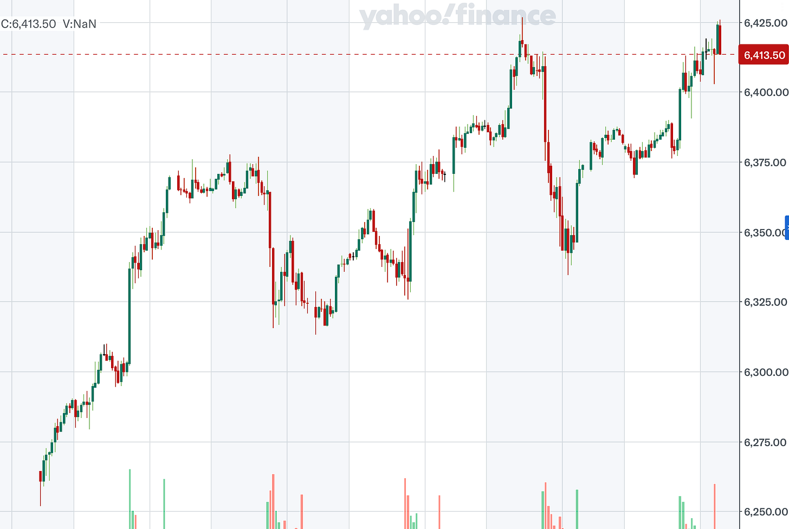
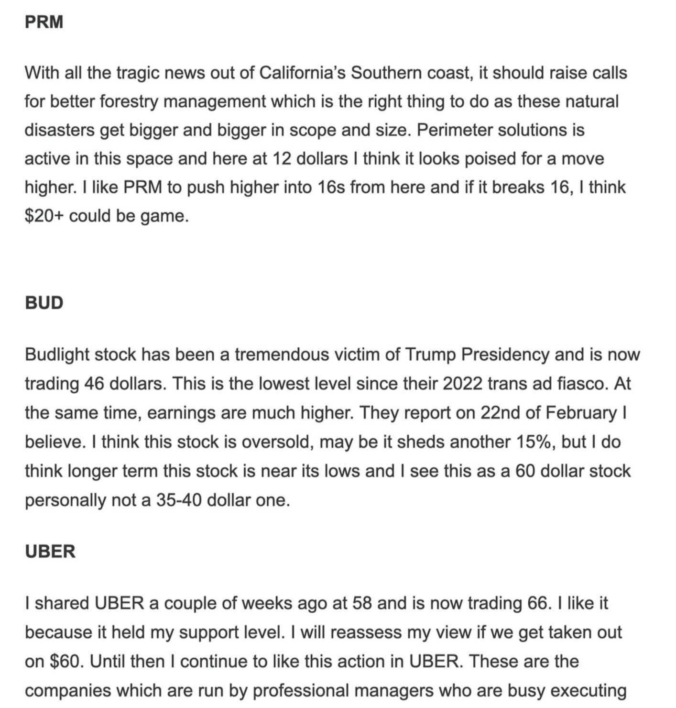
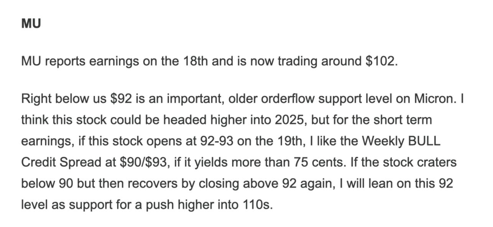
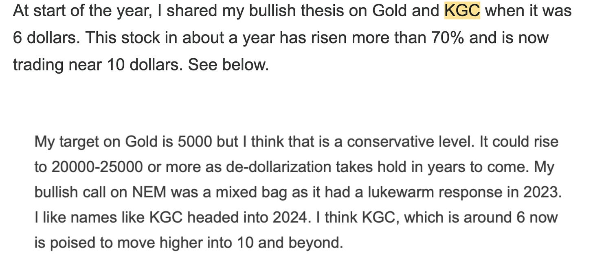

# A Not So Secret Formula To Riches in Stocks. 

*Weekly Plan 8.10.25*
*Tic Toc Trading — Aug 10, 2025*

Hey friends— 

A slightly different twist to the weekly plan today. I parked it towards the end of the email, so make sure you read all the way down. I look forward to you telling me that you found it valuable :) 

But for now, let us dive into some weekly analysis. 

The main expectation from last week was to see us find support at the lows and find sellers on rallies. See below auction from prior week. 

*Weekly Auction Emini*

This is how it played out for first half of the week and then in the latter of the week we started finding bidders above the key 6380 area to trade as higher at 6430 later in the week. 

This market closed at 6420 on Friday. SPX close was 6389. 

Now the main issue with wanting to keep selling 6380 this past week was that you can see after mid week, you are now making higher highs and higher lows. If you insist on shorting this, you are taking a stand against these higher highs. May be some sudden Truth Social post or news from the White House makes the trade a winner but technicals are not on your side. 

The main bullish catalyst for strength in the market during latter of the week was some key announcements by the President, in particular his softening stance on Apple Computers. Under this new shift, a relief was provided to Mr Cook of the Apple and the company was spared from most draconian of the import duties. 

Another noteworthy development over the week was what I would call a very poor showing by the 30 years United States bond auction. The demand was soft. The treasury had to offer higher rates to attract weaker demand. In particular, the foreign sovereign demand is severely lacking in these treasury markets. 

As a direct result, the bond market remain subdued with TLT carving out another week below critically important $90 support level. However, this weak auction, coupled with recent monetary stance from the FED, and a willingness by some Governors to cut rates in September, presents conflicting signals. 

Also while not macro related, a very interesting Financial Times report provided important context. Per the report, the largest American firms now account intangibles as their top asset. In other words, 90% of the assets of companies in the S&P500 are now things like software, brand value, intellectual property. This partly helps explain why the S&P500 large caps continue to defy gravity. This is an indication of a very different type of economy, one that is not as much based on real assets, plants,  factories and natural resources and production but instead based on digital assets. This is partly a reason why yours’ truly has been unwilling to take a bearish stance longer term on these markets, in particular the high flyers like Palantir for instance, which at time of this post is up another 50 points from the most recent swing support shared, only a few weeks ago. 

This is a decent segue to talk about some short term S&P500 levels for the days and weeks ahead. 

In my prior post, I shared the need to have strong and robust orderflow levels such as that 6222 I shared last week which provided a strong support to this market on a 3% sell off. 

If you are a long term bear here, you need to see some material weakness in this market below these levels. You need to see some consecutive daily and weekly closes below levels like 6220, else this market could remain supported. 

Even if we shed 6220, I have reasonable confidence right now that we could again discover bidding activity, if 6000 were to trade, let us say, for a move back into 6400. 

On the weekly time frame itself, if you recall I suggested a dip into 6330, that then closes back above 6380 is not particularly bearish in my opinion. And this is what we saw this week again. 

With the FED minutes next week, an all but certain departure of the FED chair soon, to be replaced with someone far more malleable to President’s agenda, is bullish. 

On the weekly time frame, we could leverage this 6342 or so area. 

> **Scenario 1:** I would not necessarily be too bearish on weekly time frame, unless we were to take out 6342 and close below it on a Daily time frame.

> **Scenario 2:** On the upside, we could see some resistance come in perhaps at 6440-6450 for a push lower, but if these dips are shallow, let us say into 6360 or so, this could pave a path forward for a push higher into 6500 towards start of the new month.

Now in related markets, I think you have some firepower to propel this to 6500. So for instance, the most recent injection of life back in AAPL. This is a stock that was dead only a few sessions ago. Analysts like Cramer were trash talking it for having all the AI skills of a toaster, and to make things worse, the looming threat of import duties was dangling over AAPL bulls at all times, day or night. 

Some of that weight has been lifted after Cook and Trump made friends last week (for now). 

The AI thing? Yeah, still a problem. Siri still thinks “Call Mommy” means “Order a mop”, But if AAPL’s current momentum holds, I believe it could bust past 240, and that might give the main index another jolt of sugar rush. 

If you recall, I shared this 200 to 230 dollar swing in AAPL move just a couple of weeks ago. It really did not seem plausible at that time , yet here we are, just 2 weeks later. 

This is in series of tremendous ideas shared by me just within last month or so alone. Frankly, the list is endless. For instance, CRWV ripper from 100 dollar long term support, back into 130! Or a SOUN 40% ripper just this week. Or a COMM tripling within a matter of days. I could go on. This just calls for patience and taking a long term view of these under appreciated ideas. 

With SOUN, this has been shaping out to be an interesting ideas. You know one of the things, I am personally never comfortable with is what do you do when the stock has already made a 50, 80, 100% move? Where do you place the stop. It is one thing if it at 10, I can take a 30-40% stop and put it at 6-7 bucks. At 14-15 now, I want to buy now, and if I did nothing at 10, this often means putting stop much lower. It comes down to risk appetizer, even when the stock-still looks good in my opinion. 

In these kind of instances, I like longer dated calls, for instance, 11 dollar call for January expiry. 

This call is now 3 dollars and change, it is $3.80, but if this were to let us say sell down to 2, or a two and half dollar range, I think this still represents good value, given the general market remains supported. 

**Perimeter PRM **

So, a few weeks ago, I did a quite extensive reasoning why something like a PRM could be bullish. 

See below. 

Lo and behold, we are now trading here above 18 on this stock, and you know if you ask me, forestry in the United States is not given enough thought to. 

Needless lives, both human, livestock, and the wild kind, are lost to intense blazes of forest fires. A lot of this can simply be prevented by clearing your forest floors of flammable debris. 

Sometime this becomes a political topic. It does not have to be. In nature, the Mother Earth takes care of this problem by burning the dead vegetation so new growth can occur. In 2025s, we live in dense urban areas right next door to immense forests, for instance most of California, Oregon, Washington, British Columbia further North, are ticking time bombs when it comes to these forest fires. 

I think PRM has a role to play in this to help the situation a bit. Furthermore, most of the land in the Western United States is actually owned by the US government. With Trump, there may be additional tailwinds by just auctioning off some of this forest lands to private entities. This could all be beneficial for PRM. I think this remains supported on dips. I think this is a 30 dollar stock, not a 15 or even 18 dollar one! 

**Micron MU **

This is yet another example of market realizing value of our calls in due time but sometimes it is not immediately apparent to everyone. See below for my Micron call at start of the year. 

This is now pushing past 118 again. While may be closer to some resistance here, I think 105 or so remains a formidable level in Micron. 

These December monthly calls on MU, for 140 strike, if had around 3 dollars, could make sense from a risk to reward point of view. 

**APP**

So this is an extremely old orderflow stock which I shared last year when it was a 100 dollars. 

I did like its earnings action in which the stock was bought up after the initial shock. 

It is now 450. This earnings day SOC (Scene of Crime) near 390, may be 400, remains an important goal post. If the stock sells off and holds these levels, I think we are headed into 500 dollars on AppLovin. 

**Look at the KGC now below.** This stock is now trading 18 dollars. 

### What I am about to share now as a personal cautionary tale and view, is extremely important to wrap your head around if you ever plan on making it in this business. Ok? You may also wanna share this with your loved ones who may be frustrated with their investing life.

A lot of the times, folks will share their stories with me, for instance a very close follower shared with me back in March she/he was up 85% (YTD). 

This is stellar performance. He/She beat every other genius hedge fund on the Wall Street! But at some point since then, these loses were erased. They turned to losses! Why does this happen? How could we see such drastic reversal in fortunes in markets? 

One reason— too much concentration. Very less diversification. Wanting to be rich quick. 

If you look at my stocks, shared here over the year or so, how many of them have doubled? How many of them have tripled? What about 10 bagger (HOOD $10 to $110), ok how about a 30 bagger (PLTR $6 to $180)! 

Now has everything been a winner? UNH is down 5%. DJT is down more than a 3rd of its value! COIN is down 20%! 

### If you understand this equation, you have solved the market mystery. You now have found the Holy Grail.

A market can only go down 100%. It cannot lose more than 100%! Unless it is crude oil in Covid LOL— which can go negative too. 

### A 10 bagger can wipe out your losses from 10 stocks that went to 0! 0! How often does that even happen? In our careers, no more than 4-5 times!

How many 30% losses can a 10 bagger which is a 10X gain , cover? Take a guess! How about a 2 bagger, how many 50% losses can a 200% winner cover? Can a KGC that has rallied over 300% cover ten 30% losers? You bet. 

So, if there are a couple of key takeaways from my number of years in the market, I have come to realize, taking a longer term approach to markets always trumps the short term. In the short term, unless you are doing it professionally and can cut loss at a dime, it becomes increasingly harder. 

Part of the reason so few win at short term is the mindset that one trade can make you untold riches. 

This is not correct mindset. A series of trades, taken over a long term horizon, proper risk management, cutting the losers early and letting the winners run is the winning formula. 

Have a great week ahead! 

~ tic 

**Disclaimer:** This newsletter is not intended to provide trading or investment advice but solely for general informational & educational purposes. It represents the personal opinions of the author, shared publicly with you as a personal blog. Engaging in futures, stocks, or bonds trading involves significant risk, and there is no guarantee of profit. In fact, there is a possibility of losing one's entire investment. Utmost caution is advised. Your account can go to zero. The author does not guarantee any profit whatsoever, and the reader assumes the entire cost and risk of any trading or investing activities undertaken. The reader is solely responsible for making informed investment decisions. The owners/authors of this newsletter, its representatives, principals, moderators, and members are not registered as securities broker-dealers or investment advisors with the U.S. Securities and Exchange Commission, CFTC, or any other securities/regulatory authority. Consultation with a registered investment advisor, broker-dealer, and/or financial advisor is recommended. By accessing and utilizing this newsletter or any of its publications, the reader agrees to the terms set forth herein. Any screenshots used are courtesy of Ninja Trader, FinViz, Think or Swim, and/or Jigsaw, with whom the author has no affiliations. The information and quotes shared in this blog may contain inaccuracies, as markets are inherently risky and subject to unpredictable fluctuations. Additionally, the content of this blog is the intellectual property of the author, and its sharing or copying is strictly prohibited. By reading this blog, the reader accepts these terms and conditions and acknowledges that it is intended solely as a personal trading journal and nothing more.