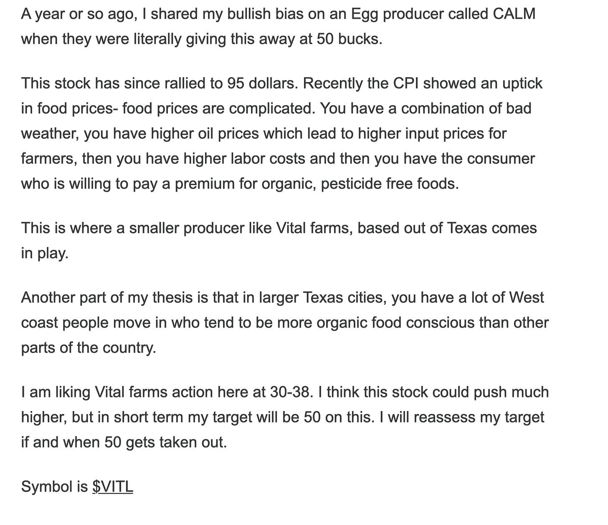

# Daily Plan 8.21.25

**
*Tic Toc Trading — Aug 21, 2025*

Today was an excellent example that proves my maxim that you do not need to predict the market to make use of it. 

If you recall, I shared the PLTR support level last night. At the open today, it was trading there. Not only that, in my chatroom below I shared a short term PLTR call at 2 dollars. 

It briefly dipped below 2 into $1.75 before staging a monster rally, clearing $3 in next couple of hours. Not only that we saw a 10% rally in PLTR, a fairly large intraday reversal. 

Install the chat room, when the market gets moving we do not have flexibility of sending an email as it gets lost in transition, chat room is the best way to get most time sensitive updates when opportunity permits. 

Below I have included another example of long term mindset, in this instance a niche farm company called Vital farms. This took almost 9 months to get here, but finally we did it. It closed near 50 today. 

On the emini side, we found buyers at weekly support zone. We saw a handsome rally from these levels. What we need to see is this market clear 6460 for a push higher back above 6500. 

On the downside, the weekly level could still remain in play. 

> Scenario 1: 6380 or so remains key level to be broken by bears for a raid into 6250. Minus that we could see this supported.

Bottomline, we need a resolution either with a close below 6380 or above 6460. 

**Disclaimer:** This newsletter is not intended to provide trading or investment advice but solely for general informational & educational purposes. It represents the personal opinions of the author, shared publicly with you as a personal blog. Engaging in futures, stocks, or bonds trading involves significant risk, and there is no guarantee of profit. In fact, there is a possibility of losing one's entire investment. Utmost caution is advised. Your account can go to zero. The author does not guarantee any profit whatsoever, and the reader assumes the entire cost and risk of any trading or investing activities undertaken. The reader is solely responsible for making informed investment decisions. The owners/authors of this newsletter, its representatives, principals, moderators, and members are not registered as securities broker-dealers or investment advisors with the U.S. Securities and Exchange Commission, CFTC, or any other securities/regulatory authority. Consultation with a registered investment advisor, broker-dealer, and/or financial advisor is recommended. By accessing and utilizing this newsletter or any of its publications, the reader agrees to the terms set forth herein. Any screenshots used are courtesy of Ninja Trader, FinViz, Think or Swim, and/or Jigsaw, with whom the author has no affiliations. The information and quotes shared in this blog may contain inaccuracies, as markets are inherently risky and subject to unpredictable fluctuations. Additionally, the content of this blog is the intellectual property of the author, and its sharing or copying is strictly prohibited. By reading this blog, the reader accepts these terms and conditions and acknowledges that it is intended solely as a personal trading journal and nothing more.