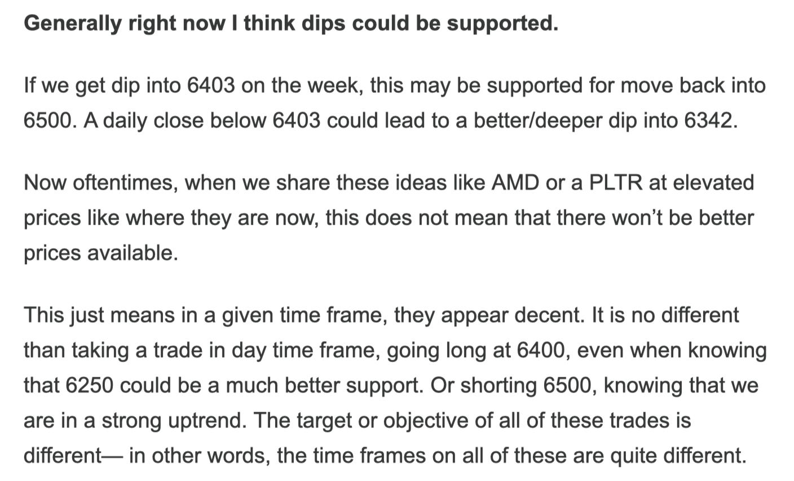

# Weekly Plan 8.25.25

**
*Tic Toc Trading — Aug 24, 2025*

Hey guys-

The primary expectation from previous week was to see any dips supported into 6380-6400 area. See below. 

The primary macro takeaway from last week was the FED Chair Powell speech at conclusion of the Jackson Hole symposium. This speech was taken as a green light for rate cuts by the FED starting as soon as September. 

This speech also highlights the challenges for this FED to execute policy in 2025— at a time when employment is slowing down and is expected to slow down some more with wages rising, there are signals that inflation in some sectors and area may already be spiking. Powell remained committed to a 2% inflation goal, where in reality, inflation remains sticky near 3% with signals that it could in fact inch higher. 

This will be harder to solve than when he managed to bring inflation down from 9% to 3%. A willingness to ease here when the stocks (basically a measure of frothiness in risk assets) already are pretty highly valued near a 30 PE, and bond yields high but historically pretty low near 4-5% for longer dated maturities. 

Backdrop of this problem is the Federal spending to service its debt itself. The US is now paying more than a trillion dollars to service its debt. This is every year. This costs the US more than its next highest line item of spending which is defense. 

Remember, from a FED perspective, they do not control longer dated interest rates. They only manage or have the power to manage the overnight bank rates. The bond market decides the longer term fate of these interest rates. Ask yourself- will you be willing to earn 4% a year for lending your money to Uncle Sam for 10 years? How about for 30 years? 

So the FED at a very basic level has 3 pronged problems staring at them— possible increase in inflation in months ahead, possible slowdown in unemployment and GDP, and the specter of losing control of the bond market. Any one of these will be enough to keep any self respecting FED chair tossing and turning at night. 

Then in the short term market movers, we have the NVDA earnings next week. This company has been growing its earnings and revenues at a breakneck speed of 80% year over year. The market will look for clues if this can be maintained going a year or two out. I said this earlier when NVDA was selling off at 100, and I will say this again- making and running AI chip factories is not hard it may be impossible to do so in 2-3 years or less. This gives NVDA a certain level of support if there were to be a dip. While it is anyone’s guess what these earnings will be on Wednesday, here is a given fact- Open AI and services similar to it will continue to grow at an insane rate. I expect OPENAI to have billions of daily users in less than 5 years. 

Now with OPENAI, unlike NVDA, they do not have a monopoly on the business. There is viable competition today. I think Google remains a formidable competition. I will count MSFT as a direct proxy to play expected blockbuster success of OpenAI but much of it is priced in. We cannot directly buy OPEN AI common stock- so this probably leaves Google as a winner as I think it still may be under appreciated compared to its peers. 

This is a stock shared by me only few weeks ago when it was 150 and change. It is now pushing past 206. I personally think Google could squeeze some more juice here. I think this may have another 10%, if not 20% worth of fuel left. 

However, I also do think if the general market finds itself in a rough patch for next couple months, 190 may be a better level to reload on GOOG. I think 190 or so could be a tremendous support on GOOG to push higher into 230 and beyond. 

Speaking of the general market, we saw a nice rally of about 100 dollars from that support level I shared in the week earlier. 

We cleared 6460 on Friday but if this rally is going to have legs I think it needs to hold this breakout. 

Therefore I do think on the emini S&P500 side, if there is a dip, may be into 6420, I think this could be supported with a move back into 6500. 

On the upside, 6500 could remain important unless overcome. 

With the 2 events of next week- the NVDA ER on Wednesday and core PCE on Friday, we will need to either break out above 6500 or below 6380 for further directional clarity. Right now I do think it is not a bad idea if there were to be a deeper dip into 6220 or so for a better swing time frame setups, but to get there or alternatively to neutralize the risk that we can get to 6220, we need to either close below 6380 or close above 6500 on longer term time frames like Daily or a weekly, respectively. 

With respect to Google, as I shared my view earlier, one short term trade, if we see GOOG dip back below 200, may be tad shy of 200, these October 220 calls I like if had for 2, may be 1.7 or so. This is a shorter term view though I believe January calls could be better but certainly higher premiums. 

Other than this, to say we are now going to moon or crater here is such a loaded question. 

In my school of thought, I believe a stock can either be cheap or expensive. We automatically shun expensive stocks, and embrace cheap ones. 

There is no dearth of cheap stocks which we shared here just days ago- you have Unity at 20 which is now pushing around 40, you have OPEN which went from 2 to 5, there are countless other examples which were cheap just few days to weeks ago. 

This does not mean a Unity is now expensive at 40 or an OPEN now cannot go above 5. This simply means it is one thing buying a U at 20-22 or a SOFI at 12 bucks than buying them at 40 and 25 respectively. By nature most traders in retail space “feel safe” when a stock is trading near highs because they feel like it can keep going up forever, in contrast at the lows it is felt a said stock will keep going lower. Both set of thinking are flawed. 

In my opinion, it is better to just wait and watch action in Unity now, as an example. 

If it surges past 40, it is now a candidate for breakout and in my line of thought, a place of stop can be right under 40. 

Alternatively, I could wait for it to sell down a bit and see what it does if it nears 35. This way if I see it hold the line, I can perhaps risk a 10-20% to make 2, 3X of that and then breakeven stop at 35 or 40. 

Both of these mindsets require patience though. You will never hear me say “OMG  Unity looks great now at 40”, not because it does not look great at 40, but because I said “ohh it looks great at 20!” only a couple months ago! Both cannot be great. There is a degree of greatness missing at 40 which was present at 20. 

We, and by that I mean we as a community of mostly momentum traders, have to view things holistically- often this includes general market conditions, seasonality, related markets, orderflow, macro, context etc. And more often this means we wait. Once opportunity is rife with possibility, we jump in. This can come in anytime. It could be at the open tomorrow, it could be a month from now. 

Remember the old timer maxims hold true even today- there are many old traders and there are many bold traders but extremely few bold AND old traders. 

Now this does not apply to everything though— I want to be 100% clear about this. In my view, higher beta stocks by their nature are more at mercy of general market than let us say something like a Disney or even a GLW. 

Both of these are orderflow stocks shared by me a few months ago at 80 and 37 respectively. They are now up about 50% from those lows. 

A good thing about these stocks in my thinking is that if the general market sells off 10% due to their nature, they will shed may be 10%. Contrast this with a high flyer like a PLTR or a U. They may shed 20%. A 30%! 

So the market is much more forgiving about lower beta stocks such as a Disney for instance. 

This has now subdued from my 130 target and is now trading 118. I think this still looks great for a move higher into 150s at some point later next year. 

A Disney brand name alone in my view is a quarter trillion dollars and this stock is selling at less than that. You have Mickey Mouse, Donald Duck, Jasmine, Cinderella, Pocahontas, Samba, Piglet. What price will you put on these? They are priceless in my view. 

These are some of the anomalies in the market that sooner or later will be corrected. 

~ tic 

*Source: Disney*

**Disclaimer:** This newsletter is not intended to provide trading or investment advice but solely for general informational & educational purposes. It represents the personal opinions of the author, shared publicly with you as a personal blog. Engaging in futures, stocks, or bonds trading involves significant risk, and there is no guarantee of profit. In fact, there is a possibility of losing one's entire investment. Utmost caution is advised. Your account can go to zero. The author does not guarantee any profit whatsoever, and the reader assumes the entire cost and risk of any trading or investing activities undertaken. The reader is solely responsible for making informed investment decisions. The owners/authors of this newsletter, its representatives, principals, moderators, and members are not registered as securities broker-dealers or investment advisors with the U.S. Securities and Exchange Commission, CFTC, or any other securities/regulatory authority. Consultation with a registered investment advisor, broker-dealer, and/or financial advisor is recommended. By accessing and utilizing this newsletter or any of its publications, the reader agrees to the terms set forth herein. Any screenshots used are courtesy of Ninja Trader, FinViz, Think or Swim, and/or Jigsaw, with whom the author has no affiliations. The information and quotes shared in this blog may contain inaccuracies, as markets are inherently risky and subject to unpredictable fluctuations. Additionally, the content of this blog is the intellectual property of the author, and its sharing or copying is strictly prohibited. By reading this blog, the reader accepts these terms and conditions and acknowledges that it is intended solely as a personal trading journal and nothing more.