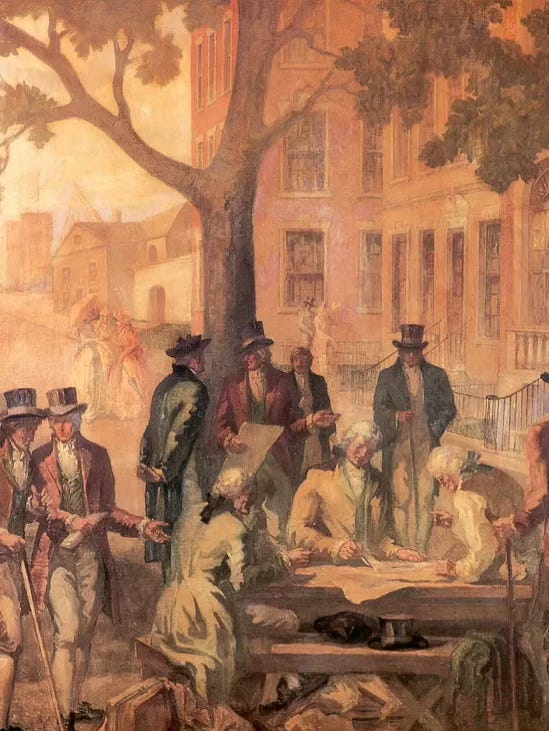
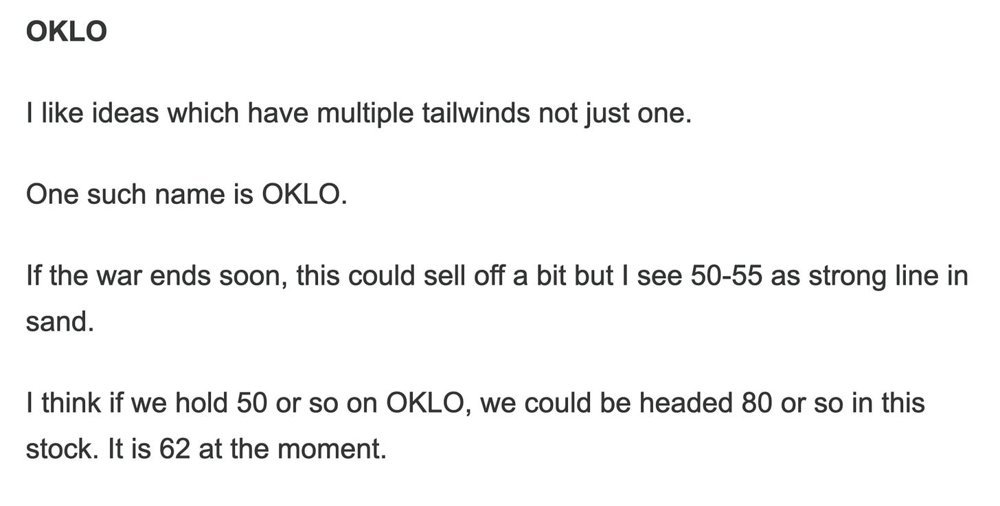

# Investors Beware: September Has Arrived.

*Weekly Plan 9.1.25*
*Tic Toc Trading — Aug 31, 2025*

Hey friends- 

We kick off a brand new quadrimester, a brand new month and a brand new (albeit holiday shortened) week when the markets reopen for business on Tuesday. 

This will be a fairly action packed week with both CPI and Non farm payrolls neatly stacked on Thursday and Friday respectively, so hopefully we see some fireworks and not this slow-fest that has plagued these markets for last week or so. 

We will top off the month with another potentially looming Federal government shutdown when the lawmakers must agree to a new budget for the US Fiscal year that begins on October 1. So in short September should be a very exciting week for the active traders and value hunters alike. 

In this installment, while we will share some high probability short term weekly levels, I also want to touch upon some longer term themes, if let us say things go south and we do begin to see some elevated volatility in next month or two. 

**Let us begin this exercise by delving deeper into few key recent themes which warrant a mention. **

On August 29th, the U.S. Court of Appeals for the Federal Circuit ruled that most of former President Trump’s sweeping global tariffs, imposed under emergency powers via the International Emergency Economic Powers Act (**IEEPA**), were unconstitutional. The court concluded he had overstepped his authority, since **IEEPA** does not explicitly grant the president the power to impose tariffs- a power reserved only for the United States Congress.

In overall scheme of things, I do not think this is a major market mover but nuance is a key. Despite Trump Tariffs, almost on every country on planet at the moment, the goods inflation as a result of these tariffs has remained subdued. You can argue this is because of n number of reasons but in my view the international supply chains have matured enough to withstand the majority of brunt of these tariffs and on domestic front, consumer spending and confidence itself on the low end of the range could be keeping goods prices from spiking in a meaningful way. 

Where most of the inflation pressure however is creeping into the equation is via services inflation- this is probably going to stay this way for some time, unless modulated lower by wider layoffs and unemployment. For now, due to the draconian immigration policies in effect, I do believe the legally authorized immigrants and the US citizens have it really good as they can demand higher wages in jobs historically performed by often undocumented workers who will historically have been willing to do these jobs for lower rates. So your landscapers, your roofers, construction workers, fast food workers, truck drivers. This benefits white collar workers too but to a certain lesser degree for sure. So if services inflation pressure persists, this could be a shock to this market atleast in the short term. 

Then the other elephant in the room which could keep these markets on tenterhooks is the brewing battle over another government shutdown which could be here as early as mid September. Historically, it has paid to buy any government shut down induced sell downs for a quick 10-20% rebounds rather soon. This I think is not going to change and could remain a potential opportunity, if the markets were to sell off due to the combination of two major factors shared above. 

**Related markets make picture muddier **

No talk of macro and fundamentals is complete without first also talking about related markets. 

Personally if you ask me, I will be outright bearish on this market had it not been for recent relative strength in AAPL and names like GOOG and TSLA. 

The TOP 7 stocks in the S&P500 index today make up 33% of the market cap of this index. In fact the valuation of top 7 stocks in the index today is higher than the valuation of smallest 400 stocks in the entire index. 

This makes the entire market a slave to the whims of mega caps. We got here to where we are as folks ploughed in billions upon billions into the AI driven mania due to NVDA, the success of AI models like OpenAI meant MSFT today is a couple hundred billions dollars shy of 4 trillion dollar valuation. Not only are folks maximally exposed to stocks like NVDA and MSFT, there are a myriad number of leveraged and non leveraged ETFs and other esoteric instruments that track the movement of these large stocks and they themselves enjoy hundreds of billions of dollars of valuation. 

Don’t get me wrong, it is not all pure fluffy mania though. The profits of companies like NVDA have surged. This is a company that on a good year in the past years may be made 10, 20 billion dollars in sales. 

This exploded last year by 10 times!  So traditional valuation models like Price to earnings, or price to sales, even book values have been keeping pace with the torrid rise in stock price. This is unlike some other recent monster movers like PLTR, where objectively you have had much higher surge in stock price, but let us be honest here— they made about 2 billion in sales 2 years ago, today they are a 100 million dollars shy of 3 billion. While impressive, this is not the same as the stellar story told by NVDA. 

**If there is one key takeaway**- companies with massively increasing profits and revenues will more than likely have stocks which outperform everything else. This is a key lesson in there. 

**The question however at end of the day is** — can NVDA sustain this torrid growth? 

For how much longer can it continue to grow its revenues and profits by 10 fold? If the answer is another 3 years, then in my opinion NVDA is cheap at 170! 

**If the answer is no one knows **— we need to have a serious chat about merits of chasing a cyclical stock, with proven max drawdowns of as much as 90% in past, and a 5 year drawdown of 66% at a 30 Price to earnings! 

**One last key development or aspect I want to cover is the recent Russian, Chinese and Indian at the Shanghai Cooperation Organization (SCO) summit in the port city of Tianjin.** 

I would not go deeper into the specifics of this summit itself, but I will share that I think regardless of what comes out of this meeting, this is inherently iffy for globalism. It consolidates regional powers and further alienates historically key US allies like India. In theory, these countries could do more trade with each other bypassing USA hegemony. In theory they could agree on holding a certain amount of their respective local currencies instead of dollars to do business. They could launch a common trading currency. While none of this is set in stone, these are potentially anti globalist forces. 

If you are a long term reader, you will fully well know my view that the reason S&P500 and Nasdaq have been so strong are due to a perception that despite Trump’s rhetoric and policies, globalism is well and alive. If this market begins to sense a danger to globalism, these markets can unravel quickly. 

**Let us summarize **

So if we summarize all of  this by saying some markets like NVDA or even a MSFT may be looking tired here, and if we assume furthermore some of this slack can be picked up by the likes of GOOG and AAPL, this could very well mean we remain stuck in a rut here without a dazzling move to the upside or without a striking move to the downside. A stagflation of sorts but instead in the market you say?

In my view, unless NVDA were to perk up here soon enough we could see a range bound market here with dips supported and rallies sold. 

Even more importantly, I believe these may be fertile environments for smaller stocks with surgically precise support levels. 

We need evidence that mega caps can all perk up here if we are to continue on beyond 6500s into 7000s. Else I think this current market environment reeks of more rangebound action here. 

Now you may say “***but ticcy you just said AAPL can pick up slack here***”. It can. I said it can, I did not say that it will. Again, for any of you who has been a regular reader longer than 2 months will know that I was first bullish on AAPL at 190. It is 230 at the moment. For GOOG, my first bullish post was at 150 back around May. It is 215 today. So they can also drop a little here and while it will not invalidate my rangebound thesis, it could translate to some more softness in the general market here. 

At this point in time, I will be a bit cautious about mega cap risk to the general market and I will be on lookout for a bit of sell off here to find more attractive levels. 

In interim, I think smaller caps are the place to be in at the moment. Quality, solid small caps, which are relatively inured from the geopolitics and trade drama playing out all over the globe will be for me personally the place to be. 

In subsequent sections I will share some smaller stocks which I believe can still do well. I am at the time of this post not too bullish on NVDA or even a MSFT here at these levels . This could of course change but I need to see more evidence of this on the tape. 

**With this out of the way, let us talk about some emini levels which can be battleground zones next week. **

To start with I will say the recent highs near 6520 remain key. These prints have offered us resistance now for several days, and I do not see that dynamic change unless we were to close above it on longer time frames like **weeklies and dailies**. 

On the downside, these dips have been shallow too. It is not like this market is willing to give up either on those support levels. So I will say 6330, a 6350 remains support unless broken! These are your emini September levels. For SPX, this means you subtract about 12 from these prices to arrive at respective levels. 

> **Scenario 1: **I will like to see support kick in, in case we were to sell down into 6330-6350.

> **Scenario 2:** What happens when and if we trade 6350 is far more important. If we see a sell off into these levels, and then a market that then immediately manages a close above 6403 in my view shows demand. However, if these bounces are shallow and are unable to clear 6403, I think we have some rough patches ahead and I will not be surprised at a sell off into 6223.

**Other ideas **

At the moment, I am not too interested in chasing the mega caps here. However, if we were to sell down into 215 on AAPL, let us say we are back below 200 or so on GOOG, I will be perked up in these names for a swing time frame set up. 

I am more interested in smaller caps when it comes to longer time frame setups. Now, please do note that smaller caps tend to have a larger beta. On top of that, smaller caps sell off more compared to the mega caps. This is just the nature of these stocks and some thing I will personally be cognizant of. So, I will not go all in at any one level. If I like the stock enough, I may make a purchase at Support # 1, and then I may add on another 10% sell off, and then I may add more at another 10% sell off. 

Normally, in my personal experience, it is possible to see a 30% to a 50% sell off in these smaller stocks,  only for them to later erase these losses and then go higher by a multiple of 200%, a 300% and so on. This is classic smaller cap versus mega cap market action which has held I don’t know ever since traders started exchanging stock certificates under a buttonwood tree on wall street some 250 years ago. 

*NYSE Circa 1790. Via USA Today.*

**Black SWAN**

   is a niche ETF with a bit higher fees at half a percent. 

This is in fact quite unique. 

I think it alleviates some interest rate anxiety and could benefit 2 ways if interest rates are cut. If they are not cut, it could still outperform longer dates bonds and notes. 

It is built in a way that it can capture some upside if the stocks continue to do well too. 

Take a look and lemme know what you think. It is about 30 or so right now. I think action looks robust for a move higher into upper 40s. 

**ETH**

At this point I favor Ethereum more than Bitcoin. 

My readers know I had suggested this as a bullish play only few months ago at 2000 and then again at 3000. It is now 4300. I favor any support into 3700 supported for an eventual push higher into 6000 dollars. 

**OKLO**

I remain bullish on smaller nuclear energy plays like OKLO. 

This is an older orderflow stock shared when it was 50. See below. 

I still like it and I think if we hold 60-62, we could head higher unto 100 on OKLO. 

**HIMS**

HIMS is now reinventing at home diagnostic testing. This is innovation, I like this and I think if we hold 33-35 on HIMS, this could retest its highs near 62, may be even a 70. It is 42 at the moment. 

The appeal of HIMS from my perspective is that a lot of folks unfortunately out there do not want to put in work and would love for something like HIMS to provide them with a short cut. 

They have some good marketing and I think a growing clientele, especially younger generation who tends to be less well informed about metabolic health. We will see if HIMS begins to collapse here below 30 outright but I kind of doubt it. 

**CWAN**

I like the charts. I like it. 

I think we can retest 35-40 on this if we do not start closing back below 18-20. 

**BA**

On the industrial side, I continue to like this action in Boeing. 

Know that I shared this back when this was 140. 

Today it is 230. However I think it continues to look good and dips may be supported for a push higher unto 300. 

**Gold **

Gold given by me first here at 1600 has been doing exceedingly well folks. 

It is now 3500. I personally believe next 3 years or so could be very good for Gold. 

If you look at Gold proxies— NEM given at 30 is now 75. 

KGC has almost tripled from $6 or so. 

GLD I started warming up later at 270, it is now pushing 315. 

With miners, I am always a little conflicted, like why own miners when it is now possible to own the metal itself outright? 

GLD is physically backed Gold ETF and I think it is a buy (add) for me on any dips. I will like to see atleast 30% more gains in GLD taking us to may be $420 on GLD by end of 2026. 

Have a great week ahead! 

~ tic 

**Disclaimer:** This newsletter is not intended to provide trading or investment advice but solely for general informational & educational purposes. It represents the personal opinions of the author, shared publicly with you as a personal blog. Engaging in futures, stocks, or bonds trading involves significant risk, and there is no guarantee of profit. In fact, there is a possibility of losing one's entire investment. Utmost caution is advised. Your account can go to zero. The author does not guarantee any profit whatsoever, and the reader assumes the entire cost and risk of any trading or investing activities undertaken. The reader is solely responsible for making informed investment decisions. The owners/authors of this newsletter, its representatives, principals, moderators, and members are not registered as securities broker-dealers or investment advisors with the U.S. Securities and Exchange Commission, CFTC, or any other securities/regulatory authority. Consultation with a registered investment advisor, broker-dealer, and/or financial advisor is recommended. By accessing and utilizing this newsletter or any of its publications, the reader agrees to the terms set forth herein. Any screenshots used are courtesy of Ninja Trader, FinViz, Think or Swim, and/or Jigsaw, with whom the author has no affiliations. The information and quotes shared in this blog may contain inaccuracies, as markets are inherently risky and subject to unpredictable fluctuations. Additionally, the content of this blog is the intellectual property of the author, and its sharing or copying is strictly prohibited. By reading this blog, the reader accepts these terms and conditions and acknowledges that it is intended solely as a personal trading journal and nothing more.