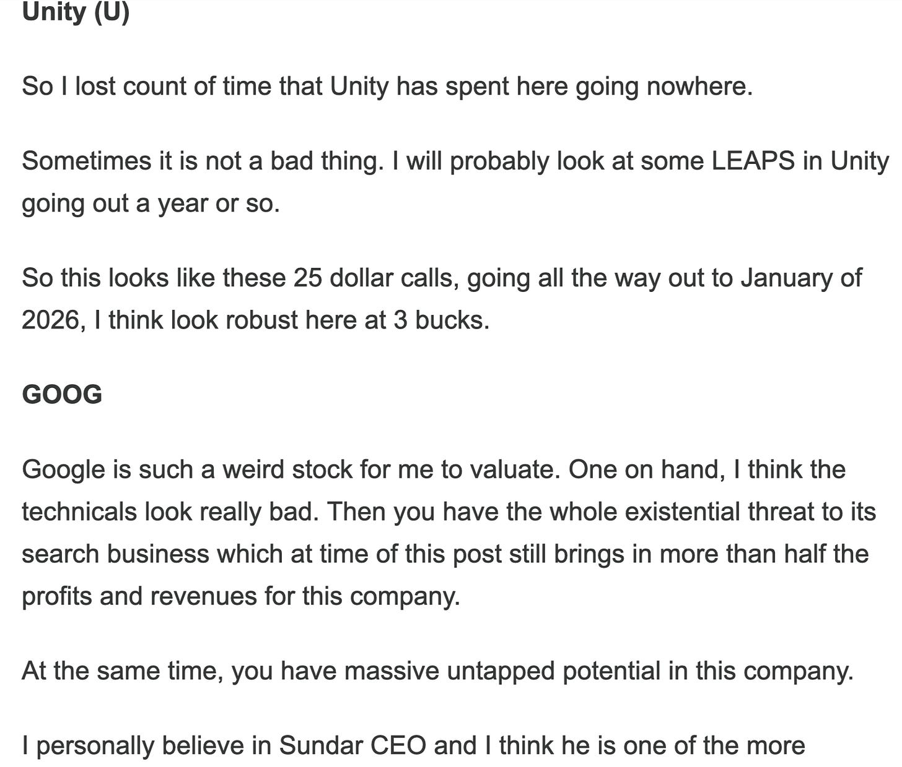

# Has LULU’s Stretch Finally Snapped?

*Weekly Plan 9.7.25*
*Tic Toc Trading — Sep 07, 2025*

Hey folks-

2 broad themes are driving this market at the moment. One longer term (and more structural in nature), another one more short term. 

**Let us first talk about the whole beef between Trump and the FED. **

From a Trump perspective, this may well be the right move. Many of his supporters could even see it as the **only **way forward, given their view that the Fed has become too political of an institution.

That said, even the best-laid plans often go astray, and actions taken with good intentions can still carry unintended consequences.

The US you see today is result of over 200 years of tinkering and experimentations by arguably the smartest people who ever lived. What sets the US apart, from both its peers in the developed world, and certainly from the developing world is a willingness of this country and its people to learn from their mistakes and use that cumulative knowledge to improve the system iteratively. 

If you point blank ask me that what then is the special sauce in the US that other countries often lack, I will answer that in the US, decentralization of power— between the state and the FEDS, the breadth and scope of the institutions and above all transparency from the public offices have all been a major contributor to making America Great. We never had that one **all pervading central figure** like a Lenin, or Mao, or a Stalin that could take 100% of the credit for the growth engine that the US is today. 

In last couple of decades however we have seen this trend bend a little with too much concentration of power, and wealth, especially within the corporations and elites. 

Ironically, the reason money and human capitals flows to the US is because of its institutions. Why do we **not** feel comfortable investing billions of dollars in other countries even when value-opportunity may be present? Because a key factor in that decision is inherent fear of opacity of institutions, corruption, nepotism,  instability of laws and regulations. What if you purchase thousands of acres of land in a developing country and a populist government there nationalizes the land holdings overnight and you lose everything? 

When it comes to institutional trust and stability, from your, and my perspective, this is most applicable particularly in case of the FED. I will submit that the reason stocks are so valuable in the US is because of the FED and no other reason. I don’t think S&P500 will be at 6500 and companies like PLTR and TSLA will be trading at 100s of PE ratios, if we did not have a FED. 

The FED ensures to a large extent the inherent financial stability in the US markets. Remember they always called it the “FED PUT”. Not a Congressional PUT. Or a Presidential Put. 

For sake of brevity, this is a very succinct and summarized take on a very complex mechanism but I think it suffices for this exercise— to get a basic understanding why these markets are so reliant on the FED and its perceived “independence”. 

**Now, later in 2025 or early 2026**, the US Supreme Court will most likely hear the arguments from the government’s side that why Trump can fire anyone at the FED, for any cause. The President can already hire the FED governors. That is how it has always been done. Now the Court will be asked to decide that the President can also fire anyone, for any reason. 

**In my view, the Supreme Court will indeed side with the President **and agree that the President has full authority to hire as well as fire anyone at the FED. 

From a Trump POV, this is a huge win. And it is, as it allows him to have a kitchen cabinet at the FED who will be willing to do as the President desires. 

But from a market perspective, this will be a major cataclysm because the market, rightfully, will assume that the US government debt now has no more checks and balances. **If you agree with me, this alone explains the recent moves in Gold and bonds. **

Right now the accepted thinking in the US is that throwing more money at a problem, any problem,  will make it go away. So whatever ills that plague the society or the markets, just print some trillions, and the problem will vanish. The will to take on this from a structural improvements, whether that is in healthcare, education, inequality in society is absent right now as it tends to take a lot of time and mental energy to approach it from that angle. This means if the markets sense the US wants to monetize its debt, by usurping the “usually INDEPENDENT” Central Bank, things can unravel. Fast. 

**Now what can help calm these fears is if inflation were to die of natural causes. **We will see if this is the case as early as mid of this week as PPI and CPI are released. 

If CPI and PPI comes in softer than expected, it takes a lot of political pressure off the FED and I think they will start cutting rates as early as this month and will continue to cut rates every time they meet for rest of this year. 

**So to summarize this:** while the markets are in an uptrend, there is potential fuel for these markets to unravel as we approach 2026, if the Supreme Court sides with Trump that he alone has powers to hire and fire anyone at the FED, thereby effectively ending the FEDERAL RESERVE as we know it. **Gold will moon, bond yields will spike, risk assets will crater. **

However, if we see softer inflation prints going into what is left of this year, I think the FED will be able to escape this fate and will embark on a series of rate cuts into the year end. Possibly, 3-4 rate cuts ahead. 

**Which brings us to the weekly short term levels— **

If you recall, last weekly plan we expected support to come in at 6360. This level while never traded, we came about a 10 handles within this level and then took off. We closed above 6403 in the same session, and rest is history. 

I think for the week ahead, if we are going to hold these Friday lows near 6440 or so, I think we are probably going to retest the Friday highs near 6530. 

> **Scenario 1:** if you are bearish here, we probably need to see some prints below 6440 and then stay there, via daily closes below **6440**. This could lead to a retest of 6403-6414.

> **Scenario 2:** Minus that, if this market stays balanced here above 6440, and in fact if we begin to accept value above **6507**, I think we are headed higher into 6600s before the quarter end.

**With this out of the way let us look at some other potential setups **

**CDP**

Not another REIT! But hear me out.. 

This is a company active in the Defense and government contractor data center space and as such represents a very niche REIT with stronger MOAT than your usual commercial ones. 

On top of that, their facilities come with security installations, the tenants tend to be longer term oriented, they are less impacted by vagaries of commercial real estate booms and busts. 

My thesis on this is based on a few points below- 

1. As the market senses rate cuts imminent, the 4% or so of yield, along with stable government customer could be enticing for high yield chasers.
2. The main risk to the story is from rising interest rates, not downward trending interest rates. With higher interest rates, the government could clamp down on spending but probably unlikely in Trump’s term.
3. This is a data center play but with a twist. The stock has run up quite a bit already, is trading 30 and is unlikely to go up a lot, atleast in any near term. However, if it were to shed 10-12%, may be into 28s, I think it may be supported and I think it may be able to capture upside atleast into 35s. May be even a 37.

**U**

On May 25th, I became bullish on Unity at 20 bucks. See below. These $3 calls I shared alone are now $20 apiece. The power of longer term LEAPS. 

Anyways, I digress. 

So if you recall, last week I said Unity is potentially a breakout candidate. And it did breakout and is now trading 44 or so. 

With any weakness in Unity, if we fall let us say a 20% into 35-37, I think these prints could be supported for a move higher into 50s. 

**SOUN**

So, this is an interesting orderflow stock which I first shared a year ago here at 3 dollars. 

Recently I reiterated my bullish view on SOUN at $8 and is now pushing past 14 bucks. 

I think the technicals look nice on SOUN. This is probably headed higher unto 20s, if we hold $10. I like any LEAPS on this headed out 5-6 month, may be $20 or $25 strikes if had for like a dollar or dollar and a half! 

**UNH**

UNH actions looks more and more attractive here if we continue to hold 290-300 area. I think this is headed higher into 350 and weekly close above 350 can pave for some repair at 370. 

**LULU**

If you recall at 230 LULU, I expected this to trade down onto 180s as find some good value there. 

This stock has not really held off support at 180 and is now trading at 167s. 

Before we go any deeper into LULU levels, lemme for sake of a thought exercise share a recent stock which surged by over 60,000%. Yes, 60,000%, not a typo. 

This is Regencell, a Chinese company that seems to have cured what is incurable. 

**Upon a closer look at their website**, it appears they are using traditional herbs to make medicines that can “cure” ADHD, even Covid. See below. 

*Credit: Regencell website*

So looks like they have a ***formula***, that can cure Covid amongst other things, using every day herbs, I see cloves in there, Mushrooms, there is some cardamoms in there too. 

Now while I would have assumed that with such a potent formula, they would have tons of sales and profits, I was wrong, they don’t have any. **0 revenues**. Negative EPS. 

But don’t let that fool you as they have very strong “testimonials”. A sample of which I included below from their website- 

The stock though now is down more than 90% of its recent highs but still up 15000% from its recent lows. It is still a 7 billion dollar company. Stock sitting here at about 13 bucks. But since the insiders own 97 out of every 100 shares, what you gonna do about this? They are probably waiting for another shot to lure in some American punters and dump it on them on next pop before they call it quits. 

The reason I share this is that in stock market, you have all sort of pump and dumps and scams. I am not saying this one is a scam, LOL, but at the very least, with insiders holding more than 97% of the float, which would have been acquired at 0 to 10 cents a share, you can see how this is a problem for every day gullible traders and investors. I am using this simply as an example of how out of whack stock valuations can get, due to numerous reasons, which technical analysis alone cannot even begin to comprehend. 

**Now back to LULU. **

Do you really think this “covid cure” herbal tea stock is worth one third of the valuation of LULU LEMON? Furthermore, do you really think that it is fair that this stock at one point was selling for 4 times the valuation of $LULU? 

I don’t. I don’t need to do any chart analysis to know this. 

So this is a tremendous example to understand how any market can get absolutely crazy and stay crazy for a while before senses return. 

Now as far as LULU goes, I think this is good value but this won’t be a quick rebound in my view. This may be could act like UNH did a few months ago and remain range bound before breaking out higher. Calling an exact bottom in names like this is anyone’s guess, but I think it is already at decent value, but if it were to shed another 20%, I think it may be even better value. 

It is just one of those things where momentum takes over and folks begin dumping everything at fire sale. It is now trading at book values when the stock made a billion in profit. Today it makes 5 times the profit but sells for same book value. I personally think this is probably a 300 dollar stock, not a 150 dollar one. 

**On a parting note.. **

Let’s wrap up the post today by sharing my views on how some of the content I share here or elsewhere may appear to someone who is super new to orderflow in general, and my style in particular. 

This is also very applicable to folks who often follow tens of dozens of so called “market experts” aka the furus. Furus are dime a dozen. They are everywhere. 

Many of them are heavy chart users, some of them use orderflow, some indeed may even be using astrology, atleast I have encountered a few in the wild that use tarot cards and astrology to make market predictions. 

When I have a reader who is either super new to me or is usually following dozens of other furus, what I say often gets lost in translation. It gets too crowded and noisy. 

At end of the day, I am telling a story based on my understanding of select few markets. It could be futures like the emini, crypto, common stocks, real estate, bonds, gold, silver, even forex at times, what have you. To get any value of my story, or for that matter any one else’s story, it is imperative that you listen to the whole story. Not just the parts you happen to like or relate to! 

Now, when someone loses the plot of the story, this definitely impacts me, right. No one wants to work in a vacuum and it is always good to have an audience where you can spread the message of the tape, or orderflow. However, it impacts such a reader way more than it impacts me. 

**Why is that? **

Let us look at events in this market of last few weeks. AAPL, TSLA and GOOG have had great rallies. NVDA and META, MSFT have been so-so, just lukewarm at best. 

Now, to a super new reader, she may be thinking “*ohh we had such great rallies in AAPL and GOOG and this ticcy guy did not share any signals and views on these*.”

The cause of such a thinking is primarily FOMO, nothing else. She wants some confirmation from a furu or me, to say that it is safe now to enter AAPL at 240. It is ok now to enter GOOG at 235! This is human nature at display in markets! This is why we are not all making millions and billions in markets! This is not a skill issue! 

**Let me repeat— making money in markets has got nothing to do with skill or technical analysis! **

It is all about mindset of the trader. It comes down to what you, as a trader do, when the trade turns into a loser. 

Anyways, I digress (again!) 

So going back to the point about me not beating the bush about AAPL at 230 or a GOOG at 230 is that I have already been crying hoarse about AAPL and GOOG, except when they were at 190 and 160 respectively! 

**You have to also think from my perspective** — if I have purchased a stock at 160 dollars and it is now trading 230 dollars, this is an almost 50% gain in what, 3-4 months? So naturally I will be a bit hesitant to have same degree of confidence at 230 that I had at 160. Don’t you think so? 

This is why I often say, throughout the year that I do not have great setups right now. A couple of weeks go I said this same thing about **OPEN. **

I said at 5 bucks now, this does not mean OPEN can’t go higher but I said it is not the same thing as buying it at 2 bucks when I shared there first! It is now almost 7 bucks! 

I have several long term readers who understand this at a fundamental level. At the same time  for every seasoned trader, I have several more newer readers, who may also be new traders. For them, I am just sharing this as an educational note to save them not only from frustration but also unrealistic expectations. 

**Every market is telling a story.** However, this story is told over months to years. You just cannot dial in every now and then and expect to understand the story. You have to follow the story religiously pretty much every day to understand the plot. 

This is very very different from 9 to 5. In 9 to 5, you get paid every 2 weeks. This is not the case with these markets. 

**In markets, 80 to 90% of profitable ideas will show up in 10-20% of time.** This means in any given year, you will have may be 10 weeks of highest fertility in market and rest of the time we just wait on our hands. This is not really to discourage anyone who may be seeking action in markets every day, but please if you want excitement go to casino. Markets can be very expensive excitement seeking arenas! 

~ tic 

**Disclaimer:** This newsletter is not intended to provide trading or investment advice but solely for general informational & educational purposes. It represents the personal opinions of the author, shared publicly with you as a personal blog. Engaging in futures, stocks, or bonds trading involves significant risk, and there is no guarantee of profit. In fact, there is a possibility of losing one's entire investment. Utmost caution is advised. Your account can go to zero. The author does not guarantee any profit whatsoever, and the reader assumes the entire cost and risk of any trading or investing activities undertaken. The reader is solely responsible for making informed investment decisions. The owners/authors of this newsletter, its representatives, principals, moderators, and members are not registered as securities broker-dealers or investment advisors with the U.S. Securities and Exchange Commission, CFTC, or any other securities/regulatory authority. Consultation with a registered investment advisor, broker-dealer, and/or financial advisor is recommended. By accessing and utilizing this newsletter or any of its publications, the reader agrees to the terms set forth herein. Any screenshots used are courtesy of Ninja Trader, FinViz, Think or Swim, and/or Jigsaw, with whom the author has no affiliations. The information and quotes shared in this blog may contain inaccuracies, as markets are inherently risky and subject to unpredictable fluctuations. Additionally, the content of this blog is the intellectual property of the author, and its sharing or copying is strictly prohibited. By reading this blog, the reader accepts these terms and conditions and acknowledges that it is intended solely as a personal trading journal and nothing more.