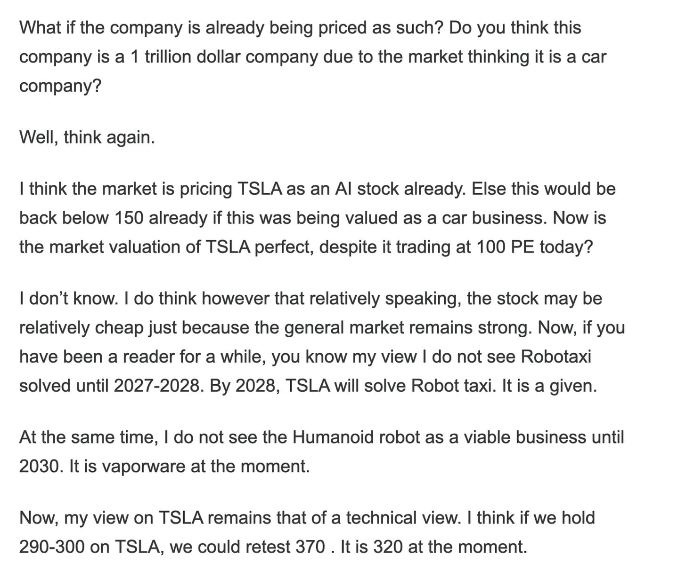

# Wake up! It is 2021 All Over Again.

*Weekly Plan 9.14.25*
*Tic Toc Trading — Sep 14, 2025*

Traders- 

When we are developing our understanding of the markets, so we can extract profits from these markets on a consistent fashion, a big part of this process is to understand what outcome is more likely than lets say another outcome. This is foundational. 

Remember, there can be n number of outcomes in any market. It is never set in stone if a market will go up or go down, or sideways, but there can be instances where one outcome could be of a tad bit higher probability than another outcome. 

This is very important as this training or this ability to discern what is more likely to happen will give a trader confidence in his or her methodology. 

Profits come from confidence, not mastery of charts. We have a million chartists but far fewer millionaires and billionaires, this is not a coincidence. 

The second most important aspect of your development as a trader is to just understand the time frames of your trades. A lot of guys do not understand this. For instance, if your intent is to get in and out the same day, or same hour, it is not the same as taking a position for next 2 years. These are fundamentally different games even though you could call both of them trades. 

In an intraday strategy, I would never be willing to take a 20-30% heat on my trade, whereas in a trade that could be for next 2 years, a 20-30% heat against the position, while not the norm, is actually not unheard of. It happens all the time, as a matter of fact. 

The third aspect of this is to gather meaningful information which can help guide you to make a trading or investing decision. Often for newer traders, this means relying excessively on indicators. This in itself is not wrong or right, whatever floats your boat as they say, but in my mind, a shorter time frame trader can be a lot more systematic— in this she can reliably use an indicator or a chart pattern to get in and out of trades, as long as she is fanatic about respecting her system rules. If you are a systemic trader, there can be 0 room for not respecting rules of your own system. 

However, when we begin to talk about longer term trades and themes, some understanding of factors outside of technicals is a given. If you look at nearly all of our recent huge winners, when we first shared those, many months and in some cases, even a year or so ago, you will notice the charts at that point of time looked abysmal. If you relied on charts alone, you would have never been able to catch this move, not atleast at the lows. 

NEM, BABA, UNH are but a handful of examples which have been monster winners in last one year and the charts looked nasty 1-2 years ago. 

**I am sharing this as an educational note**— not to discourage anyone who may be using a certain methodology to make sense of these markets. Remember markets, like anything else we interact with in life, are a system. You could argue they are even a language and if you want to interact with markets, you have to be able to speak the same language fluently. Once you are proficient in the market language, the next harder step to overcome is your own emotions and any deeply seated negative self sabotaging beliefs you may have. 

Thinking in probability terms and math helps remove a lot of emotion and drama from your own psychological make up, thereby giving you an additional layer of capability and prowess to place trades and see them thru fruition without making execution mistakes arising out of fear and FOMO. 

**One tactic you can use is to simply trade small**— for 1-2 years just trade really small, use micros instead of minis, use a couple of lots instead of going big with a 20 lot order, buy 10 shares not 100, these are all sample tactics to train yourself to develop your mindset and methodology first. The goal is to learn without any duress. If the account is blown, then no matter you are a chart trader or a macro trader, you won’t have any bullets left to carry on. You will give up and won’t reap rewards that often come with consistent training and learning spread over years. 

**Speaking of some longer term trends, let us for a bit talk about recent movers and see where we may be headed on these. **

So on Thursday, the monthly CPI came in at nearly 5%, when annualized. This is more than twice the FED’s “target inflation” rate of 2%. 

For any self respecting Central Bank and the political class, this should be a serious red flag— but since we live in funny times, it is more unfortunate than ironic that the FED next week will embark upon a series of rate cuts, in face of increasing inflation. They will be debating how many cuts and how fast to cut when baby inflation is being born as we read this post on a crisp Saturday morning. 

Longer term readers know my views that I believe we are in a very 2020-2021 like Monetary and Fiscal environment at the moment. What we are witnessing in stock market is extremely very much like what we witnessed back in the 2021. 

If you can extrapolate the events in stocks today to 2021 days, it is not hard to see where this is headed next. A few months ago I shared my thesis on the mechanism of how easy stock market gains work to attenuate inflation pressures so I will not repeat myself here. Read my previous work to get that understanding. 

However it suffices to say, 2025 stock market action is 2021 stock market action but on steroids. 

Atleast in 2021, you had a sub 2% inflation base to begin off and justified in some parts actions of the FED then— rate cuts and QE. However, in 2025 the FED is embarking on rate cuts when base of CPI is already at 5% (based on most recent data) and stocks are already at 6600! 

I think we could be back at 8-9% inflation reads in next couple of years and this will have some very interesting ( and unfortunate) outcomes. For a debt laden country, like the US is, saddled with 38 trillion dollars in debt, and a consumer already drowning in credit cars and car loans, this will further fuel the fires of inequality and political turmoil. Let me be the first one to predict— there will be very little meaningful or atleast sustainable growth out of all this spending. 

**On paper, one trade that benefits from all this is Gold. **

My longer term readers know how bullish I have been on Gold since it was in 1600s. On gold stocks, like KGC and NEM, I have been a bull from $5 and $30 respectively. They are pushing above $20 and $80 respectively now. On SLV, I have bee a bull from $17 and it is now $38! 

Now I can understand someone may say but tic Gold is now already up a full 2000 dollars from the initial trade and I do not like it anymore. 

I understand this view and I respect it, but remember my view that just because an asset is up a lot it does not mean it will start going down now. 

In fact, my longer term Gold target always has been $5000 an ounce and now I am raising it to $8000 an ounce. So you see even now at 3600, Gold has some room to run. 

A valid and reasonable criticism of this trade is that this price action is just like 2011, and Gold will be cut in half here. I personally do not think this is like 2011 at all. For a few reasons actually- 

1. In 2011, the national debt as a percentage of GDP was 60%, NOT 120%!
2. In 2011, the US stock market valuation was a fraction of what it is today, with some leading stocks even trading at 150-200 PE!
3. In 2011, the US geopolitics relationship with other major nations was much more favorable and the foreigners did not have a lot of incentives to wean away from the US debt and US dollars. Today, the central banks around the world view the US dollars with some degree of suspicion and hostility. The foreign Central banks are hoarding Gold, they are not hoarding US Dollars! The game is changed forever in 2025, they are not coming back to fuel the US spending binge!
4. In 2011, you could argue that the FED was much more “independent”. As the year goes by and we usher in 2026, Trump admin will have a complete and total grasp of the US FED with crony like Governors,  and will unleash a mix of monetary and fiscal policy not seen here in the US EVER!
5. Remember as FED begins to spin a web of tall tales and euphoria next week, they will be cutting rates even as inflation rears its head above 5%. The market in my view should take everything with a grain of salt coming from Powell’s lips, and in my opinion there is no credibility left for FED. The FED was saying for years the jobs market is robust, yet we see an almost million dollar revision down in jobs for one year period alone! I do not believe FED on anything, inflation being least of their credible tales.

My conclusion from all of this is that Gold is perhaps headed much higher into 5000. And beyond. 

**I trust in Gold a hundred folds more than the FED. **

A counter point of view is that Gold can pullback here 10-20%. I am not saying it will, I am saying any asset can and am also saying that a pullback is healthy and desirable. 

I will remain bullish on Gold on any pullbacks and will add on any 20-30% dips. 

As far as playing Gold bull market, I am personally hesitant to single stock risks due to having seen many scams and busts during my lifetime, unless it is really a larger company or something I have a great conviction in, for instance, I have Hecla at 6, I gave KGC at 5 and NEM at 30 a couple years ago. 

My favorite ways to Play Precious Metals thesis is using physical Gold, GLD and GDX! 

GLD and GDX are 334 and 69 respectively at time of this post. I think they continue to look great. 

**Emini levels **

For emini, I am now using December levels. December is at 6645 at time of this post, anyone still on September, it is at 6590. For SPX levels, please subtract about 60 from the December levels, SPX at time of this post is 6585. 

On December Emini, 6550 or so remains important this week. 

> Scenario 1: Any dips into 6550/6560 could be supported for a move back into 6640.

> Scenario 2: I will say as a secondary level of importance, 6600 remains key as well. I think if we do not close below 6550, even a 6600, we are probably headed into 6742s on Emini December.

**TSLA**

In my post dated June 29th, I called TSLA the “Cheap AI” Trade. I was very bullish on TSLA near 300 when almost everyone else was bearish. 

See below. 

This stock has since risen handsomely and is now trading 395 at time of this post. 

Technically, the stock looks good. If you are bear, you will like to see this now trade below 369. 

I think if we remain bid above 369 on TSLA, we are probably headed to $420 on TSLA. 

For all the bears out there, this one day could be a good short, that day just is not today in my view.

**Hecla**

This is an older orderflow stock which I first shared at 6 and is now pushing past 11. 

With these miners, there can be some volatility ahead if FED cuts next week and comes in rather dovish, in the short term these could sell off due to the way a lot of these algos are coded for short term trading, not long term macro outlook. 

I like Hecla January 2027 $10 CALLS at $2 to $2.5. 

**HIVE**

Speaking of the miners, as an opportunistic and tactical play, keep an eye out on these miners like HIVE. 

I fundamentally don’t like crypto miners, unlike the gold miners these can be very highly manipulated and in my personal view carry no value intrinsically. 

However, this does not mean there cannot be some short term mis-pricing in such names. 

As purely speculative lotto, these March $2 CALLS on HIVE are now 2 dollars. 

My main beef with these issuers is they offer a ton of stock on any upticks, so keeping this in mind, I still think these calls may make some sense, especially if these were to dip a little into 1 to 1.5 or so. 

**JD**

JD action appears nice. I gave this way back when it was like in 20s, it is now 33. I think 38-40 could be fair value but I like to see 30 hold on it. 

May be March $42 CALLS look nice if had for 2 bucks, may be a tad bit lower than $2. 

Remember for any of these calls I am sharing my views on, the Government shutdown if materializes end of the month could lead to better pricing. This is a pure speculation that may be we see a shutdown, or even a credible worry of government shutdown could lead to some softness in markets to trade some lower levels which could offer nice discounts in orderflow stocks. 

**UNH**

I remain constructive on these value type names like UNH and BABA etc. Remember these have been shared way back when UNH was 237 and BABA was 70 dollars, here in this Substack. They are pushing 350 and 150 at the moment. They are up a ton but in my mind they can still go higher. 

I think they continue to look good. UNH c suite has been angling for meeting with Trump. An intervention from Trump on legal woes for UNH, could bring much needed relief for UNH and this could push higher into 400s. 

This is it for now. Like, share and subscribe  if you find the post useful. Much-much more to come for our subscribers. Stay tuned. 

~ tic 

**Disclaimer:** This newsletter is not intended to provide trading or investment advice but solely for general informational & educational purposes. It represents the personal opinions of the author, shared publicly with you as a personal blog. Engaging in futures, stocks, or bonds trading involves significant risk, and there is no guarantee of profit. In fact, there is a possibility of losing one's entire investment. Utmost caution is advised. Your account can go to zero. The author does not guarantee any profit whatsoever, and the reader assumes the entire cost and risk of any trading or investing activities undertaken. The reader is solely responsible for making informed investment decisions. The owners/authors of this newsletter, its representatives, principals, moderators, and members are not registered as securities broker-dealers or investment advisors with the U.S. Securities and Exchange Commission, CFTC, or any other securities/regulatory authority. Consultation with a registered investment advisor, broker-dealer, and/or financial advisor is recommended. By accessing and utilizing this newsletter or any of its publications, the reader agrees to the terms set forth herein. Any screenshots used are courtesy of Ninja Trader, FinViz, Think or Swim, and/or Jigsaw, with whom the author has no affiliations. The information and quotes shared in this blog may contain inaccuracies, as markets are inherently risky and subject to unpredictable fluctuations. Additionally, the content of this blog is the intellectual property of the author, and its sharing or copying is strictly prohibited. By reading this blog, the reader accepts these terms and conditions and acknowledges that it is intended solely as a personal trading journal and nothing more.