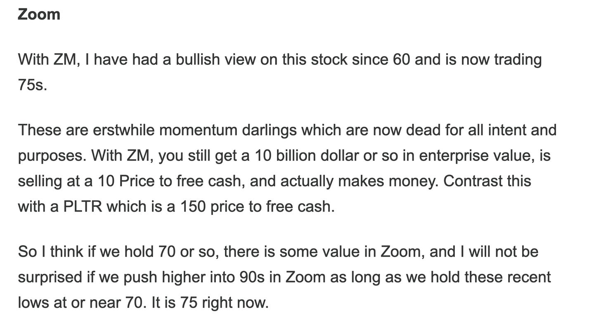

# Daily Plan 9.17.25

**
*Tic Toc Trading — Sep 17, 2025*

So with the FED tomorrow I dont like to do a super formal plan but I think the line of least resistance remains up and if there are any dips they could be supported. 

As far as bears are concerned I think we will need to take out 6640-6650 and stay below it to target the weekly support levels around 6600. Minus that we could see continuation to the upside. 

I mean it is also not imprudent to just sit this one session out. You have higher premiums on 0DTE due to FOMC, you probably end up getting burned on both long and short side. I think real move could begin later tomorrow night or even Thursday. 

The real key takeaway from this FED will be the pace of rate cuts. Is the language more so around the lines “here is your 25 BPS cut and we will wait to see how much and how fast we cut more” OR “we are cutting 25 BPS today and then we will cut 3 more times between now and year end”. This is key nuance. Former could certainly dash some hopes for the newly minted bulls here at 6666 but I personally really doubt it as explained in my weekly post. 

This is very much a 2021 market which will crash and burn later but that’s not today in my opinion. 

**Zoom**

With respect to Zoom, this is an older ordeflow stock from 2024 which I first gave at 60 and is now pushing higher unto 85s. 

I think this is one of those asymmetric things where I do believe longer term as AI takes hold, you may see a natural decline in office based workplaces and Zoom could benefit from this. 

At any rate, LEAPS on this going far out into late 2026, may be even 2027, may be into 110-125 range if had for 1-2 dollars could make sense from a risk to reward perspective. These options tend to have low DELTA so those may not end up moving a whole lot until we get closer to expiry or we begin a strong uptrend above 90-100. 

~ tic 

**Disclaimer:** This newsletter is not intended to provide trading or investment advice but solely for general informational & educational purposes. It represents the personal opinions of the author, shared publicly with you as a personal blog. Engaging in futures, stocks, or bonds trading involves significant risk, and there is no guarantee of profit. In fact, there is a possibility of losing one's entire investment. Utmost caution is advised. Your account can go to zero. The author does not guarantee any profit whatsoever, and the reader assumes the entire cost and risk of any trading or investing activities undertaken. The reader is solely responsible for making informed investment decisions. The owners/authors of this newsletter, its representatives, principals, moderators, and members are not registered as securities broker-dealers or investment advisors with the U.S. Securities and Exchange Commission, CFTC, or any other securities/regulatory authority. Consultation with a registered investment advisor, broker-dealer, and/or financial advisor is recommended. By accessing and utilizing this newsletter or any of its publications, the reader agrees to the terms set forth herein. Any screenshots used are courtesy of Ninja Trader, FinViz, Think or Swim, and/or Jigsaw, with whom the author has no affiliations. The information and quotes shared in this blog may contain inaccuracies, as markets are inherently risky and subject to unpredictable fluctuations. Additionally, the content of this blog is the intellectual property of the author, and its sharing or copying is strictly prohibited. By reading this blog, the reader accepts these terms and conditions and acknowledges that it is intended solely as a personal trading journal and nothing more.