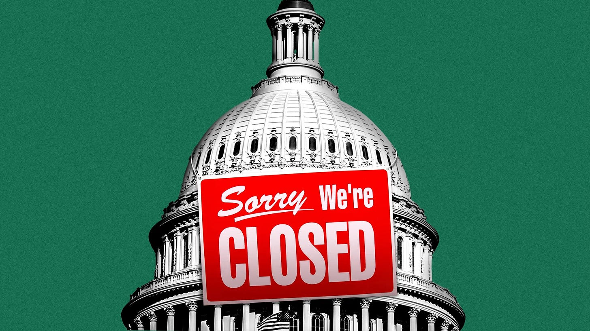

# Shutdown Threat. Traders Bail Out. Sell off Looms. 

*Weekly Plan 9.28.25*
*Tic Toc Trading — Sep 28, 2025*

Hey traders- 

A little bit of a longer read today, touching upon some critical execution notes as well as my views on government shutdown and its impact on risk. 

If you are not too keen on execution stuff, fast forward to end of the email for more hands-on active trading themes. 

Often when I talk to newbies, and by newbies I do not always mean someone who started trading just last week but rather someone who has the potential to make some really amateur mistakes which I will share below- — a key question that always comes up is the part where they will blame me for giving a support level which then did not hold, they got stopped out only to see the market reverse and take off 100-200% or more. 

**Why does this happen? **

**Is this avoidable? **

**Let us kick off the post with this key question. **

Let me take one or two very recent examples where this happened. And again, the reason I am sharing is not because I am defensive or I am trying to explain myself away, but I am simply sharing how the professional traders think and trade, and contrast this with how an average rookie operates, so you can avoid those same noob mistakes. I assume none of us reading this today is making these mistakes though. 

Right ;)? 

If you are a Substack reader, I first shared Intel as a bullish play at $19 back in February. It then rallied to above 25 and then again at 22, I reiterated my bullish bias on Intel in this very Substack. 

When I first posted my bullish view at 19, INTC did not get a lot of attention. The stock was dead money for several decades, it had not gone anywhere. And at 19, the stock was in a long drawdown of multiple months. 

Then when it ripped to 26, and pulled back into 22, and I reiterated my bullish view at 22, this is where it got a lot of traction. Because folks had seen it go up almost 35% in recent weeks and they assumed that 22 now is a good place to make some quick bucks. 

**What happened though at 22? **

It kept falling! 

And this is where I personally took a lot of heat and lost a lot of friends over this trade as the stock fell from 22 to into almost 17! 

What a lot of folks hating me for this call forgot was that even at 22, I said 18-19 will have been my Line in Sand on this play. In other words, I fully expected this stock to pullback into 17 and 18s! 

**Again**— I do not want this to sound as if I am trying to defend my honor over this Intel call I made 6 months ago, I am not. Over the course of the year, I will may be make 20-40 swing/long term trades and some of them will do really well and a few of them will end up being really bad. I do not lose sleep on it. I am using this as an example to demonstrate how I would have traded this. 

You see when an amateur is trading, when you give him a tip, or when he decides it is time to buy, he will most often go all in at one single price point.  This is because they want to make huge gains from a single trade. This is the classic FOMO and greed trading mistake. 

So let us say Johnny started trading last year and he finds out Tic likes Intel at 22. Because he had no way of knowing Tic tic liked intel way before that at 19. Now when Johnny gets a tip on internet what he does? He immediately makes up his mind that this is the trade that is going to wipe out losses from last 10 of his trades. This is the big lambo trade. 

And he goes all in on intel at 22! Max port, short term calls, 100 lots, entire capital staked on intel at 22! 

**Guys, if this is you, please do not be Johnny! **

This is how I will do— and when you read this, some of you will think “***ohh but this makes no sense***”. Yes, this makes no sense. But at the same time, know that 90% of traders will lose money in this game. And they lose their money because what I am about to describe, they do the exact opposite of that. 

Let us say I want to buy 10000 shares. Do I buy 10000 shares on Intel at 19? No, I won’t.  I will buy may be a 2500 shares at 19. And then watch. If I am right on the trade, the market should go in my direction without giving me much pain and heat. 

**Why is that? **A market moves up when there is more buy orders than sell orders on the tape. A market moves down when the number of sell orders overwhelms the buy orders. There is no other reason. So when my order of 2500 shares hits, if my order hits in an environment where there are more buy orders than sell orders, then the market should go up, right? 

100%. 

What happens if I buy and the market drops? Does not this mean that there is an abundance of sell orders compared to buy orders? 

What does Johnny does when the market drops after he buys? HE BUYS MORE! He averages down! 

**ARE YOU WITH ME FOLKS SO FAR? **

Now I just proved using orderflow methods, that if a market drops, after I buy, it means there are more sell orders overwhelming the buy orders. You do not need PHD to understand this. Yet what do I do? I keep buying even as the sellers overwhelm the buyers? Am I fool? 

If I am buying, and stock is dropping, this means 100%, all the bids below my purchase price are being obliterated by sell orders, else price won’t move down an inch! 

So I just now have proven without a a shred of doubt why it sucks to average down, I am now going to show what  I will do if the market drops after I buy. 

**I will get out. Take the small loss. **

Now if the market goes up after I buy, this is exact inverse scenario to what I mentioned earlier. This means the buyers are overwhelming the sellers. I am right that in a few months, the US government is going to take a stake in INTEL. I should now buy more. 

**What do you think Johny does in this scenario? He sells on the small pop! **

Again, don’t be Johny folks! 

So if you buy 19, and the market is now rallying to 30 bucks, this is where I will buy 2500 more shares. I am already sitting on a handsome profit, and part of this new purchase of shares will be funded by the market. I will keep adding like this on a market ripping higher and when the mania takes hold, where everyone is now convinced Intel is the new NVDA, I will similarly begin to sell. 

**Why does this work? **

Because by averaging up (and not averaging down), letting your winners run, cutting your losers early you’re talking the road less traveled. These type of activities and trades are painful. So not a whole lot of folks are able to do this because this is painful from a mental perspective. 

**Averaging down is easy.** Letting a loser run is far easier psychologically than letting your winner run because it protects you from mental pain. Taking small profits feels good. Sitting on large gains is psychologically hard. 

Yet ironically you must master doing the hard things if you want extraordinary results. If it was easy, everyone would be doing this. 

**The key takeaway from this whole read is this:** 

1. Send a probing order first into the markets. See how the market reacts. It remains unchanged? Probably not good. It drops? Definitely NOT good. It rallies? This is good. This is very nice.
2. Nearly all successful  people are averaging up. You start a new pizza franchise, a new laundromat. You make profit, you add new locations. Do you add new locations if the first franchise is losing money? No you cut your loss.
3. Trading is no different than any other business. You wanna expand if the business is good. You wanna cut the loss if business is bad.
4. In fact go analyze all your trades this year. I am 100% convinced 99% time when you were bagged, you were trying to average down. Go backtest now and if this is true, make sure you subscribe and share my post with other traders like you send who may be averaging down. Save them and protect them from being bagged, good friends do not let friends average down! Share

**Let us now review some key levels this week for the emini S&P500 this week**

When it comes to the world around us, a lot of things appear to be not working. There is widespread disunity and disharmony amongst the folks, there is unease and hurt feelings over politics, often times there are rifts between families over ideological or political leanings, you have pretty much every thing viewed under a lens of some sort of conspiracy theory— in short, if you dial in to the zeitgeist and mainstream media including various social media outlets, you will be forgiven to think that we have max chaos every where at the same time. 

Shockingly there is one arena though which appears thousands of miles far from any sort of disturbance, let alone chaos. Imagine a scenario if you will of one last outpost in this sprawling empire where there are always sunny days, not a shred of doubt or fear, everything is going great, and various actors and players in this arena go to great lengths to ensure the continuity of this wonderland— **this is your US Stock Market. **

And don’t get me wrong there is a certain grace and beauty in this well oiled machine that keeps chugging along day after day, week after week where every small dip is bought up, there is literally zero worry or fear, and for most part stocks, from monster trillion dollar market caps to even small and micro caps make new  highs day after day. 

**What is it? Why is that? **

Not that I am complaining, but would you too not be curious what may be behind this unnatural strength? 

Could it just be the momentum, plain and simple? Is the US economy really that strong that companies that have made no profit ever and perhaps will not make no profit ever, are also up a 1000% within a matter of days?

Or could it be that deep and concerted effort is being made by powers that be to ensure that the folks wake up every day and look at stock market tickers in the morning and assume everything is ok? Is this some sort of a mind control device, this stock market? 

*Source: Axios*

I do not know and I do not think it matters. Atleast it does not matter when it comes to making good profitable trades.. What do you care why your trade did well, as long if it did well? And even if you knew why it did well that perhaps that would not be the reason it did so well as there are multiple forces at play, many of them beyond scope of our comprehension. 

Now what I just said is not totally true either. It would have been more accurate to say that it does not matter what is causing these moves in the short term, however, to try and understand this more closely could help us predict and prepare for how this will end up in the long run. And whenever I say long run, it is given that this is  2+ year time frame. 

I would not spend a whole lot of time on this as I understand that most of the folks are not really looking for what is going to happen 2+ years from now, but I still believe it is somewhat important to understand. 

The reason for this current price action and tape is the way the national resources and mass consciousness is being applied in this current moment in time. As simple as that. 

**What do I mean by that? **

So when we talk about resources, first thing to understand is that money is not a real thing. It is simply a unit of measure, like a gram or an inch or miles per hour. Real wealth, whether it is you and I or a country is really in hard assets and natural resources, production capabilities, agro output etc. I briefly covered this is my last weekly post— the current mindset in the US when it comes to solving any problem is to throw a bunch of money at it. So we see this in recent announcements when it comes to Intel for example, when it comes to LAC, the Canadian lithium miner which doubled in a day, these are all government examples, we see this in private sector too— you see this in NVDA “investing” 100 billion dollars in OpenAI so OpenAI can buy back GPUs fro, NVDA. You see this in Musk making promises to Tesla car owners that they can too lend out their cars to the Robot taxi network and earn money while they are at their 9 to 5 or sleeping and their car drives itself around, hauling passengers. 

**In the political class, what we are seeing now, I have not seen anything remotely close to this in over 3 decades of being active in the markets. **

So you hear statements like “We can make the stocks go up again”, “Buy the dip”, “STOCK MARKETS CRASHING. I TOLD YOU SO!!!”. These are all actual quotes from those inside the admin at the moment. 

**Now, the reason I shared this is to build a couple points**: 

1. Stock market looks extremely good right now, and can be thought of as a tool being used to mask other important things which are not working that well in the moment.
2. The powers that be are fully invested in making sure that this dynamic continues. These people at a deep level understand that most of the populace confuses Money and stock market gains with real economy and natural resources. And as long as stocks continue to rally, this misconception can be used to advantage.
3. This is why they will use stock market as a tool to accomplish their agenda which is power consolidation and reshape America for next 1-2 decades. If you are shorting this market at the highs, at the very least be cognizant of what force you are up against— the might of the political class which is now the strongest class in the US and perhaps globally.

This is a nice segue to talk about the weekly emini levels. On the emini we last traded 6700, for SPX prices please subtract 60. 

So my main premise last week was that of balancing at 6750, and then if 6700 broke, I expected a dip lower into 6612. 

This was a picture perfect scenario with quite bit of nice action between my levels all through the week. 

Now looking at the week ahead, the main act this week is the looming shutdown. The main bone of contention at this moment in this fight is the Democrats wanting to extend certain subsidies in Obamacare. They are saying they are open to negotiations but as of this morning, the Democrats have not been courted by the Republican leadership for any sort of talks. 

**Strategically, my take on this is that Dems lose a lot more than the GOP, if this shutdown were to happen. **

**Why is that? **

Even without this shutdown, Trump has been consolidating the Federal government and this shutdown gives him additional powers by laying off and firing Federal employees he deems pro Liberal. It is his sole discretion to decide which agencies are essential and which are not and, could stay shut down for weeks if not months. 

This is really rock and a hard place for the Dems and my recommendation here will be to avoid a shutdown. This is politically better for the DEMS. The DEMS need to avoid this shutdown at all cost in my view. 

Perhaps the markets sense this too and this is why we have barely any takers below that key weekly level I shared last Sunday. If I am a democrat, I want to avoid this shutdown. I would even say if I am a Republican, I want this shutdown as it will consolidate my power more. 

**This brings us to weekly levels **

In this point in time, my thinking is that a shutdown can be averted. Due to the reasons I listed above. This is why I am bullish and think dips if any into levels below can be bought. 

Even if these below levels break, I think the dips will be bought for another push higher into 6750, possibly 6800. 

**What are these levels? **

6610 and 6640. 

> **Scenario 1: **Any dips into this zone could be bought for another push higher unto 6700. Any consolidation then above 6700 could set its sights again on 6750.

> **Scenario 2:** Let us say I am wrong and there is a shutdown, what then? If I am a bear, I will not raise my hopes too high unless we begin closing below 6492-6500 again. This is really where the rubber meets the road and unless we are going to break this support, the dips could be shallow.

**Other considerations **

This past week the Tik Tok sale was finalized and an American consortium led by Ellison of Oracle, Silver Lake, and MGX group of Dubai will own the US portion of the app now, with 50% of profits shared with the original founder Byte Dance of China. 

In my view, this is an additional bullish catalyst for the stocks as this sale, if you could call it that, it is a classic shakedown, removes a lot of uncertainty of future trade wars with China. The aim all along was to gain control over this app so certain lobbyists and interest groups in the US have direct control over the impressionable minds of Zoomers which is the Generation Z folks. If you do not believe me, look at the terms of this deal. Half the profits still go to Byte dance, the sale price is paltry— all this points to need for control over this app which I have been saying was one of the best apps and was throughly enjoyed by me before I decided to uninstall it. 

Then in a remarkable event, you had Mike Wilson of Morgan Stanley  come out this week and pour some cold water over traditional 60:40 stocks to bond portfolio, which has been the mainstay of Americans’ retirement plans for over a century. 

He is exhorting folks to now consider a 60:20:20 portfolio with 20% of assets dedicated to Gold. This is probably a good suggestion. 

If you are my reader for some time now, you will know I called this back when Gold was at 2000. I said as an insurance, I will have 10-20% of my long term portfolio in Gold. It is good to see mainstream finance types now coming to same conclusion, albeit Gold has now doubled when I first thought this up. 

**With Gold, this is not traditionally a very glitzy investment**. Gold does not move that much on best years. What you are seeing right now is an anomaly. This is an insurance nothing else. May be we see Gold keep on ripping for next 3 years, but if there is a major political realignment in 2028, or even if there is a tremendous political reshuffle in the midterms, I do expect gold to sell off. Though it will now create a permanent plateau here around 3000-4000 in my opinion. 

So, if you extrapolate the consciousness that is prevalent right now in consumers, in the political class,  in the finance types, keep an eye out on all these stocks which in my mind, I call them “***State Sponsored Stocks***”. You can come up with your own potential list, but I will say an Intel, which even here at 36 could have more juice to squeeze, potentially Boeing— this remains a candidate for proclamations from the President to “protect” as a national security interest. I have been a BA bull from 150s, it is 210 right now, I think BA can trade into 300s. 

Folks, to kick off the quarter, I am now offering the largest ever discount for the publication. Join now and protect your self from all future price hikes. Click link below. 

Start writing today. Use the button below to create a Substack of your own

**Other Ideas **

With TSLA, if you recall I was extremely bullish on 200 or so range and then again at 300. 

At $420 in Tesla I thought ok may be we will now see some selling. 

I abandoned these plans a few days ago  at which point I sent the below chat update to abandon the PUT plans on TSLA. 

This is an insane stock that keeps pushing higher and higher. 

I think one day it could be a good short but I do not think that day is today folks. 

In fact, if they shutdown the government and the stocks sells into 400-410, I think it may be supported. I see it push higher into 500 dollars now. 

The stock is currently offered at $440. 

**HIMS**

So with HIMS if you recall, I just gave this when it was 40 dollars only a few days ago and it is now pushing here past 55. This is a company that has a niche consumer  in younger males. 

I did a very detailed DD on this only a few weeks ago when this was $30 so I won’t rehash all that. 

Suffice to say, I still like it. 

These January $70 CALLS which are $6 at the moment, this whole government shutdown thing is confusing me (since there will be volatility if it goes down), but just to be on safe side, if these calls were 3-4 dollars, I think they look good from risk to reward. 

**NVDA**

If you are my regular reader, you know that after the earnings I have 168 support on NVDA. This was not only a good support but this was also the exact low in NVDA. 

I am now bullish on NVDA, if we hold 165-170 on NVDA, I think we are headed into 192. It is 177 now. 

I like November 21, $200 CALLS on NVDA if had for 1-2 dollars. They are 4 dollars right now. 

This is it for now. If you like the value from newsletter and want deeper research, methods and execution based topics to be shared, please subscribe and share with traders, like your self. 

Folks, on a parting note, trading and investing is all about creativity. This is not some scripted, 9-5 type endeavor. To become a good trader, you have to become creative. And to become more creative you have to rise above conditioning— current conditioning for masses right now is constant anxiety, fear. This leads to fight or flight mode, and in such a mode, you are not able to do creative work. To rise above this, shutdown all distractions and apps and news. There is not a shred of truth right now on any news at the moment. All apps and all news right now are bought and paid for by special interests. They have an agenda and you are their fodder to feed the agenda. This will all culminate in a war in the Middle East before 2028 and will begin a long term bear market in the US but we are not there yet. Create a long term vision and plan, do not worry about the “How” part of it, the how will appear with time as long as you know the “why” and “what”. Have a great week ahead. 

~ tic 

**Disclaimer:** This newsletter is not intended to provide trading or investment advice but solely for general informational & educational purposes. It represents the personal opinions of the author, shared publicly with you as a personal blog. Engaging in futures, stocks, or bonds trading involves significant risk, and there is no guarantee of profit. In fact, there is a possibility of losing one’s entire investment. Utmost caution is advised. Your account can go to zero. The author does not guarantee any profit whatsoever, and the reader assumes the entire cost and risk of any trading or investing activities undertaken. The reader is solely responsible for making informed investment decisions. The owners/authors of this newsletter, its representatives, principals, moderators, and members are not registered as securities broker-dealers or investment advisors with the U.S. Securities and Exchange Commission, CFTC, or any other securities/regulatory authority. Consultation with a registered investment advisor, broker-dealer, and/or financial advisor is recommended. By accessing and utilizing this newsletter or any of its publications, the reader agrees to the terms set forth herein. Any screenshots used are courtesy of Ninja Trader, FinViz, Think or Swim, and/or Jigsaw, with whom the author has no affiliations. The information and quotes shared in this blog may contain inaccuracies, as markets are inherently risky and subject to unpredictable fluctuations. Additionally, the content of this blog is the intellectual property of the author, and its sharing or copying is strictly prohibited. By reading this blog, the reader accepts these terms and conditions and acknowledges that it is intended solely as a personal trading journal and nothing more.