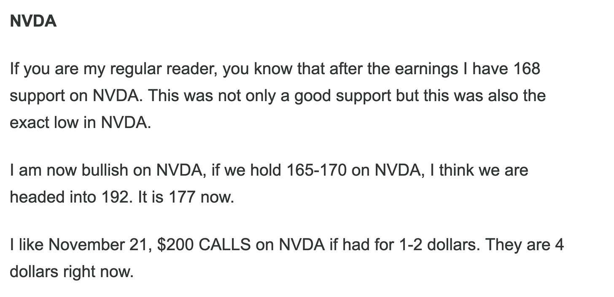
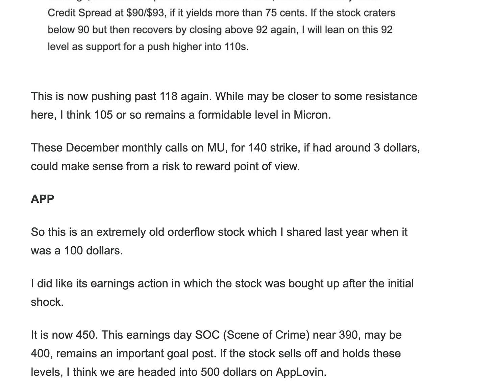

# Daily Plan 10.2.25

**
*Tic Toc Trading — Oct 01, 2025*

Hey folks- 

So pursuant to the weekly plan, we came within 20 dollars of that weekly support level and saw a trend day today, carving out a low exactly at 6680 and then rallying some 80 points higher into 6762. 

This was egged on by the likes of NVDA which I shared as a bullish play just on Sunday night. 

See below. 

These calls are now in excess of 7 bucks and NVDA looks primed for a break higher here at 187. 

In related space, look at these Micron (Mew) calls. They are pushing past 46 dollars. These were 3 dollars only a couple months ago! 

So on the emini side, despite the shutdown and all, as alluded to in the weekly, this has been well received by the markets. It likes it. 

We could say may be 6740 is key tomorrow. We are now trading 6759, I would say if we hold 6740, we are now headed higher into 6800. I would not fade this unless we went below 6740 on the intraday time frame. 

These are emini levels. So SPX is 6740 minus about 60 handles. 

~ tic 

**Disclaimer:** This newsletter is not intended to provide trading or investment advice but solely for general informational & educational purposes. It represents the personal opinions of the author, shared publicly with you as a personal blog. Engaging in futures, stocks, or bonds trading involves significant risk, and there is no guarantee of profit. In fact, there is a possibility of losing one’s entire investment. Utmost caution is advised. Your account can go to zero. The author does not guarantee any profit whatsoever, and the reader assumes the entire cost and risk of any trading or investing activities undertaken. The reader is solely responsible for making informed investment decisions. The owners/authors of this newsletter, its representatives, principals, moderators, and members are not registered as securities broker-dealers or investment advisors with the U.S. Securities and Exchange Commission, CFTC, or any other securities/regulatory authority. Consultation with a registered investment advisor, broker-dealer, and/or financial advisor is recommended. By accessing and utilizing this newsletter or any of its publications, the reader agrees to the terms set forth herein. Any screenshots used are courtesy of Ninja Trader, FinViz, Think or Swim, and/or Jigsaw, with whom the author has no affiliations. The information and quotes shared in this blog may contain inaccuracies, as markets are inherently risky and subject to unpredictable fluctuations. Additionally, the content of this blog is the intellectual property of the author, and its sharing or copying is strictly prohibited. By reading this blog, the reader accepts these terms and conditions and acknowledges that it is intended solely as a personal trading journal and nothing more.