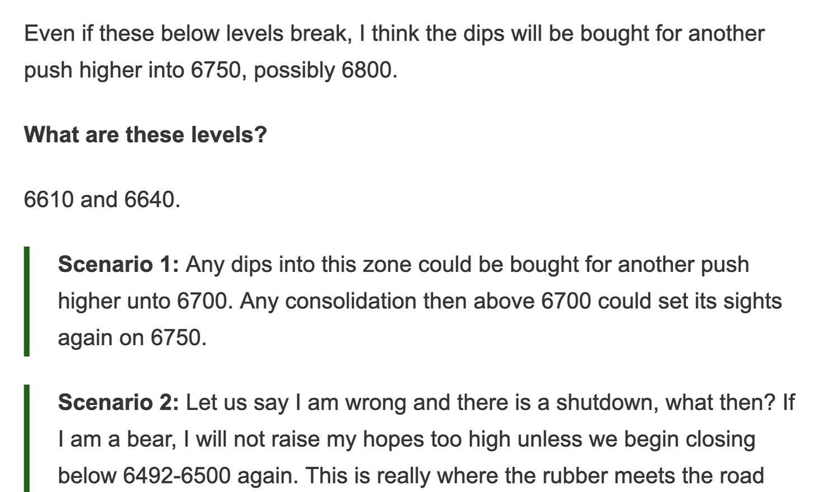
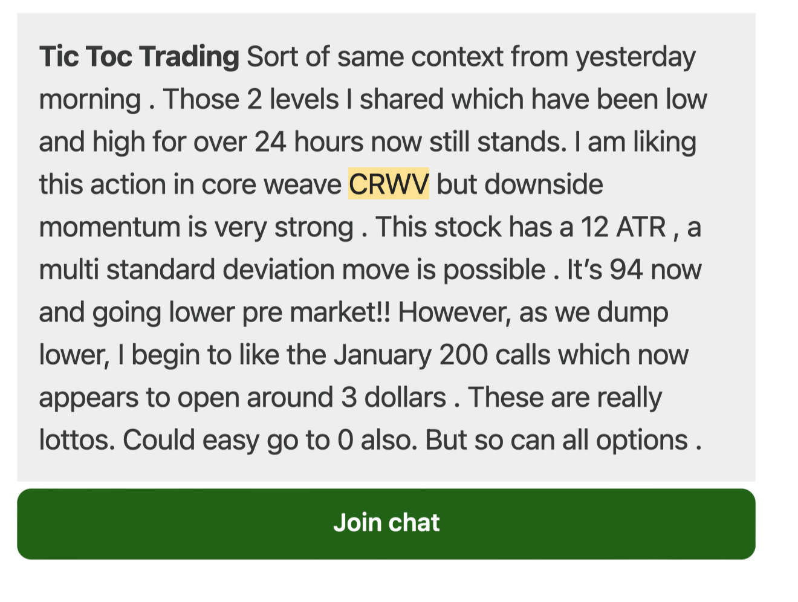
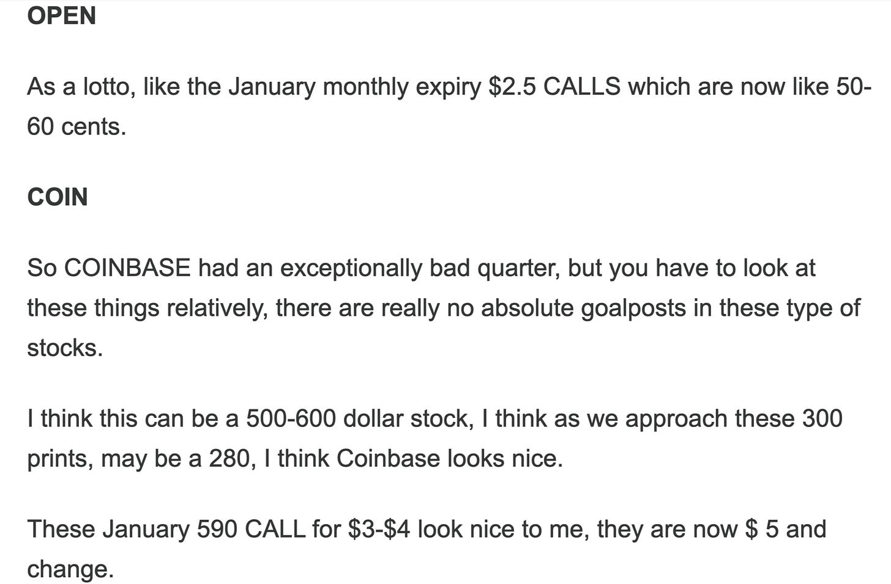

# Weekly Plan 10.5.25

**
*Tic Toc Trading — Oct 05, 2025*

Let us take an inventory of our trading plan from last week and then use that as a continuous auction framework to derive some levels for the week ahead. 

Our primary expectation was to see us see supported at 6660 on the week and to push higher unto 6800s. Please see below. 

With the week ahead, the government being shut down, and Chinese national bank being closed first 2 days of the week, there is not much planned risk involved for the week. 

In terms of structure, you broke out of 6750 and then found rejection at 6800. A break out above 6750, that then manages to see some daily closes below 6750 can see some volatility ahead. 

While I do not think we have seen a conclusive evidence of impending bear market yet, if you are in the camp that sell off can come, you need some help from some unknowable event risks, in absence of structural orderflow and price action bearish causes. 

I personally will like to see this market sell off a little bit here , may be into 6620 or so and then find bidders to push it back above 6750. 

This is why I will lean on 6620 as potential support on weekly time frame, if tested. 

> **Scenario 1:** 6620 if tested could be supported for a move unto 6750 on weekly time frames.

> **Scenario 2: **On the upside, unless we begin to see a daily close or two above 6800, this could remain resistance for push down into 6750, but at the same time if we are unable to break below 6750 by the time this week rolls by, I think this may be consolidating for a push higher above 6800. In other words, 6800 resistance needs to see us clear and close below 6750 here in next session or two for a meaningful retest of 6620 from scenario 1 above.

These are emini levels, SPX is about 60 points lower for reference. 

**Other themes **

Folks, before we dive into some other interesting set ups, some have asked my views on Quantum. 

Let us for instance take example of Rigetti or even Ionq. 

These 2 stocks now are $40 and $75 respectively. If you are a reader of this blog for longer than a month or two, you know all about my extremely bullish views on these in recent months. 

For instance, RGTI was given first at $5 and then at $10! 

So please bear with me when I say I do not have a super strong feelings for RGTI or any of the other quantum stocks at the moment. This is a common theme— when toc stock is cheap and unloved, no one wants it. When it goes to the moon, everyone wants it. 

I operate a little differently. 

Now I do not have any decent support level on RGTI at the moment. I do think this is probably headed to $50. In absence of decent support, this is not very useful, is it? But I will say let us say RGTI dips into 35, may be a 32-33, I will think that could potentially represent some degree of support for a push higher into $50. 

Instead what I like is more value type names at the moment for the long haul. 

**This looks like a Pfizer for instance. **

With a $20 line in sand, I think Pfizer could head higher unto 40s, may be even 60s here. In short term options, these $30 MARCH options at 90 cents right now look nice to me personal. 

**ORCL **

With ORCL, this is an older orderflow stock which saw its fortunes triple  from 125 to almost 350. 

It is now aggressively selling off. It is now like 287. 

Tik TOK deal I think is not fully priced in by the markets. There is opportunity for ORCL, as well as risks— the whole thing is politically complicated at the moment. 

As more and more details become apparent in this deal, it appears to be less attractive than initially thought. Also you have the Middle East politics at play here and as the US populace becomes more vocal about foreign influence on the US politics, this could take a toll on players aligned with the other side. 

I am not saying ORACLE is one but eventually I like to see ORACLE hold 240s. Right now there is for me nothing attractive in ORCL for longer or shorter term options but if this stock were to sell down into 240s, may be even 250s, I will be interested in $300 LEAPS on it but I dont have any right now. 

**TSLA**

Similar story. If we see general market weakness take it toward gap fills near 400, I will like to see this supported for a move higher unto 500 dollar area. It is $429 at the moment. 

**TTDU**

2X  ETF. 

Very nascent market. Very new. 

These $33 December Monthly calls, if had for 2-3 dollars, I like them. They are $6 and change at the moment.  

**CRWV**

At the risk of sounding like a broken clock, a risk I am willing to take, with short term options, I use a methodology that combines orderflow, support resistance, greeks (math) and context to come up with attractive options. Often this means, there will not be any trades to share for weeks at a time. This is not necessarily me not wanting to share trades but rather the very nature of market. Y’all saw this in NVDA last few weeks. In fact at start of September I did not have anything to share in NVDA but last week only I have a NVDA option that more than doubled. 

Below are 2 more good examples. We trading at 2-3 dollars at a point and then rallied above 10. 

With a longer term mindset audience, I can afford to wait. My folks understand this and can be patient. This cannot be said about other furus whose MO is to sell super expensive 200-300 dollars subscriptions a month as they know their subscribers will not last longer than a couple of months. I want my folks to succeed long term therefore I am being upfront about nature of these markets. You have to wait for the trades to come to you. You cannot chase them with any sustainable success. 

Now with Core Weave, I think it still remains in play. I have shared this at 90 and it is now 134. I think this could remain in play but could be volatile with line in sand perhaps near 110-120. This is probably headed higher above 200 but not without volatility. 

~ tic toc 

**Disclaimer:** This newsletter is not intended to provide trading or investment advice but solely for general informational & educational purposes. It represents the personal opinions of the author, shared publicly with you as a personal blog. Engaging in futures, stocks, or bonds trading involves significant risk, and there is no guarantee of profit. In fact, there is a possibility of losing one’s entire investment. Utmost caution is advised. Your account can go to zero. The author does not guarantee any profit whatsoever, and the reader assumes the entire cost and risk of any trading or investing activities undertaken. The reader is solely responsible for making informed investment decisions. The owners/authors of this newsletter, its representatives, principals, moderators, and members are not registered as securities broker-dealers or investment advisors with the U.S. Securities and Exchange Commission, CFTC, or any other securities/regulatory authority. Consultation with a registered investment advisor, broker-dealer, and/or financial advisor is recommended. By accessing and utilizing this newsletter or any of its publications, the reader agrees to the terms set forth herein. Any screenshots used are courtesy of Ninja Trader, FinViz, Think or Swim, and/or Jigsaw, with whom the author has no affiliations. The information and quotes shared in this blog may contain inaccuracies, as markets are inherently risky and subject to unpredictable fluctuations. Additionally, the content of this blog is the intellectual property of the author, and its sharing or copying is strictly prohibited. By reading this blog, the reader accepts these terms and conditions and acknowledges that it is intended solely as a personal trading journal and nothing more.