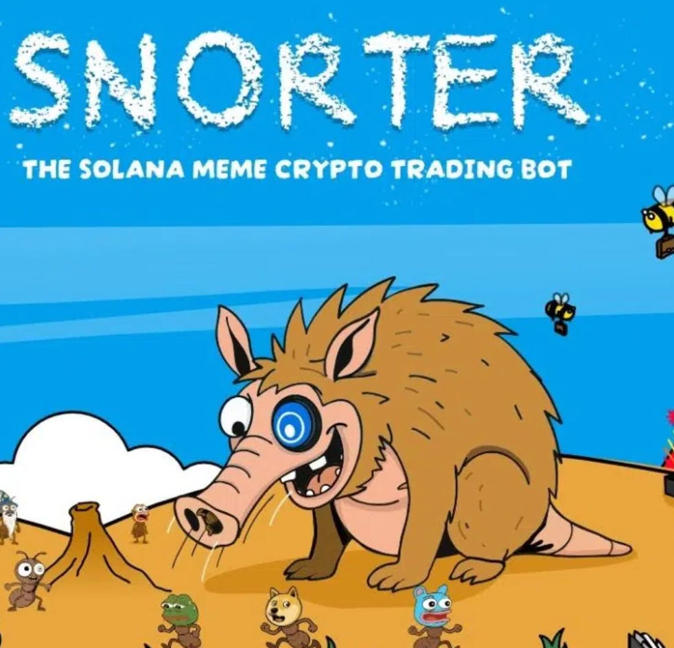

# Lows Are In. 

*Weekly Plan 10.12.25*
*Tic Toc Trading — Oct 12, 2025*

Hey traders— 

Friday was a session that will be remembered forever in infamy by many caught on wrong side of the tape, these were your folks who were using an unholy and insane amount of margin to seek outsized returns, lulled to sleep by recent calm in these markets. 

But calm can only last so long, and eventually the markets force a reckoning that volatility exists. 

These calm waters were deceptive and underneath the surface were lurking dangers of sudden reversals. 

A bare 3% sell off in major US indices on Friday wiped out tens of thousands of traders, and the crypto market took the brunt of this onslaught with several traders losing nearly all of their multi-million dollar portfolios. 

There were confirmed reports of some crypto traders going as far as taking their own lives, a loss unfortunately irreversible. 

**Now, not everyone was lost though.** Those who had correctly read the conditions at 6800 and were wary of taking on risk at 6800 were spared. Those who shorted this market at 6800 made a buck but perhaps no one did better than some crypto insiders who as a matter of fact opened brand new accounts only minutes before the 100% China tariff announcement made an absolute killing raking in tens of millions of dollars. Perhaps billions. 

This is the Wild West I often talk about in my posts here and elsewhere— there is an exclusive club of insiders who are privy to knowledge most retail traders can only dream of. These club promoters publicly talk about buying stocks, buying crypto at  these sort of local or long term tops, but in background, amongst themselves they have a coterie, a secret cabal and when they are selling easy money dreams to unsuspecting retails, they themselves are building massive short positions often sneakily and often minutes to hours before major policy flip flops and announcements. 

**This is the nature of these markets in 2025.** And they eerily remind me of early 20th, late 19th century conditions in the US stock markets where the public was often wiped out and insiders made a killing in stocks operating on insider information. 

The public almost always as a rule rather than an exception likes to chase. They feel most safety when prices are high, ironically when prices are that high is when most are at most risk. 

Now Friday is past us. Instead of dwelling on past, let us explore, using key support and resistance levels and orderflow to determine if these levels now between 6500 and 6600 can be a good buy point. 

One line of thought now is that Trump will soon reverse his stance and these new tariff proclamations will come to a naught. This is the now infamous TACO trade where Trump reverses a key position only for the stocks to rally sharply higher. Let us dive deeper to see if this viewpoint holds merit and determine some support levels from a risk to reward perspective. 

Before we get to that, did Trump really cause this sell off? 

**No. **

The conditions were already ripe for this sell off and he just helped precipitate it. The markets were overbought and they released some steam. If anything, this sell off helps uncover an often rarely talked about factor- **margin trading**. 

Amongst key factors that caused this sell off was leverage. I understand leverage very well, perhaps better than many. Leverage can be very good under the right set of conditions, and, fatal when chasing a wrong spot. 

What is leverage anyways? 

Many of these traders had “full ported” at 125K often at 10X leverage. Even a 10% move was enough to liquidate their accounts. 

10X leverage can be okay I guess when a very liquid asset is down 50-60% and begins to attract serious value type investors , but at all time highs, even a small move to the downside can wipe these traders out and this is exactly what has happened on Friday. 

When you ask me my view on leverage, I think holding anything long term on margins is a sucker’s play. Sooner or later the trader will get liquidated and hence bagged, never to return to the markets again. In long term, I like my sleep very much and as a rule, I do not use leverage. 

If I want to use leverage, intraday emini S&P500 provides enough opportunities with a market that is one of the most liquid. Short term options, priced fairly  are also great options (no pun) for taking on leverage. But I cannot imagine having a 4, 5, a 10X leverage and hold it over a period of months to years. These type of unknowable risk events, like the one on Friday can wipe out a trader within hours. How much leverage do you think a Peter Lynch or a Warren Buffett or a Munger was sitting on during financial meltdowns? 

0. Yes, Zero. 

I think all three of them did quite well in their careers. 

Then the other contributing factor which caused the liquidation event at the first place was Trump post from Friday itself. 

The US was already tightening the export controls against China in recent weeks. Pressure tactics are being applied using commerce and other means against China and its other allies like Russia and even India to some extent for few weeks now. Now from a Chinese perspective, this violates the spirit of Madrid deal back in June. 

Remember the Chinese are not reactive as far as setting Econ policy goes. They are taking careful measured steps, with little to no flip flopping and usually plan these things out very thoroughly, in many cases years in advance. So I highly doubt they will roll back their counter measures and export controls, unless they obtain substantial concessions. This is why this is a little complicated. While in April, the tariffs were almost unilateral, something that Trump imposed and he could withdraw at will, sort of a one man economic think tank, this time around, you also have retaliation from China. On top of that Trump just had a rough week with many of his inner circle believing that he deserved that Nobel. So whether intentional or not, you have this situation now where I don’t know how you rollback this new 100% tariff ultimatum without giving substantial concessions. In other words, this adds another layer or two of complexity. 

If you have been involved with this publication as a reader for a while, you know I do not like to share too many subjective feelings here— what I instead like to share is my views backed by orderflow. 

Sometimes this means extended periods where we will not have a whole lot going. 

I like to say, I have been very upfront about this— that whatever value I share here, 80% of that value will come within 20% of times. Pick any month. Any year. 

This is a very important concept to wrap your head around— because sometimes we get lost in a thought process that since I am a monthly subscriber or whatever, there will be something good going on every day just because I have subscribed. 

This is not a correct line of thought in context of market action, and this is why I have asked in past, be ready to commit to atleast 2 years to see this play out over time. 

Now in last 2+ months, I have been repeating myself there is nothing really remarkable about this market that attracts my attention. This has manifested itself as early as last week with me not sharing a whole lot of tickers and setups. 

**In hindsight, results are for all to see**— the largest sell off in stocks, going back to Liberation day sell off.  A 20000 dollar day in Bitcoin. The largest ever value destroyed in crypto — EVER. There is no precedence for this. 

So, did Trump cause it? No. 

Could I or YOU have predicted this? No. 

Could we have prepared for this? Yes. 

And prepare we did— I was just not feeling this market for a while now and I did not have whole lot going in last several weeks.

**Is this some sort of new bear market? **

Well, structurally it is not. One day of sell off cannot define a long term bear market but we will see how days and weeks ahead shape up. 

**Now as far as buying this dip goes**,  I can already tell you that those folks who have been new to these markets will already be out in full force over the weekend saying this is a good dip to buy and so on. From my perspective, you have seen a lot of carnage just today and we may need to consider a few things before I feel a green light for swing timeframe long setups. 

The main challenge here to overcome will be 6630 on the week. If we can get past this, we have perhaps seen worst of sell off. 

1. So first off, this whole range between 6500 and 6800 is sort of iffy. So what I mean by that is if I did not have confidence in this market at 6800, I did not have confidence in this market at a 6600 either. So to say this is some sort of great dip at 6600 for me, is not the case. Now another 300 dollars shaved off this market from Friday close? We could be approaching decent areas of support.
2. Now a lot of folks burnt by Friday liquidation are calling Trump Taco, they are saying he has already caved in. I mean with Trump, you have to understand, his inner circle will be the first to find out his next moves. Then he will publicly declare his intent for his non inner circle followers. Now if you look at the magnitude of carnage on Friday, it suffices to say his premium and closest followers could have been loaded with shorts. This was quite a sell off. Now if I am loaded with shorts, may be a 300 point sell off is not quite enough to wet my beaks. But if this was a 10% sell off, that ought to sweeten the deal. A 15% sell off is even more attractive?
3. Bottomline is that a Trump confirmation here urging his folks to buy again could be the signal we all need to see a decent low. This personally for me could be 6200. Remember, the challenge for any dip buyers here will be this 6620 area.
4. If you now take out 6620 on upside, stay above it, I will say may be the low is in. However, as long as 6620 stays as resistance, this could add pressure in coming days.
5. To summarize: I will wait for some sort of acceptance here above 6630, if I were to want a larger swing of more than a 100 or so points. In past Trump has been helpful in letting us know that this is a good low, may be he will be nice this time around too and let us know. Interim, if we get to a 6200 and there is no help from Trump to decide if this is a good dip, I may dip my toes and then add more at 5900.

**Emini S&P500 levels for next week **

When it comes to the weekly time frames, both **6630** and **6450** will be my levels for the week folks. 

The market has closed at **6550** for the week. 

> **Scenario 1:** With **6550** as potential support, if this holds, we may retest 6630 in the week.

> **Scenario 2: **On the upside, you have 6630 which now needs to be overcome by the bulls if we are to retrace into 6700. This may now be resistance atleast in day time frame. What you want to see is if we find sellers at 6630, how much do we sell off? Do we hold these Friday lows? If so, that is a positive signal.

Longer term, let Trump post “Buy the dip”. This is just the reality of trading these markets in 2025. Either that, or if this market continues to hold Friday lows at 6550, I think these are plus signals for bulls. If you are in the bearish camp here, in my view you want to see this market break 6550. And stay below it.  

Under 6550, I think 6450 or so is a decent support level for a move back into 6630 or so. 

**Other ideas **

Let us look at some other potential ideas as a shopping list if favorable levels were to trade. 

**ETH**

If you are a regular reader of the blog, you know I was bullish on Etherum at 2000 and then again at 3200 for a push into 5000. 

While it did not trade 5000, it missed it by a few dollars, I do think we probably have seen low in ETH near 3400 in this swing time frame. At any rate, I think if it retests the lows, if these lows are held, 3300 or so remains a key Line in Sand, we could go retest 4800 on ETH. 

Now in my view, this rosy view does not translate to alt coins. I think crypto is due for serious consolidation. At end of the day, we should see serious consolidation around handful of names like BTC and ETH. If I hold things known as Snort coins, frog coins, etc, I would be cognizant of recent market events where there was no liquidity to be found at any levels. This is historically a harbinger of end of these markets, not some one off event. 

*Snort Coin as Store of Value?*

**EWJ**

On more longer term, multi year theme side, back in April I shared this ETF when it was closer to 60. 

Since then this has rallied higher unto 80s and sold off on Friday. 

I continue to like this on sell offs, this has a 1 Price to revenue, when you compare this with S&P500, our US ETFs have almost 4 price to sales. This is relatively much cheaper. Concentration is much smaller, with largest stocks in the ETF at about 4% of the ETF. 

Back many months ago, at 2000 Gold I shared my opinion how gold can be an insurance, and how I would hold may be 10% of my long term accounts in Gold. This is kind of similar where I won’t go all in but these Japanese and European ETF are cheaper and I will probably hold 4-5% of my long term accounts in these on the long side. 

Another unlikely name in this space could be  . 

This is an ETF that has been red in a year where everything has mooned. While a red flag, if I am taking a longer term view of 10+ years, I think this could be a solid 10-15% annual ROI with lower VAR. One thing that works for this as a whole is that the IT component, which is most at risk from anti globalist forces at play here has been shrunk down less than 3% in the ETF. Remember this a country that has relied historically on cash and gold hoardings as wealth preservation— as Gold becomes more and more expensive, this will push lower income households into owning stocks and could present sizable tailwinds for the ETF. 

One of the goals here is to share themes which are not too correlated with each other. This is why you will see me invest and talk about Gold, international, high yield, on top of your every day retail plays like TSLA and NVDA and OKLO. I just do not like being all in very correlated names. Atleast not in long term accounts which tend to be much more passive. 

** Other longer term **

Other similar long term themes will be in names like UNH and ULTA. 

If you are a regular reader, you will recall these were shared by me way back when they were at 237 and 300 respectively. Now they are pushing past 350 and 540 respectively. 

Perhaps there is some vol going ahead, another 5-10% but I think they should be relatively inured from global trade wars and could continue to benefit, another thing going for them being cheaper valuations.

**Earnings **

***NFLX***

Netflix kicks off the earnings season soon. This stock has been under some pressure of late, but I think a split here can be great for the stock. 

I think the stock is looking good for a push above 1500 but I would think 1100 or so remains a key level and potential line in sand. I think if there are any dips unto 1100-1130 levels, this could remain supported. It is 1200 or so at the moment. 

**Other themes **

***NOK***

This is an older orderflow stock first shared by me back when it was like 3 bucks. Now it is pushing into 5 dollars. With all the geopolitics related drama, I like LEAPS on this which even a year or two out now are 50-60 cents. I think this could remain supported on dips and I think if and when it clears 10 dollars, it could find new support from instructional types and can head higher above 10 into 15 dollar range.

~ tic 

**Disclaimer:** This newsletter is not intended to provide trading or investment advice but solely for general informational & educational purposes. It represents the personal opinions of the author, shared publicly with you as a personal blog. Engaging in futures, stocks, or bonds trading involves significant risk, and there is no guarantee of profit. In fact, there is a possibility of losing one’s entire investment. Utmost caution is advised. Your account can go to zero. The author does not guarantee any profit whatsoever, and the reader assumes the entire cost and risk of any trading or investing activities undertaken. The reader is solely responsible for making informed investment decisions. The owners/authors of this newsletter, its representatives, principals, moderators, and members are not registered as securities broker-dealers or investment advisors with the U.S. Securities and Exchange Commission, CFTC, or any other securities/regulatory authority. Consultation with a registered investment advisor, broker-dealer, and/or financial advisor is recommended. By accessing and utilizing this newsletter or any of its publications, the reader agrees to the terms set forth herein. Any screenshots used are courtesy of Ninja Trader, FinViz, Think or Swim, and/or Jigsaw, with whom the author has no affiliations. The information and quotes shared in this blog may contain inaccuracies, as markets are inherently risky and subject to unpredictable fluctuations. Additionally, the content of this blog is the intellectual property of the author, and its sharing or copying is strictly prohibited. By reading this blog, the reader accepts these terms and conditions and acknowledges that it is intended solely as a personal trading journal and nothing more.