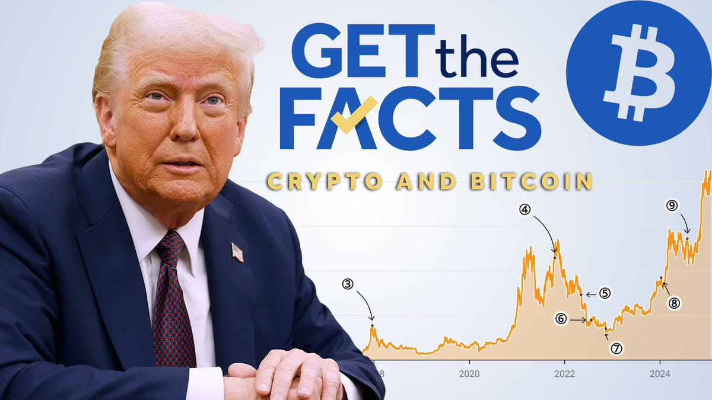

# Sell the Rallies. Buy Dips. 

*Weekly Plan 10.19.25*
*Tic Toc Trading — Oct 19, 2025*

Friends— 

What is a Profit Mindset? Is there a mindset which aligns you more to being a profitable trader than a non profitable one?

Yes, just like in any other arenas of life, you have positive and negative mindsets, fixed and growth mindsets, even in the markets you can have a profit and non profit mindset. 

To exactly define what it is can be challenging, just like you can’t quite describe the salient features of a growth versus fixed mindset but its manifestations can be observed in a person, same way you will know if you have developed a profit mindset or not yet. The bad news is very few have it. The good news is with practice it can be developed. It is like a muscle. Lose it if you dont use it. 

A profit mindset can be described as a state of mind which is carefree, yet not cocky, observant rather than in constant FOMO or fear, reactive rather than predictive, patient rather than rushed. 

If you have the Profit mindset oftentimes you can uncover opportunities which others may miss. At a basic level in markets, this means finding and buying stocks when they are cheap. Now cheap does not necessarily mean always low priced. We have many stocks which appear cheap at the moment but continue to sell off. On the other hand, you have many stocks which appear very expensive in price but continue to rally. 

This goes back to my post many weeks ago when I said if you find a good stock at good prices it does not mean it will come without volatility. If you recall many of the stocks that I shared here as bullish plays back when they were 80-90% cheaper than current prices, experienced extreme volatility of 30-50%. 

You have dozens of examples this year, including names like RGTI, IONQ, OKLO, SOFI, CELH, TSLA for instance, Intel, AMD— all of these were shared anywhere from 50 to 90% below current prices before they doubled, tripled, in some cases like RGTI and OKLO they are up more than 8-10 folds! 

So in addition to finding stocks at cheap prices, you have to be willing to take a patient stance in which cases often there will be extreme volatility before other traders realize the value that you have realized often weeks and months ahead of everyone else. 

Now, a lot of ink is spent on debating whether we are in a bear or a bull market right now. This is also a non productive and futile exercise. If you did not buy any stocks when they were 80-90% cheaper than current prices, and you bought stocks at the top, before they fell 20-40% from those recent highs, obviously your stocks are very much so in a bear market. Debating if it is in bear market, it won’t bring you closure. You know they are down 40%. 

**Current market conditions are non productive for traders like us**— as we have almost nothing of value present in the market at the moment. While the general market is barely up 14% on the year, several of our stocks, in fact most of them have seen insane rallies this year. When I say this I really mean someone who takes on a bullish position and holds it for months to year plus— those kind of setups are missing in action at the moment. 

While there are opportunities far few here there are a few set ups which could be in value range with the caveat that if the General market turns South, there could be significant volatility in these names as well. 

Generally when I am a little iffy on the general market conditions for next 6-9 months, I do not like super high priced options, even for LEAPS. In this case, take EL for example. Normally I would like 100 dollar LEAPS going out a year on EL. But since I am a little apprehensive of the general market indices, I will wait for a significant discount on this option which is now $15. I will rather have this at 4-5 bucks with more than 5-6 months left to play out, this is just an example but you get the gist. 

**EL **

As I said before I think Estee seems a decent value play here and is now trading at 100 dollars. I think this could remain supported on any dips into 80-85 area and this could eventually push higher into 200 dollar + range. Now I first spoke about this as potential bottoming play near 50 dollars and since then it has doubled. At 100, historically speaking it is not as cheap as when it was at 50. They were selling this at a 4 price to book value. Though given everything else, I think closer it gets to 80, closer it gets to meaningful value again purely from risk to reward perspective. 

**ACN**

This is another one of those well run businesses which have been marred by fears of  the onslaught of AI. The underlying business itself is still solid — we do not see any material impact of AI on the company. Still pretty robust Free cash flows but that has not stopped the market from dumping it almost and cut its value in half. 

Now if the world goes in a deeper recession, we could still see this dump lower into 150s even from current closing prices around 230. However, I believe Accenture remains supported on any dips. I think this is a 400 dollar stock, not a 150 dollar one! 

**NVO**

This is a fallen angel as well down some 60% from its recent highs. Their main money maker Ozempic fell out of favor and has some liability concerns especially within the US market. 

In Europe this drug is tightly regulated and its side effects are fairly well known. This stock just shot up as Americans discovered Ozempic. They started popping weight loss pills like there is no tomorrow, and some of them got hurt pretty bad. We are talking serious internal damage. 

Even if you discount the Ozemic business bust, I still think as it approaches 35-40 area again, it presents a compelling value to move back to 80-85 and recoup some of its losses. Again— these stocks are in pretty severe downturn and it could be weeks to months before other folks come to realize value. 

**APH**

This is a stock I first went bullish at 60 bucks or so here in the Stack and it has since doubled to over 120. 

While I think this is probably going to push higher above 150, I will like to see some consolidation  here in these type of names, may be a 100 dollars could be nice on APH. 

So a lot of these names I shared in this email today are value type names. These are kind of far removed from AI trade, with few exceptions, while I think they are in value range, do know that I fully expect 20-30% VAR adverse move if things get going south in the general market. Even then I think they present compelling value for anyone with 2-5 year time frames. Any of these names, if I am not taking a 2 year view, I think I am not going to fully reap the value from these. 

**MP**

MP is such an interesting play via a vis global trade wars and politics at the moment. This is kind of same story whether you pick up a Rio Tinto, SSCO, Hecla or MP. 

What you have with China is a dominant global player asserting itself and has come to leverage the same tools the US used over last 80 years to have hegemony over trade and commerce. 

While the US used its sheer might of military power and power of reserve currency status, Chinese are using rare earths as their tool of choice. 

This is a delicate game— you dont wanna scare away and alienate your trading partners, at the same time you want to use the edge you have to eke out favorable trade terms. 

While I think an all out trade war fears like back in April are unfounded, I think the rare earth question will loom on these markets for decades. 

China is bigger player in rare earths many times over than its next viable competitors which are Russia and India. 

Now with MP specifically, if we see cool down in trade tensions with China next week, we could see short term selling in these type of stocks. But I do think any sell off in to lows 70s, mid 60s I think can be supported. I think Western nations now will devote significant effort and time to this rare earth problem as a national security priority and could keep a bid under these mining names. I could see MP push higher above 150s but not without significant volatility and VAR. It is now 80 dollars. 

No interesting options right now but if we sell off in this on earnings on 6th, I may have some thoughts on the 70-80 dollar longer dated options. 

**Other value type plays **

**GATX **

Keep an eye out on these industrial leasing plays like GATX. They have reporting next week. 

I am thinking any dips in this could be supported. 

This is not a very liquid market, so with options it is a little iffy. But let us say these June 2026 $200 calls if had at 2-4 dollar range, I like it. The stock itself is 170 bucks at the moment. 

BA also I continue to like this stock though it has been under pressure. I gave this at 130. It almost doubled from 130. It is now under pressure at 210. 

Industrial resurgence of USA is coming back folks. This will happen, I think. 

I remain a Boeing Bull. I think 300-350 is possible. With Airbus the problem is this A380 plane, which caused them 40 billion dollars to develop which was a flop. Boeing people were shrewd enough to avoid a 4 engine plane. Those things are not coming back. 

The US airports are not equipped to handle a double decker plane. Very few airport, like IAH, JFK, ORD can. 

The US airports, also due to geography are better suited to Boeing Dreamliner 787. 737 is a huge hit which they can fly even from the American Boondocks  to large European cities non stop. 

A380 is only successful for Doha and Dubai. I favor BA over Airbus. Any dips into 180-200 in BA could be a gift, I think this is headed much higher. 

**General market **

With emini S&P500, if you recall I mentioned 6600 as potential buying zone on Wednesday I believe and while we saw some volatility below this, we carved out a low at 6641 in Friday cash session and then proceeded to rally into 6720, ending the week near 6710. 

These moves are exacerbated by Trump commentary with respect to the trade deal, but you have to figure out of the recent volatility really is due to the trade war being back in the scene again or if it is something else. 

If it is not trade war related, and if it is structural or some other reason, you do not want to see this market find any takers about **6800** on the weekly time frames. 

Furthermore, if you think this is just run of the mill sell off and nothing structural yet, you do not want to lose **6600** on the week. 

**To summarize: **if we see rallies in the week, these may get sold, unless we begin finding some closes above **6780-6800** again. 

On the downside, if we begin closing below **6600**, this can cause volatility in days and weeks ahead and therefore I think we must hold 6600. 

On the macro side, I do not think trade war is a concern. We have seen this from the President. He is using the threats as a negotiating tool and in my view these threats really have not worked thus far. The market senses this as well — this is why you are seeing these shallow dips. However, if the underlying cause of recent sell off is not trade related, this could become a structural issue as we begin closing below 6600 and this could lead to a deeper sell off into some of the levels I talked about last week, which I think should bring in solid support for a nice year end rally— if we get there. 

Some of this is due to related markets like Gold and silver. I do continue to think a Gold dip is a better entry than this breakout. Some of this rally in gold and silver was caused by shortage of US dollars, as well as Indian holiday season which should soon add some supply to this market. London bullion dealers ran out of silver and JP Morgan, latest silver dealer, cannot deliver metal to any market until November. On top of that, Dollar is looking supported here and for Gold to continue to climb, I think dollar needs to give up 95-96. Minus this, I think Dollar at 102-105 could be better spot for Gold long reentry. It is 97 at time of this post. 

~ tic 

*Source: KOAT*

**Disclaimer:** This newsletter is not intended to provide trading or investment advice but solely for general informational & educational purposes. It represents the personal opinions of the author, shared publicly with you as a personal blog. Engaging in futures, stocks, or bonds trading involves significant risk, and there is no guarantee of profit. In fact, there is a possibility of losing one’s entire investment. Utmost caution is advised. Your account can go to zero. The author does not guarantee any profit whatsoever, and the reader assumes the entire cost and risk of any trading or investing activities undertaken. The reader is solely responsible for making informed investment decisions. The owners/authors of this newsletter, its representatives, principals, moderators, and members are not registered as securities broker-dealers or investment advisors with the U.S. Securities and Exchange Commission, CFTC, or any other securities/regulatory authority. Consultation with a registered investment advisor, broker-dealer, and/or financial advisor is recommended. By accessing and utilizing this newsletter or any of its publications, the reader agrees to the terms set forth herein. Any screenshots used are courtesy of Ninja Trader, FinViz, Think or Swim, and/or Jigsaw, with whom the author has no affiliations. The information and quotes shared in this blog may contain inaccuracies, as markets are inherently risky and subject to unpredictable fluctuations. Additionally, the content of this blog is the intellectual property of the author, and its sharing or copying is strictly prohibited. By reading this blog, the reader accepts these terms and conditions and acknowledges that it is intended solely as a personal trading journal and nothing more.