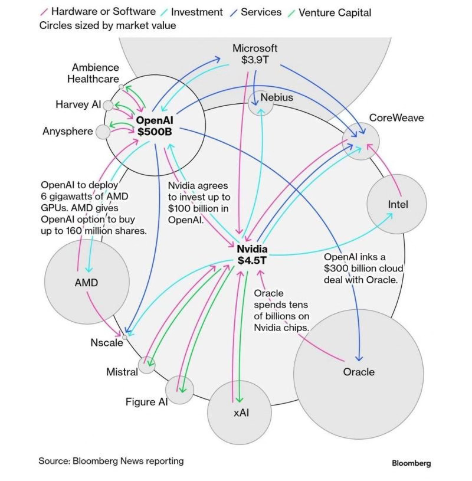

# Is AI in a Bubble?

*Weekly Plan 10.26.25*
*Tic Toc Trading — Oct 26, 2025*

Dear friends— 

Our primary expectation from last week was so see rallies being sold and dips being bought. The weekly resistance level for the week was at 6800 which during the week offered numerous shorts and at one point led us to a full 100 points sell off. 

As we unwrap a new week, we have a few key themes which are in driver’s seat at the moment. 

The first one being an all pervading sense that perhaps AI stocks are now in a massive bubble. Main argument deployed by those in the bubble camp is that of circular funding— in these type of schemes, companies in the space, fund each other to drive their own revenues. 

The critics argue if NVDA GPU sales are so strong then why are they pouring billions of dollars into AI companies like OpenAI & Data Center companies like CoreWeave in garb of “investing”. 

I think these allegations are true to some extent but if I were to take the other side of this argument, I would say NVDA has so much cash with these GPUS selling at 50-60 grand apiece, that they do not know what to do with this cash. So they want to diversify away from their core business of selling silicon and be part of the AI implementation where I think the next wave of growth could come from. 

**These are endless examples**— Microsoft investing in OpenAI, Google investing in Anthropic and Perplexity, Oracle getting in on the action of late. While I think there could be some truth to the circular funding allegations, I do not think an investor can use this thesis alone to justify these bearish positions. You need more. Something tangible. 

And even if these allegations are wholly true, you have momentum against you and these stocks could still run up 20-30% bringing atleast some short term pain to the shorts, while they wait for the so called “fraud trade” to play out. I dont subscribe to these type of thesis when deciding what to buy and sell— mostly we have been right using momentum and orderflow and I will like to keep it that way. If we see cracks form in these markets, we may miss out on top 10-20% of sell off, but I think that is worthy confirmation. 

**Then the other elephant in the room is the trade war or rather trade war rhetoric itself. **

You have various folks describing Trump actions as some sort of inherently anti trade and Trump is portrayed as some anti globalist President. As more and more data become available, and more facts about Trump are revealed, it is my assessment that he is at core a globalist and trade advocate not an anti trade President. In fact many of this admin’s extreme trade hawks have been relegated to lesser important voices within the administration and more and more voices that are pro trade have come to the forefront. I personally now believe that China trade deal will be cemented pretty soon and this should put to rest the anti trade rhetoric for once and for all at least for another year or two. 

Now this does not mean that a lot of this has not already been priced into these markets. If that is indeed the case, we need some sort of price action framework to make sense of it all. 

**Now if this was not enough**, you have almost all of the big tech mega caps reporting thru the week. So there is lot of event risk packed into the week not even counting the inflation numbers and the FOMC later in the week. 

Main challenge of trading in shorter time frames, is that we will go thru dozens and dozens of themes and ideas. And then look at each one of them thru technicals, ordeflow, even fundamentals and often end up rejecting every one of them just because they are not cheap. 

**Now this certainly does not mean things cannot change quick.** You saw this with my BYND CALL at 1.5 dollars which saw this stock almost go up 600% within a matter of days and then you saw the 10% plus sell off in Silver and gold almost the very next day after I shared a short term PUT in silver only last week— thing is we just do not know when the opportunity presents itself. Stay plugged in and read every post with an open mind. 

Now as far as the emini S&P500 goes, last Sunday, we opened quite weak. This weakness was promptly eradicated during the week and we had a rather strong close. 

We will see if we see a repeat of this here this week with Sunday opening not that far off from here. 

However, I would think this 6720 or so level from last week remains very important this week as well. We last traded 6820 at time of this post. 

I will lean on this **6720-6740** level, if traded as a potential support to move back into 6830s during the week. 

**Let us talk about some other things on my radar **

**BABA**

Alibaba could potentially benefit 2 ways in coming months ahead— trade deals and it being much cheaper compared to its American tech peers. 

Remember this has now more than doubled when I first shared here in this Substack when it was trading 70 dollars but just because it is now priced at 175 does not mean it has to turn south from here automatically. I will stay bullish on BABA for it to push higher into 250s from here. 

**PLTR**

I am interested in February 20 Monthly $240 CALL, if this call can be had for 4-5 dollars. This call is now 9 dollars. A trade deal being inked is a major win for tech bros and crypto bros within the admin and I think this should help reward tech bros like Thiel and KARP and I would in this instance see this stock rally higher above 200 if we hold 160, it being about 180 now. 

**North Face **

If these trade deals are signed, it makes it a lot easier for these apparel makers. I mean pick any… Ralph Lauren, Levi’s, North Face, Secrets of Victoria… 

 if you are a regular reader of Substack,  you will recall I shared this as low is in at $11 or so. This stock now is $16. 

I think a major risk for these type of stocks is recession. But if there is none, these may still be cheap. 

One way to look at VFC is thru LEAPS. 

If you look at far out LEAPS, even in 2027, for instance, these 25 Dollar, January 2027 LEAPS at 1 or even 1.5  dollars appear interesting from risk to reward. I think this call closed near 2 bucks on Friday. 

**WAYSTAR **

As a momentum play, keep an eye out on this WAY Stock which is now trading like 38 bucks. 

Perhaps I will have my line in sand on this near 32. If 32 is held, I think dips can be supported and I see this stock as a 60 dollar stock if not 70. 

** NTLA**

I right now like these CRISPR type smaller bio tech firms too but know that these things can be insanely volatile. 

This is a 25 dollar stock right now, at times I like to park some ideas as TBD so I do not lose sight of them later, this is my personal journal as well, so keeping an eye out on these January or February MOPEX CALLS of 25 STRIKE if had for like 2 dollars. May be even a 3. These are like 5 bucks at the moment. 

This is it for now folks. Remember it will be a consequential week ahead. If there is one key takeaway from me— do not chase. Let it come to you. This is true for everything else and it is perhaps the truest in markets. Let it come to your levels and then take a calculate risk. 

~ tic toc 

Start writing today. Use the button below to create a Substack of your own

**Disclaimer:** This newsletter is not intended to provide trading or investment advice but solely for general informational & educational purposes. It represents the personal opinions of the author, shared publicly with you as a personal blog. Engaging in futures, stocks, or bonds trading involves significant risk, and there is no guarantee of profit. In fact, there is a possibility of losing one’s entire investment. Utmost caution is advised. Your account can go to zero. The author does not guarantee any profit whatsoever, and the reader assumes the entire cost and risk of any trading or investing activities undertaken. The reader is solely responsible for making informed investment decisions. The owners/authors of this newsletter, its representatives, principals, moderators, and members are not registered as securities broker-dealers or investment advisors with the U.S. Securities and Exchange Commission, CFTC, or any other securities/regulatory authority. Consultation with a registered investment advisor, broker-dealer, and/or financial advisor is recommended. By accessing and utilizing this newsletter or any of its publications, the reader agrees to the terms set forth herein. Any screenshots used are courtesy of Ninja Trader, FinViz, Think or Swim, and/or Jigsaw, with whom the author has no affiliations. The information and quotes shared in this blog may contain inaccuracies, as markets are inherently risky and subject to unpredictable fluctuations. Additionally, the content of this blog is the intellectual property of the author, and its sharing or copying is strictly prohibited. By reading this blog, the reader accepts these terms and conditions and acknowledges that it is intended solely as a personal trading journal and nothing more.