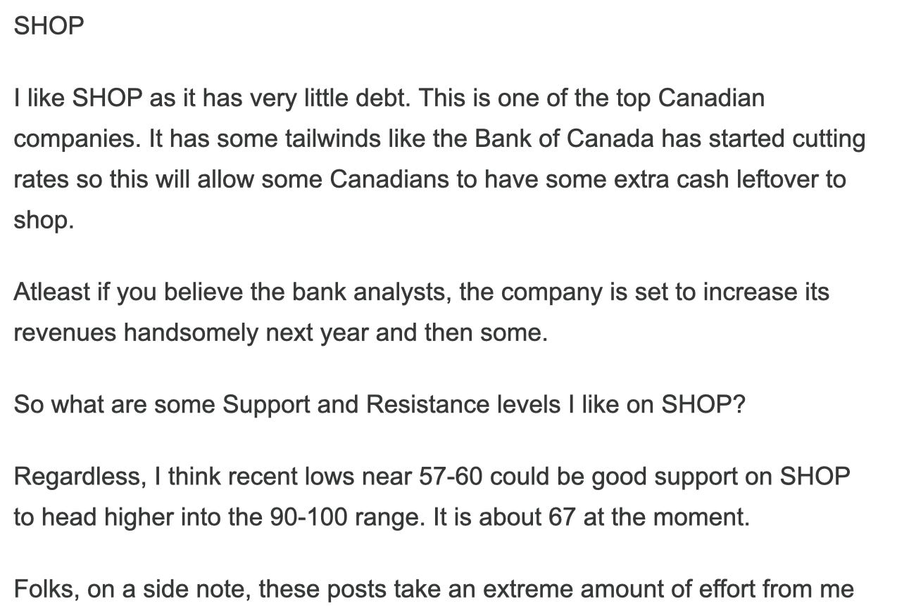

# Daily Plan 10.30.25

**
*Tic Toc Trading — Oct 30, 2025*

Hey folks - 

So yet again, we saw our support level see almost the exact low in the session today. Very nice level. 

A lot of uncertainty in short term was taken off the table today. If you are expecting this level to break you have to ask where is uncertainty going to come from? Where is catalyst? 

We can again lean on this level from today at 6890. 

I think if we hold 6890 and cannot find offers below this, we are headed to $7000 on emini S&P500. 

SHOPIFY 

I became bull on SHOP at 50 bucks, it has now traded into 178. 

Earnings are next week. 

What you have right now is everyone piling into NVDA at whatever price they can get. 

If you want a good sell off you want NVDA softness. If this is up another 2-3% tomorrow, it takes emini with it. 

This is why I favor a confirmation below of some sorts near 6890. Else we can remain supported due to momentum in NVDA alone. 

~ tic 

**Disclaimer:** This newsletter is not intended to provide trading or investment advice but solely for general informational & educational purposes. It represents the personal opinions of the author, shared publicly with you as a personal blog. Engaging in futures, stocks, or bonds trading involves significant risk, and there is no guarantee of profit. In fact, there is a possibility of losing one’s entire investment. Utmost caution is advised. Your account can go to zero. The author does not guarantee any profit whatsoever, and the reader assumes the entire cost and risk of any trading or investing activities undertaken. The reader is solely responsible for making informed investment decisions. The owners/authors of this newsletter, its representatives, principals, moderators, and members are not registered as securities broker-dealers or investment advisors with the U.S. Securities and Exchange Commission, CFTC, or any other securities/regulatory authority. Consultation with a registered investment advisor, broker-dealer, and/or financial advisor is recommended. By accessing and utilizing this newsletter or any of its publications, the reader agrees to the terms set forth herein. Any screenshots used are courtesy of Ninja Trader, FinViz, Think or Swim, and/or Jigsaw, with whom the author has no affiliations. The information and quotes shared in this blog may contain inaccuracies, as markets are inherently risky and subject to unpredictable fluctuations. Additionally, the content of this blog is the intellectual property of the author, and its sharing or copying is strictly prohibited. By reading this blog, the reader accepts these terms and conditions and acknowledges that it is intended solely as a personal trading journal and nothing more.