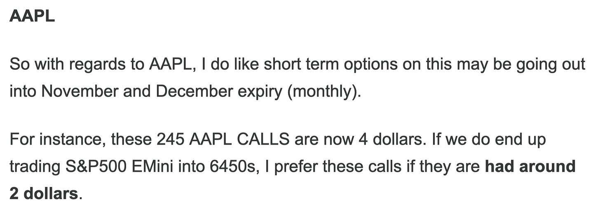
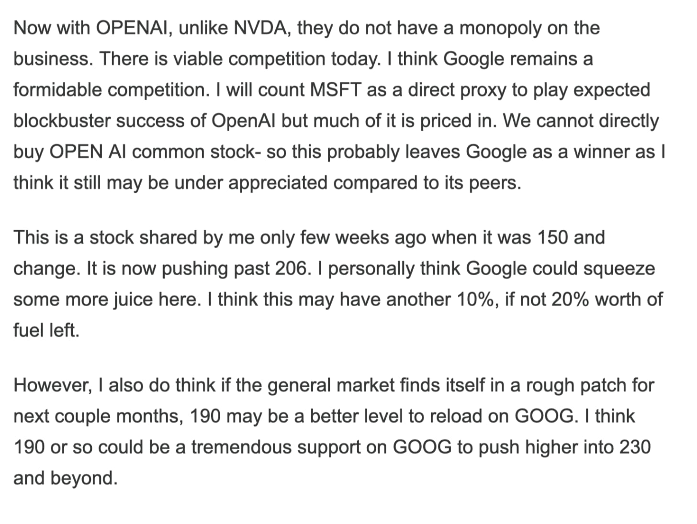
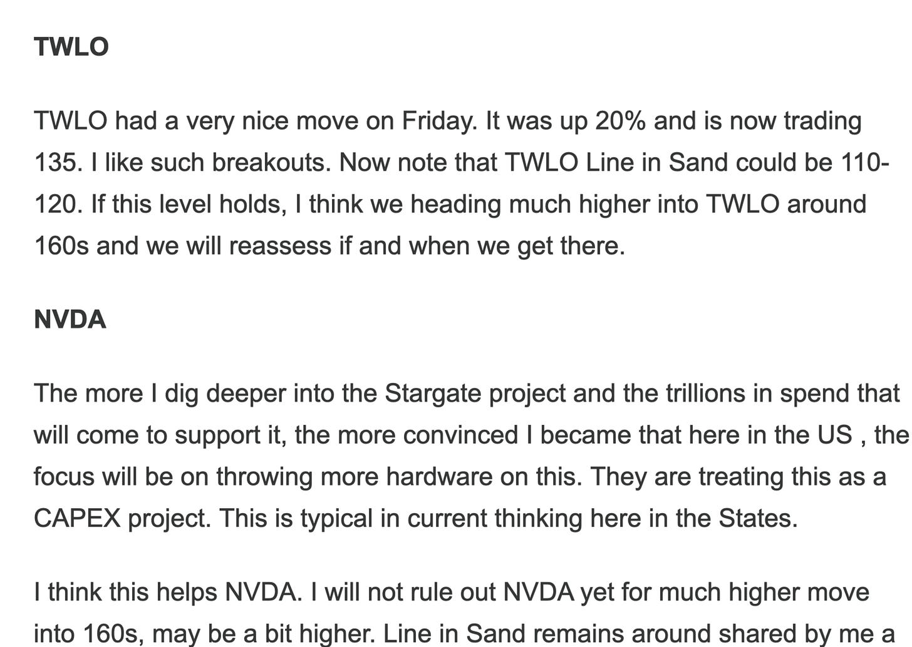
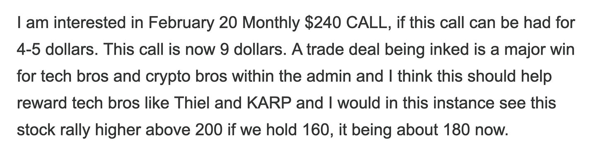
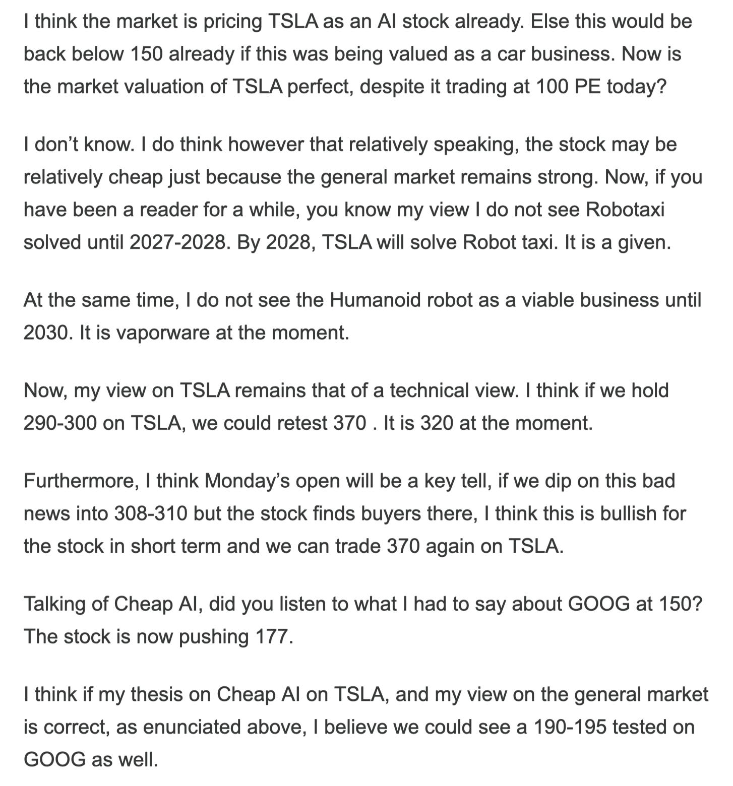

# Weekly Plan 11.2.25

**
*Tic Toc Trading — Nov 02, 2025*

Hey traders— 

The primary expectation last week was to see any dips into 6720 being bought back up into 6830 range. 

This never happened as we had a nice gap up on Sunday night and we did all of weekly business above this range. We traded almost into 6969 on the week and then remained subdued for most of the week with finding sellers at the weekly highs and then finding bidders near 6850 zone. 

The key takeaway from this week was the FED Chairman Powell’s commentary, which poured cold water on almost certain December rate cuts. This rate cut was baked in but then Powell came out fairly strong and said that the “FED rate cut in not set in stone” and that there may not be a rate cut after all. 

I do not buy this. 

FED actions certainly do not match FED verbiage. FED has decided to pause on the Quantitative Tightening with these markets still at all time highs and unemployment still very low. They have an almost $7 trillion balance sheet, and they have hit the brakes on any more winding down.  This is definitely a very dovish FED even when you consider the natural rate of inflation at the moment is hovering around 3% annualized, and the short term FED rates now are also a few basis points higher above the current annualized inflation rate. This means if you have cash, you are actually making nothing or close to negative 1% on your cash hoardings. 

On top of that you have all sort of conflicting signals, with longer dated bonds dipping, and Dollar rallying. If you look at these two markets alone, it does appears the FED will have a hard time messaging the longer dated bonds. Technically these auctions look weak and this could mean the FED losing control and having to deal with higher rates with higher inflation for longer. Right now though no one appears to care. This has led equities to remain supported. For now. However dollar back above 102-103 and TLT back below 87-88 is one scenario I do not see an upside for the stocks. 

Then the other key event for the week itself was some fairly good earnings from AAPL, GOOG and AMZN. If you are a long term reader, I have had a bullish bias on all of these with AAPL long term calls shared by me a few months ago doing extremely well. See below. 

Outside of these AAPL calls, I have been calling for AAPL new all time highs even a few months before that when this stock was languishing at 190-200 zone. 

So with these markets, what you have is that there are insider info “haves” and the “have nots”. You have folks who know what the President is thinking, they are in his inner circle and they have information ahead of folks like you, and I. This gives them a tremendous edge. 

This is the reality of trading these markets in 2025. Do not take this as a political statement, this was always the case, but this was perhaps never this pronounced. 

Now, generally speaking, this does not impact you if you take a long term view. Long term views will play out, as they should based on fundamental strengths or weaknesses of business, but this is quite impactful for anyone taking a short term view on these markets. 

One way to protect yourself is that you take a long term view on these markets. You are insured against presidential tweets from day to day, if you have a 1-2 year time horizon. 

Another way is you just take a very short term view from seconds to minutes. Generally, the shorter your time frame, the higher your win rate will be but at the same time your targets and your stop losses will have to be extremely tight. To be more accurate, your win size and average loser size will almost be identical, in some cases your average win size may even be smaller than your average loser, if your win rate is like 80%. 

The longer your time frame, the lesser your win rate will be but you compensate that with having a very large win size, relative to your average loser. In this case, you would still win big even with a 50% win rate, or even lower, if the size of your winners is 2-3, 5-10 times your average loser. 

In my view, if trading in intraday time frames, former approach is better. The latter approach is far better for anyone taking longer term trades out side of day to day time frames. There is no right and wrong solution in this, it comes down to your goals and objectives and most importantly your nature as a trader! Personally, I am not going to sit thru a large drawdowns in intraday trading. It will have to be very precise and surgical. 

In long term time frames, I have shared my view that on some of these strong growth stocks, a 30%, even a 50% drawdown is possible and often happens before the stock makes a 500%, a 1000% move to the upside ! 

**This is the age of distraction **

As a shorter time frame trader, focus is your edge. Very few now have ability to focus for any length of time, and if you have it, you are leaps ahead of everyone else. 

Look, regardless of what methodology  you use to make sense of these markets, if you lack focus it will not work. Any methodology, whether it is the charts, the indicators, the fundamentals, the moon phases, or even a study of offers and bids like orderflow is, is primarily a construct we all create to make sense of thee markets because naked pure price action is never enough, right ;) 

What you really need is focus. And by that I mean thru the session, we have 5-6 active hours every day, there will be set ups which will be too good to not make money from. But to find those, and make money from those, you need to be present.  

In other words, I am saying do not trade what you do not understand. During those 6 hours in the cash sessions, there will be few times every week when you “understand” perfectly what is going on. It is during these moments that your risk is most defined, and hence the lowest. A Presidential tweet does not impact you, if you have focussed and found out when these “perfect setups” come into being. This is just one of those things which I cannot describe in words, either you understand this or you do not, but it is a given for any one who has been in these markets 2-3 years or more probably understands what I am trying to say here with some degree! 

Hope it was understood what I meant by these few preceding lines. 

**Levels for the week **

So for the week, even though the auctions appeared weak, you have this whole gap up zone right beneath us at **6821** or so. 

Friday close was around 6870 for the emini December contract. 

If you are too bearish here, you need to see us fill this gap and then remain below it. Else I think we are headed higher into 6969, perhaps 7000 again. 

Now in related markets, you have this weird strength in Dollar which BTW I called here a few days ago. This at some point could become a problem if this persists, especially above 102-104. 

As a minor level, we can also leverage **6917** level in intraday time frames. I think this is an intermediately interesting level. Probably short term resistance intraday as long as it holds, but if we were to close above it, this could become supported for a move right back into **6969**. 

**To summarize:** If you are in the bearish camp, you need this 6821 level broken and stay down to target 6750 which could be a nice support for push higher into 6969. 

During the week, 6917 could also remain a key level. The bulls need to break it and close above it on daily time frames to build momentum targeting 7000. 

**Short term **

These short term Boeing  $225 CALLS for December MOPEX look nice here at 2-2.5 range. 

** PLTR**

So these PLTR CALLS are now up big and earnings are this week. The stock is now already trading 200 dollars. 

I think any earnings related dip in stock into 185-190 could be supported and we could push higher into 220s on PLTR. 

**TSLA**

I shared TSLA at cheap AI play back when it was 300s. It is now 450. 

I think TSLA action continues to look robust and I see this trade into 500 at some point. If we begin to find daily closes above 500, I think this is probably a 600 dollar stock not a 420-450 dollar one. 

**Disclaimer:** This newsletter is not intended to provide trading or investment advice but solely for general informational & educational purposes. It represents the personal opinions of the author, shared publicly with you as a personal blog. Engaging in futures, stocks, or bonds trading involves significant risk, and there is no guarantee of profit. In fact, there is a possibility of losing one’s entire investment. Utmost caution is advised. Your account can go to zero. The author does not guarantee any profit whatsoever, and the reader assumes the entire cost and risk of any trading or investing activities undertaken. The reader is solely responsible for making informed investment decisions. The owners/authors of this newsletter, its representatives, principals, moderators, and members are not registered as securities broker-dealers or investment advisors with the U.S. Securities and Exchange Commission, CFTC, or any other securities/regulatory authority. Consultation with a registered investment advisor, broker-dealer, and/or financial advisor is recommended. By accessing and utilizing this newsletter or any of its publications, the reader agrees to the terms set forth herein. Any screenshots used are courtesy of Ninja Trader, FinViz, Think or Swim, and/or Jigsaw, with whom the author has no affiliations. The information and quotes shared in this blog may contain inaccuracies, as markets are inherently risky and subject to unpredictable fluctuations. Additionally, the content of this blog is the intellectual property of the author, and its sharing or copying is strictly prohibited. By reading this blog, the reader accepts these terms and conditions and acknowledges that it is intended solely as a personal trading journal and nothing more.