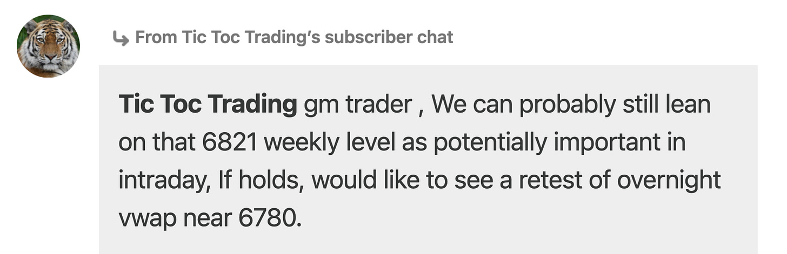

# Nearing Lows.

*Daily Plan 11.7.25*
*Tic Toc Trading — Nov 07, 2025*

Hey folks— 

So from our chat update yesterday, we saw a nice sell off into 6750s today. 

If we see another day or so of balancing here, per my weekly post, I think we have seen the swing time frame lows here. 

For the session tomorrow, if we can hold 6703 or so, I think we can retrace back to 6821 in next couple of sessions. 6821 remains important resistance in my view, unless we begin to see a couple of daily closes above it. 

We last traded 6742 at time of this post. These are emini S&P500 levels. 

To recap— I think **6703**, if holds could be an important support for a move back into **6821**. **If **we see a Daily close or two now above 6820, this is a good sign for the bulls and could mean we have seen swing lows here near 6700. 

I will cover this in more detail, but as many of you have been aware, I have been not too keen on a lot of stocks at these levels, in last several weeks now, and results are clear in hindsight why I was not feeling it. Despite stellar earnings, we have seen these stocks not able to make much dent indicating orderflow weakness in these names. 

Hopefully a lot of setups should now clear up between now and year end which I will be sharing in my weekly post. Stay tuned! 

~ tic 

**Disclaimer:** This newsletter is not intended to provide trading or investment advice but solely for general informational & educational purposes. It represents the personal opinions of the author, shared publicly with you as a personal blog. Engaging in futures, stocks, or bonds trading involves significant risk, and there is no guarantee of profit. In fact, there is a possibility of losing one’s entire investment. Utmost caution is advised. Your account can go to zero. The author does not guarantee any profit whatsoever, and the reader assumes the entire cost and risk of any trading or investing activities undertaken. The reader is solely responsible for making informed investment decisions. The owners/authors of this newsletter, its representatives, principals, moderators, and members are not registered as securities broker-dealers or investment advisors with the U.S. Securities and Exchange Commission, CFTC, or any other securities/regulatory authority. Consultation with a registered investment advisor, broker-dealer, and/or financial advisor is recommended. By accessing and utilizing this newsletter or any of its publications, the reader agrees to the terms set forth herein. Any screenshots used are courtesy of Ninja Trader, FinViz, Think or Swim, and/or Jigsaw, with whom the author has no affiliations. The information and quotes shared in this blog may contain inaccuracies, as markets are inherently risky and subject to unpredictable fluctuations. Additionally, the content of this blog is the intellectual property of the author, and its sharing or copying is strictly prohibited. By reading this blog, the reader accepts these terms and conditions and acknowledges that it is intended solely as a personal trading journal and nothing more.