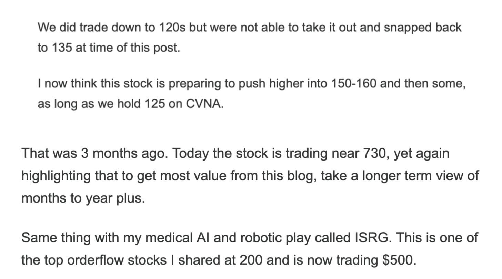

# Vibes Down. Repo Rates Up.

*Weekly Plan 11.9.25*
*Tic Toc Trading — Nov 09, 2025*

Trader friends— 

One of the questions you must continually ask yourself when you are trying to find good trade set ups is that what has changed for the underlying business in recent months to quarters?

Remember, finding stocks to buy and sell is not simply a matter of analyzing a bunch of charts and squiggly lines— at end of the day, you are buying a piece of the business when you buy shares. Some market participants believe that charts alone give you all the edge you need. This may be true in extremely short time frames but when you intend to take a position and hold it for months to years, you need something more. You need a secret sauce. 

This sauce is in understanding the underlying business. Remember, you are buying a story, a theme, you are not buying a chart. A chart alone will not make you money, it is a photograph, a snapshot of what the stock has done in the past. It is history! It has very little if any value in predicting the future. 

Do you go to the bank to get a photograph of money? 

No! You demand real cash! This same way charts can show you where a market has been, but to understand where a market is going, you need to understand its story to some extent. 

The reason I bring this up today is that I have a lot of questions from folks asking me about my views on stocks like PLTR, AMD, NVDA, AAPL, TESLA! 

Some folks have accused me of not having any strong opinion on these stocks of late in last several weeks now. 

Let me be the first one to say, **I am GUILTY as charged! **However, being hands off in last few weeks has meant we avoided some really bad trades like a plague. We were prescient in washing our hands off momentum, right before things started this giant chop fest! Now as things firm up again, we can get back in, but we will need some sort of confirmation of this first as I lay out in next few sections. 

The thing is in this forum, in particular we have a very broad audience, not just geographically but also in terms of experience level, as well as time frames. We have traders who trade 10 second charts to traders who only take one trade a year. On top of that we have traders who have been trading for over 40 years and we have traders who started trading last week. 

In such a diverse audience, sometimes it gets difficult to get my message across. The bottomline is that each one of these stocks I talked about above, I gave buy points in each one of these stocks, several weeks and in some cases, months ago. 

PLTR for instance was reiterated dozens of times at $6, $30, $100, $150! 

AMD is another classic example where I first shared this as a 2-3 year play when this stock was at $90! Today is closed at 234! 

SOFI was shared under 10 bucks and now it is trading $30! 

So if you are with me thus far, you can understand it is harder and harder for me to have the same conviction in these stocks at all time highs when I already had strong conviction in these when they were anywhere from 50 to 90% cheaper! 

**Momentum is such a weird thing.** 

When it is there, while it lasts, it can give us dozen upon dozens of great trades. The thing with momentum though is it cannot last forever. Like you have been seeing last few weeks — these earnings from stocks like HOOD and PLTR have been fairly robust. Yet the market simply does not like it. 

**Why is that? **

Has something changed in PLTR as a business now at 200? 

Is OKLO not the same stock now at 200 that it once was at $20? Why did tic not like OKLO at 200 the same way he loved it at 20?

Well, the **orderflow value** simply is not there. I talk about it often, value in context of orderflow is not necessarily price or even the fundamentals. Orderflow value pertains to lifecycle of a stock where you can plot out accumulation versus distribution. 

If you go back and look at all the super monster ideas from this year, you will notice one consistent theme— these were all given when these stocks were in accumulation. When no one knew or cared about these stocks. 

If you now notice the current conditions, we do not have a lot of such names. Nothing seems attractive. This is what I am saying —- most of the year we are competing with FOMO and momentum jocks. 

It is infrequently we have a tremendous number of opportunities. If you can understand this one thing, you will be heads and shoulders above rest of traders. You will be on your way to become massively profitable. Mot of the year we have nothing. And then suddenly a plethora of opportunities. 

Now all that I said is valid in a classic market like this, nearing all time highs. This is not necessarily the case if there is a 50% crash let us say tomorrow. 

In such a cataclysm, it pays to plough into very orderflow stocks like McDonalds for instance. If there is a crash tomorrow, I want to plough into Costco, the likes of AXP and Phillips Morris and Home Depot. These and other type of names I will share during the actual crash are my bread and butter for long term buy and hold, provided they are had at a favorable price. 

**I will never sell these and hold on to them forever. **

Now some may argue why not plough into Costco here at 950! It is a rock solid business, the backbone of American small businesses and retail consumers, myself included. 

The problem with this is that I understand Costco all too well. And I am simply using this as an example. This is a glorified grocery store selling now like a small tech growth company, 

A 400 billion dollar company that makes 8 billion a year. This bottom-line is not going to grow fast enough to justify the multiples. So even though the business is bullet proof, I just cannot. Not at 950! 

In my view this is probably a 450 dollar company not a 950 one, given all else being equal. Now this does not mean it can’t squeeze another 20% higher, but it won’t make anyone rich. It will not double or triple anytime soon! 

**Now on the other spectrum of this euphoric craze is total doom and gloom as exemplified by stocks like Celanese. **

This major chemical player in the US, right now selling for value less than that of water company Primo. As a matter of fact, Primo only a few weeks ago was selling for twice the valuation of Celanese. *BTW yours truly gave PRIMO at 10 before it more than tripled last year! *

Ask yourself is Celanese really worth $4 billion and change? Must the business be this bad? Can the stock be so bad that it cannot even find a single buyer, even at Covid lows which are about 20% higher than the closing price from Friday?

Everyone’s losing their minds over AI right now like it’s the second coming of sliced bread, the internet, and the iPhone all wrapped into one glowing GPT burrito.  
But let’s calm down. We’ve seen this movie before, and spoiler: the ending isn’t some utopia where robots do our laundry and write love poems.

1. Take crypto. Remember crypto? The land where every guy with a hoodie and a Discord channel became a “visionary” who was totally gonna change the world but right after they finished launching their 47th token named DogePepeMoonCoin. Even the U.S. government was like, “Wow, geniuses! Einsteins!” Meanwhile, in the real world, the biggest achievement was making cartoon ape monkeys worth more than most people’s homes.Payments using crypto are still far from reality, we still are yet to see meaningful tokenization across finance and other sectors. Now stablecoin legislation is one win I will submit to the sector. Long story short, the promoters have milked crypto to enrich themselves using public markets, not necessarily done anything of value with the technology itself that benefits the common man. If  you use this as an extension to AI space, what are the odds that most of AI is also based on hype? Have the US companies achieved meaningful advances using AI other than giving people powers to generate distracting and useless memes? I do not think so. Not yet. In recent past, major technical innovations— internet, iPhone, P2P payments, have all been used to bring value to millions and billions of folks. Crypto and AI is the first major tech which has mostly been used up to enrich a bunch of promoters using public stock markets.
2. Even if the AI is not a hype, I will still question the whole valuation aspect of it. Most of these tech CEOs themselves have been at forefront of hyping the stocks. With the exception of Cook, Nadella, and Pichai (who at least pretend to play it cool), everyone else has been out there practically waving pom-poms on earnings calls.  This has in some degree made these companies even more expensive than they ought to be. As a side effect of all the pumping, the stock valuations already are as if these companies were making tens of billions of dollars in profits from products and services.
3. Last but not the least, if hype and valuations don’t eventually kill these stocks, the social impact these companies are going to bring to the US and impending economic trends almost certainly will.

The reason I shared this tidbit is that not only these AI companies very extremely well owned, they may also be trading on the upper end of their possible valuation range. If you are a regular reader, you are no stranger to this publication sharing several dozens of ideas in last two years which have gone up anywhere to 5 to 10X. 

These are 10 bagger trades and we have had several of them, which I am not going to reiterate all of them right now. 

My point is there will be many 10 bagger trades at some point in future of this publication, but that day is probably not today and that stock is probably not going to be a NVDA or a PLTR now. 

This is why I want to share with folks on an ongoing basis stuff that actually still may be cheap and also share a shopping list in case there is a major sale event in the US stocks. Bottom-line is I am not going to share something if I do not have conviction in it. And if this means I do not share something for days and weeks, months may be, then so be it. As a publication frequented by high frequency traders looking for quick trades, this hits me, but that is ok. A lot of furus will share some options every day and some trades every hour that go to 0, do not count on me to tow that line! 

**So this brings us back to Celanese. **

Now if you believe the US auto industry and the housing sector is dead and is to stay dead for a long time, Celanese makes no sense. But if you are willing to take a 2-3 year time frame on this industry, and open to some potential heat into low 30s, I think CE makes sense here. 

It is trading around $41 at time of this post. Take a look and let me know what y’all think. 

**Other themes **

Other than names like CE, I like names which have very specific tailwinds right now. I like relatively AI inured stocks. I am not going to be chasing AI plays for foreseeable time unless I see very compelling setups. I hope that is ok. 

**JBHT**

One such name with multiple tailwinds is the freight company JBHT. 

For remainder of Trump admin years, I expect the pressure to remain on non US truck drivers. Now some supply shock created in this crackdown on foreign truck drivers is picked up by smaller cummins powered trucks but their scope is limited. When it comes to big rigs, JBHT remains the king of the roads, no pun. 

I estimate about a million driver shortage when it comes to the freight trucking over next 3 years. This is a great time for be a truck driver where you can demand much higher rates now and the companies must pass on this cost. 

Take a look at JBHT. 

It is now trading 170 but I expect any dips on this to remain supported. I see this stock push higher into 300 dollars in next couple years or so. 

**BABA **

Alibaba is one of the oldest Substack stocks which has only now started showing some serious moves. I remain a bull on BABA stock even on any dips into 130s. This stock is now 160s. 

I think this stock is headed to 300 dollar range in next couple years or so. At the moment, China has an upper hand in trade negotiations, one can make all the noise you can, but the power dynamics currently help support stocks like BABA, which I think remain cheap to start with. A dip here even of 10% only makes them cheaper. 

**MP**

Gold (GLD, NEM etc) are all great ways to play geopolitics and debasement, but also keep an eye out on MP as something in a similar boat. 

If one thinks that rare earth play is over with China deal being inked now, they are entitled to that opinion. I do not necessarily buy this. Expect long term strategic tailwinds for these rare earth plays— as the name suggests, these are not so rare, but China has an edge in fully integrated mining to manufacturing process, which the US needs to now catch up. Most of the US rare earths was outsourced to China due to cheaper prices there, and more regulations here in the US but I think this is set to change in next years to decades. 

But at the same time, I do expect significant volatility in these stocks a flavor of which we just saw last week. 30-40 are possible in my view before stabilization. 

One way to cap volatility is to look out into May June next year for 100 dollar strikes. These 20-30 delta calls at like $2 or so can be a fixed risk way to let this play out. 

**ISRG**

I know the humanoid robot is all the rage nowadays but as far as I am concerned, this robot remains a vaporware still, probably years away from any sort of monetization. 

Perhaps, it is time to pay some attention to my type of Robot? My robot is making billions in profits right now. It is available to be purchased, it works, and it costs 2 million bucks if you want one! 

ISRG is a Robotics company specializing in surgeries. I first shared this about 2 years ago when this was a 200 dollar stock. 

The stock is now pushing past 550 and the question is can it push higher still?

Technically I think the answer is yes. I think this one industry should continue to grow around 20% a year, the main risk to ISRG is from Medtronics which has been marketing its own Hugo robot aggressively. 

The install cycle in these type of robotic devices can be about 10 years. Additionally, surgeons are trained to use a certain robot exclusively. This has a network as well as “lock in” effects. In short, hospitals, once they install a certain company’s robot, will rarely ever make the switch to another provider. 

This gives ISRG a very strong competitive edge in this particular segment. 

However like all things, competition can catch up— but I do not see this materially affect ISRG growth for atleast another 3-5 years. 

The stock is now 560, I think this remains supported on dips. My line in sand on this will be $400. I think if we hold this, we are headed far higher in ISRG, into $700 and beyond. 

The reason I have this wide line of sand is for anyone who is first time buyer of ISRG, and who did not buy any when this was 200, then 300, I think will be cognizant that no matter how strong the fundamentals of a company, if the general market begins turning south, it will take all sort of stocks down with it, with very few exceptions. 

**UNH**

I gave this at 250, it is now around 320. I think this is near good support. 

I see this retrace back to 400 at some point. 

I think inflation is here to stay, this is sticky inflation, these rates have to reset at some point next year and the stock may be cheap I think so close to $300. 

**Momentum **

In momentum, I will buy SOFI if 22-24 trades. It is now 29 at the moment. This was first given at 10 before it tripled, I think this remains supported on drops to push into 50s. 

**Emini levels **

On the emini side, I had some really good levels this week. We will have good setups in emini if the volatility is high enough but not too high, this is a given. 

We could have volatility this week as well so should be a good week. You have the inflation numbers this week as well as there is drama playing out in overnight REPO markets with the SOFR rates right now trading slightly above the upper range where the markets will find comfort in. This can spread to all sort of risk on markets if not tamed. Soon. 

Regardless, I will lean on **6820** as potential weekly resistance. 

On the downside, let us assume we had an overreaction below 6703, if so then 6700 should hold as support. 

If we begin slipping below **6700**, I think we could retest **6592**-6600s so if you are in the camp that lows are in here, you need to see 6703 supported this week. 

This is it for this week folks. 

Have a great week ahead! 

~ tic

*Source: JB HUNT*

**Disclaimer:** This newsletter is not intended to provide trading or investment advice but solely for general informational & educational purposes. It represents the personal opinions of the author, shared publicly with you as a personal blog. Engaging in futures, stocks, or bonds trading involves significant risk, and there is no guarantee of profit. In fact, there is a possibility of losing one’s entire investment. Utmost caution is advised. Your account can go to zero. The author does not guarantee any profit whatsoever, and the reader assumes the entire cost and risk of any trading or investing activities undertaken. The reader is solely responsible for making informed investment decisions. The owners/authors of this newsletter, its representatives, principals, moderators, and members are not registered as securities broker-dealers or investment advisors with the U.S. Securities and Exchange Commission, CFTC, or any other securities/regulatory authority. Consultation with a registered investment advisor, broker-dealer, and/or financial advisor is recommended. By accessing and utilizing this newsletter or any of its publications, the reader agrees to the terms set forth herein. Any screenshots used are courtesy of Ninja Trader, FinViz, Think or Swim, and/or Jigsaw, with whom the author has no affiliations. The information and quotes shared in this blog may contain inaccuracies, as markets are inherently risky and subject to unpredictable fluctuations. Additionally, the content of this blog is the intellectual property of the author, and its sharing or copying is strictly prohibited. By reading this blog, the reader accepts these terms and conditions and acknowledges that it is intended solely as a personal trading journal and nothing more.