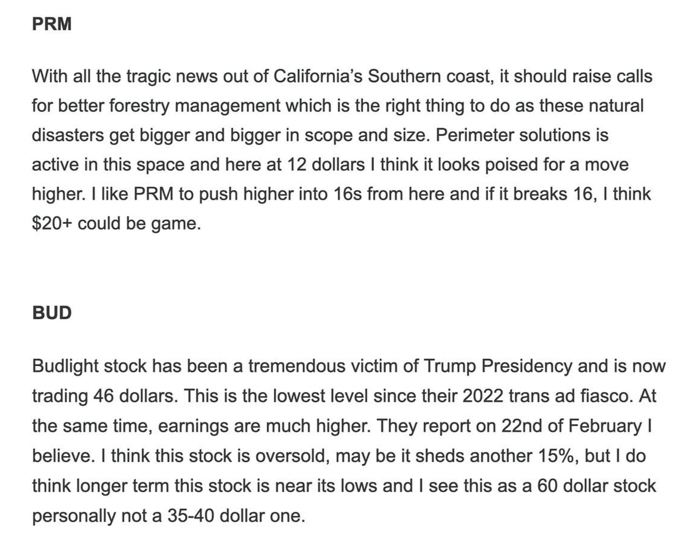

# NVDA to the Moon. 

*Weekly Plan 11.16.25*
*Tic Toc Trading — Nov 16, 2025*

Hey trader friends— 

There remain inherently conflicting signals on this tape which makes it harder to call this market in any one direction. 

We see this in most recently weekly auction, where there has been a lack of urgency to bid this market up above 6830 and at the same time, there are few takers below 6691, which both happened to be our weekly levels from last Sunday coincidentally. 

Lot of retail is getting crushed buying the dip. Some getting crushed selling the rips. In last 10 days alone, there have been almost four (4) $100 days in the market. For context, in 3 months prior, we had only one. 

Volatility is beginning to rear its head again, and VAR models are beginning to burst at the seams. 

In related markets, then you have the momentum darling crypto coins which have been in shambles of late. You have a lukewarm strength in the US dollar and a fairly elevated pricing in commodities. 

Long bonds refuse to budge, but with the government shutdown lifted, we should begin to see official data trickle in starting this week with the Non farm payrolls. 

NVDA earnings on Wednesday also can be significant catalyst for the indices. 

As far as the NVDA earnings go, this market has been remarkably well bid. NVDA has no shortage of haters, and despite this the stock has refused to go down. 

This may change one day but it is anyone’s guess when. 

For now, I believe the stock looks robust going into the earnings. I think if we hold 177s on NVDA, this is headed to retest its recent highs near 210. 

Another dimension to think about when performing prognosis on these markets is the current state of US politics. This should not be taken as a political opinion but rather part of a DD on current state of affairs when it comes to these risk markets. We have to look at all potential factors acting on markets we trade, often times it is liquidity, volatility, macro but at times it is politics.  

Arguably Trump came back to the White House with a fairly robust mandate. This was by all measures a fairly resounding win at the elections. Some of the issues he espoused were bilaterally popular. 

Fast forward only 9-10 months into the nascent administration, these Epstein files are hung like an Albatross. This thing refuses to go away— neither there is a resolution nor a firm denial. It just hangs in there. 

So the direct effect of this is some seeds of discontent and some fragmentation within the alliance, and this potentially has the seeds for a rout in the mid terms. Politically this brings uncertainty. But it also brings a prospect of no major concentration of power at the Center, at the Federal level. While markets hate uncertainty, they love political Defragmentation as it makes it harder for policymakers of any one party to police the corporations and enact policies that appends the status quo. The mice will play when the cat is away. 

Then the other overlooked aspect of this is Trump himself not wanting to rock the boat too hard now with the mid terms barely a year away, and in fact wanting to preserve the stock market at all costs to project an aura of “*everything is fine*” messaging.

So this in my opinion is an under appreciated reason for the strength in this market despite lukewarm reaction to recent earnings, despite repeated rejections at 6900 orderflow level, and despite worsening macro and uncertainty. In stock markets you have that one thing that sends the message “everything is great”. And the powers that be, want to keep that message alive. Atleast thru 2026. 

**This could be the narrative until it stops being one. **

This is why I said in my previous post from Friday, if you are a bear here, you at the very least want to see this whole 6690-6700 zone breached and for this market to remain below it and then target 6500. 

Else these rallies can get bought, and they can get bought aggressively like we just saw on Friday! 

Now this does not mean that this is a healthy market. The breadth still sucks. The dips get bought by retails’ pavlovian training to buy any and all dips in mega caps, often by smaller retail investors. 

In short from our perspective, the longer a meaningful sell off is avoided and by that I mean a 20-30% sell off from the highs, the longer we must wait to find juicy, profitable stocks! This means longer we must wait for stocks to get inside what I call an accumulation zone and we have to contend with fewer and fewer set ups, if any! 

So this is where we are in dog days of 2025, this is neither a strongly trending bear market nor is this a strongly trending bull market. This market remains in a giant chop and we need to see clear signals on the tape that the choppy waters are behind us. 

Amidst such a backdrop, we need to set aside short term momentum until situation becomes clearer and focus only on names which can remain bid on dips for next 4, 5, 10 years. 

BTW folks if you have not, try and subscribe. I know it is hard out there but our readers usually come from a strong economic background. You may wanna lock in these prices as the prices do not go up for existing subs. Ever. 

**PRM**

This is a stock shared by me first here when it was around 10 dollars. 

It has since doubled and is now trading $25. 

I think it is still relatively undervalued and this could continue to appreciate into 40s if one were to take a 2-3 year view on this. 

These April 30 Dollar calls, the market is not really pricing in any aggressive moves in this stock, but if these were had for a dollar, if the stock were to dip into low 20s, these could be good swing time frame set up. 

**KGC**

This is one of the top orderflow stocks which I first shared here around 5 dollars. 

The stock is up 5 times in little over 2 years time frame. 

Now ask yourself with this type of background in the nation, with all the misstated objectives and goals, what does it do to Gold prices over next 3, 5, 10 years? 

It is probably headed much higher. 

These reasons and along with continued subdued energy prices could be a boost for these smaller Gold miners, like KGC. 

I think this could remain supported on dips and could rip higher into 40s if one were to take a 2-3 year view. 

**GOOG **

Again, most of you get most value from this Substack if you take a long term view. This stock only a few months ago was shared here when it was trading in 80s. I then reiterated it as a strong buy at 150. 

The stock closed at 274 on Friday. 

I think Google will be the largest mega cap company if one were to take a long term view. I think this stock could remain supported on any dips. Yes there will be bear raids in Google, yes there will be soft patches but in investment time frames which I often take 5-10 year plus view, Google remains on top of the list. 

**KMT**

Scarcity in crypto coins is all the rage. A lot of folks mistakenly assume Bitcoin is scarce. I have my reservations about this, but can we ask ourselves— are shares in  a metal cutting company based out of Pennsylvania scarce? 

A 75 million share float. 2% yield. Book value of 1.5 billion with a market cap of about 2 billion. Does this make something like KMT really scarce? 

Can we say this stock is as scarce, if not more “scarce” than Bitcoin or Dogecoin or Snorter coin? 

The technical patterns look robust I think, furthermore I think if we hold 18-20 on KennaMetal, we could retrace into 40s. It is about 26 at the moment. 

A lot of guys have asked me for my views on the so called scarce asset of crypto. At a basic level I do not believe Crypto coins are scarce at all! 

This a man made scarcity— it is not natural. Its value is entirely based on a perception. You want to stay away from perceived values. And stick with intrinsic values. 

Now from time to time, I will see some set ups in crypto which could turn out to be good trades but they are in no way and shape “buy and hold” conviction plays for me personally. 

Look, if you recall, a few months ago, I called for Bitcoin to have either the same or worse returns than the S&P500 on an annual basis. I was early by a year or so, but here we are. QQQ is up 20% on the year. Bitcoin is almost flat. 

QQQ in many ways is far more scarce than Bitcoin ever will be. QQQ is an index of profitable American companies churning billions in cash flow every month— this is real scarcity. Not everyone can own QQQ. So much so that top 10% of American households own 90% of all stocks in QQQ companies. 

This is real, tangible scarcity. 

Now with something like Bitcoin, may be it has role to play, may be it is an alternative asset. Just may be. Even then, I have consistently maintained that promoters like Saylor are a liability for this asset class, not benefactors. 

It is one thing owning tens of thousands of Bitcoins because you just bought them for a dollar apiece 10 years ago, it is a totally different ball game buying Bitcoin at these prices by issuing more shares in your company and issuing debt. This can be a fatal combination under right circumstances of liquidity or lack thereof.   

Now specifically with regards to MSTR, I have had a negative view of this stock, citing elevated stock price with respect to the Net asset value (NAV) when this was 400, calling for the stock to be cut in half. 

We are here now at 199. 

My view is right now that of opportunistic. If we get a clear path forward on release of these Epstein files, may be we see some more volatility going into Bitcoin and hence MSTR next week or two. 

If we trade into 134-150 on MSTR, I am a buyer. For a quick run back into 200-220. As this gap between MSTR and NAV of Bitcoins it holds expands, it becomes short term attractive and I think that level for me personally will be 130-150. May be this corresponds to Bitcoin 89K for some sort of short term support. 

**Other ideas **

**Core Weave **

I think NVDA earnings may be good and this could help Coreweave. 

I think CRWV is oversold so close to this 60 dollar level (it is now 75). I will like to see Coreweave retrace into 100 atleast. 

These December 19th $85 CALLS which are now 6 dollar appear nice but I will have Line in sand on these around 3-4 dollars. 

Have a great week ahead folks. Cheers. 

~ tic 

**Disclaimer:** This newsletter is not intended to provide trading or investment advice but solely for general informational & educational purposes. It represents the personal opinions of the author, shared publicly with you as a personal blog. Engaging in futures, stocks, or bonds trading involves significant risk, and there is no guarantee of profit. In fact, there is a possibility of losing one’s entire investment. Utmost caution is advised. Your account can go to zero. The author does not guarantee any profit whatsoever, and the reader assumes the entire cost and risk of any trading or investing activities undertaken. The reader is solely responsible for making informed investment decisions. The owners/authors of this newsletter, its representatives, principals, moderators, and members are not registered as securities broker-dealers or investment advisors with the U.S. Securities and Exchange Commission, CFTC, or any other securities/regulatory authority. Consultation with a registered investment advisor, broker-dealer, and/or financial advisor is recommended. By accessing and utilizing this newsletter or any of its publications, the reader agrees to the terms set forth herein. Any screenshots used are courtesy of Ninja Trader, FinViz, Think or Swim, and/or Jigsaw, with whom the author has no affiliations. The information and quotes shared in this blog may contain inaccuracies, as markets are inherently risky and subject to unpredictable fluctuations. Additionally, the content of this blog is the intellectual property of the author, and its sharing or copying is strictly prohibited. By reading this blog, the reader accepts these terms and conditions and acknowledges that it is intended solely as a personal trading journal and nothing more.