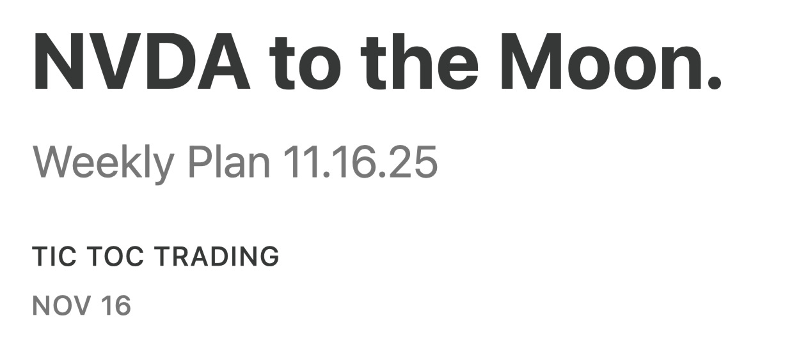

# NVDA has mooned. 

*Daily Plan 11.20.25*
*Tic Toc Trading — Nov 19, 2025*

Hey folks—

Signal value is a must in these markets. 

That signal came today with those NVDA earning. Not only did we trade almost into 200 at time of this post on NVDA which yours truly shared only on Sunday at 185, we see breaking action in core weave clearing 80 again. We see GOOG trade unto a high of 303 and much more. A lot of furus are not able to provide consistency  in these markets, orderflow can. Do not focus on quantity of calls but quality and consistency. If the so called furry is bearish one moment on NVDA at 180 and then bullish the next at 197, this does not help you much! 

I do not like to share stuff only for sake of sharing. There must be a signal based reason for it. 

That signal for the session tomorrow and may be rest of the week could be this market taking back 6691. 

You do not now want this level to give up if you happen to be a bull. 

> Scenario 1: If we hold 6691 this level could remain supported for a push higher into 6730s.

> Scenario 2: If we open and remain supported at 6654, we could retest 6703.

For bearish thesis to play out, we now need to retest 6654, remain below it as a bearish signal to target 6500s. Else we may be headed back to 6800. 

Have a great day ahead. 

~ tic tic 

**Disclaimer:** This newsletter is not intended to provide trading or investment advice but solely for general informational & educational purposes. It represents the personal opinions of the author, shared publicly with you as a personal blog. Engaging in futures, stocks, or bonds trading involves significant risk, and there is no guarantee of profit. In fact, there is a possibility of losing one’s entire investment. Utmost caution is advised. Your account can go to zero. The author does not guarantee any profit whatsoever, and the reader assumes the entire cost and risk of any trading or investing activities undertaken. The reader is solely responsible for making informed investment decisions. The owners/authors of this newsletter, its representatives, principals, moderators, and members are not registered as securities broker-dealers or investment advisors with the U.S. Securities and Exchange Commission, CFTC, or any other securities/regulatory authority. Consultation with a registered investment advisor, broker-dealer, and/or financial advisor is recommended. By accessing and utilizing this newsletter or any of its publications, the reader agrees to the terms set forth herein. Any screenshots used are courtesy of Ninja Trader, FinViz, Think or Swim, and/or Jigsaw, with whom the author has no affiliations. The information and quotes shared in this blog may contain inaccuracies, as markets are inherently risky and subject to unpredictable fluctuations. Additionally, the content of this blog is the intellectual property of the author, and its sharing or copying is strictly prohibited. By reading this blog, the reader accepts these terms and conditions and acknowledges that it is intended solely as a personal trading journal and nothing more.