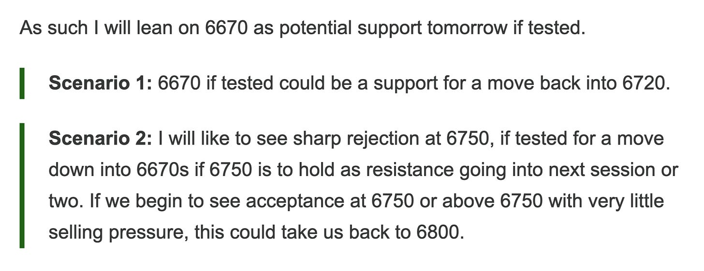
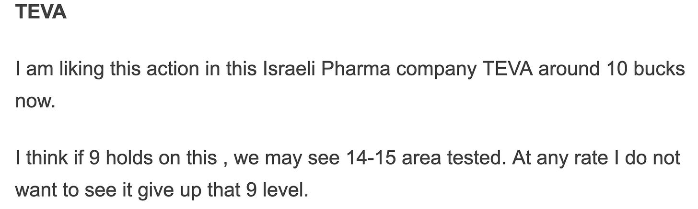

# Weekly Plan 12.1.25

**
*Tic Toc Trading — Nov 30, 2025*

Hey traders— 

The primary expectation from last week was to see us supported at 6520 and see sellers emerge at 6750-6800. We rallied sharply at start of the week and on Monday night I shared probability of continuation into 6800 if we started accepting value above 6750. See below. 

So what you have at start of the brand new trading week and month is a market with compressed volatility. We saw this on Wednesday and Friday as well. The range compressed significantly  on both sessions — coming at highs of trading range, this is almost always a sign of weakness but there are a few caveats. 

The main challenge for bears going into week ahead will be the lack of selling pressure at 6750 as seen earlier in the week. As a bear, you want to see us trade down below and remain below 6750 on the week. 

Minus this, I think we could see support kick in right at 6740-6750 level. 

A secondary level of interest remains 6816 as shared on Friday. 

> **Scenario 1:** I think if 6740 gets tested, this could present weekly time frame support for a move higher into 6850s.

> **Scenario 2:** My edge case for the week will be a market that remains above 6816 or a market that remains below 6740. These can be trend bullish and bearish scenarios respectively. In other words, a market finding acceptance above 6816 could be bullish trend continuation and a market that remains below 6750 could be a bearish trend continuation.

Outside of this, we are looking for two type of trades— one being value play. Are there fair valued stocks available trading right now at attractive valuations? In this category, there really is not much going on right now. As has been the case for several weeks now. Even a 20% S&P500 sell off unlocks a lot of these names for us. 

The second type of trades we look for obviously being trend following. In this category, we have seen most of the action in recent weeks. For instance TSLA, AAPL and GOOG. 

In a trend following method you are looking to ride the trend until and unless it begins to invalidate your thesis by breaking below key support levels. So for instance, look at TEVA. See below from my post earlier in January last year. 

This stock has now tripled from these levels and is now trading around 26. 

AT 26, do we now become bearish because it has “risen a lot”? 

Far from it, you want to look for dip buyers on weakness in general market. Am I willing to risk 20-30% on a name like this to see it rally another 100%? 

At any rate when a stock breaks out of a prominent resistance and holds it, this tends to attract various other trend followers. So in this instance, if we continue to hold these 20-23 handles, I will expect this to continue to rise further into 30s. 

**COHR**

Coherent being another name. Do we now start selling it because it has doubled in a year?

Far from it, I will look to buy this on dips. Now any market you are interested in atleast know its basic attributes. Which in other words mean know at a minimum key inflection points. Know its average daily moves,  etc. This can give you a fair understanding of key support and resistance levels. 

In case of COHR, while I will expect this to rip higher into 200s at some point, I am willing to risk 20-30% on it if it were trading around 130 again. 

Trend following works best when you have the tailwinds from the general market as well. Unless and until we have clarity in general market trend, and the general market itself is at fair prices, you will get chopped around in individual stocks quite a bit even if they happen to be amazing stocks. 

**Lotto**

**RGTI**

In short term lotto, these $25 RGTI CALLS for December 26, if had sub $1, may be around 80 cents or better make sense for a quick trade. 

For the stock itself, if you are bearish here near 20s, at the very least you want to see some daily closes below $18-$19. Else it could retrace  back to $30. 

~ tic 

**Disclaimer:** This newsletter is not intended to provide trading or investment advice but solely for general informational & educational purposes. It represents the personal opinions of the author, shared publicly with you as a personal blog. Engaging in futures, stocks, or bonds trading involves significant risk, and there is no guarantee of profit. In fact, there is a possibility of losing one’s entire investment. Utmost caution is advised. Your account can go to zero. The author does not guarantee any profit whatsoever, and the reader assumes the entire cost and risk of any trading or investing activities undertaken. The reader is solely responsible for making informed investment decisions. The owners/authors of this newsletter, its representatives, principals, moderators, and members are not registered as securities broker-dealers or investment advisors with the U.S. Securities and Exchange Commission, CFTC, or any other securities/regulatory authority. Consultation with a registered investment advisor, broker-dealer, and/or financial advisor is recommended. By accessing and utilizing this newsletter or any of its publications, the reader agrees to the terms set forth herein. Any screenshots used are courtesy of Ninja Trader, FinViz, Think or Swim, and/or Jigsaw, with whom the author has no affiliations. The information and quotes shared in this blog may contain inaccuracies, as markets are inherently risky and subject to unpredictable fluctuations. Additionally, the content of this blog is the intellectual property of the author, and its sharing or copying is strictly prohibited. By reading this blog, the reader accepts these terms and conditions and acknowledges that it is intended solely as a personal trading journal and nothing more.