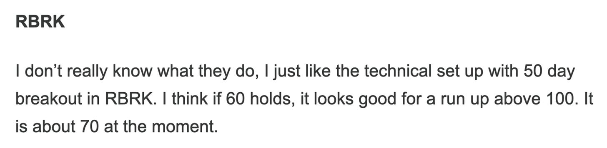

# Markets Have Topped.

*Weekly Plan 12.7.25*
*Tic Toc Trading — Dec 07, 2025*

The FED will deliver a 25 BPS rate cut on the 10th. This is now a foregone conclusion. 

However, what is not a foregone conclusion is continued rate cut regime going into 2026. 

Expectations heading into the December 10 FOMC meeting have been all over the place, mostly because people keep hearing what they want to hear. At the press conference following the 29 October rate cut, Fed Chair Jerome Powell cautioned that another reduction in December was “not a foregone conclusion,  far from it.” 

The meeting minutes reinforced that message, showing that many participants were leaning **against** a December cut. The lack of fresh official data ahead of the meeting, due to delays caused by the government shutdown have further eroded the likelihood of changing those views.

So, the bottomline is that while it is almost certain we get a 25 BPS rate cut on Wednesday, this could well turn out to be a hawkish FED meeting. 

The real issue is what the Fed chooses to signal for next year. We will get a new set of forecasts, but it is worth remembering what those forecasts looked like last time. The Fed expected only one rate cut in 2026. That view assumed modest growth around 2%, unemployment near 4%, and core inflation still above target at 2.7%. Unemployment is already at that level, and in all likelihood set to rise even further. 

Whether this guidance matters much is another question. The Federal Reserve itself is in changing and changing FAST. A band new chair arrives in May. Kevin Hassett is widely seen as the leading candidate, and he has been clear about his preference for lower rates. If President Trump prevails to remove Governor Lisa Cook, any replacement is likely to feel dovish the same way. When the personnel change, the policy tends to change with them. Forecasts adjust after the fact, not before.

My personal take is that in 2026 we are almost certainly going to see inflation dip back into 2%, may be a 2.2 to 2.3% range and this should justify the dovish stand. With the new FOMC packed with Trump appointees, this could set the stage for multiple rate cuts, not just the one promised by Powell in last FOMC. 

The other elephant in the room is the Supreme Court decision on whether the president has the authority to impose tariffs. This is a key risk to watch over the next couple of weeks. If the Court rules that he does not, markets are not prepared for it. That would be a meaningful shock to risk assets and would almost certainly lead to sharp volatility ahead. When an assumption everyone relies on turns out to be wrong, prices adjust quickly and usually painfully.

Last but not least, before I dive into where I see this market headed into next week and next couple of  months or so, I want to address a question looming on minds of nearly a third of investors. 

**Has the AI bubble popped now?**

The short answer is No. But there is (much more) nuance to it. 

Most of the US growth at the moment is coming from AI related investments. In fact, most of the US job growth has come only from 3 sectors— Government, Hospitality and Healthcare. The US economy has lost jobs in every other single sector. 

So you can see why these AI related economic activities are so critical for the US, if you want to avoid a sudden drop in the GDP and officially go into recession in an election year. 

President Trump and his inner circle view AI as the engine that keeps growth alive for years. Inside policy circles, including around the FOMC, there is a belief that AI can also help ease the inflation problem by lifting productivity. Whether that belief proves true is a separate question. AI at the moment is the holy cow, it is the panacea that cures all ills in the US economy. 

Then you also have to consider that the top 10% of earners in the US are driving most of the spending at the moment. Their spend alone is propping up all sort of industries and sectors and without this spend, we will already be in a recession. 

So if you combine all of these factors, the natural answer you arrive at it is that it does not matter AI is in bubble or not, if this bubble were to pop, this will have serious and remarkable repercussions for the US economy in 2026. 

If you are still with me thus far, we can summarize the top  themes acting as forces on US economy and the US stock market as thus: 

1. FOMC rate cut next week at 25 BPS is a foregone conclusion. The FED chair may come in hawkish in his remarks as far his outlook for 2026 goes but it really may not matter much since the FOMC next year will be packed by Trump loyalists.
2. The US jobs picture supports a much dovish FED tone next year. This is also potentially supported by lower inflation supported by ongoing softness in energy prices and rents.
3. Supreme Court pending ruling on Trump’s ability to impose tariffs unilaterally bypassing the Congress is a wild card. If the ruling aligns with Trump agenda, this is probably bullish. An unfavorable ruling could be short term bearish.
4. AI may or may not be in a bubble but this bubble cannot be allowed to burst. Atleast not until 2027 for reasons mentioned above.

**Emini levels** 

The emini S&P500 closed at 6880 on Friday, SPX closed at 6870. To make any sort of directional call with the Supreme Court decision pending is anyone’s guess but here are few key price levels to watch out for next week to next couple of months. 

1. In the short term, this market has been well supported in a low liquidity environment. The dips, even the tiniest of dips have been bought. This is however unlikely to be sustainable when liquidity returns.
2. Slightly longer term, looking at next few weeks to next few months, the price action reeks of balancing.
3. Unless we are able to clear out these resistances and hold a breakout on strong volume above 6950 or so, I favor a deeper sell off, perhaps a 10 to 15% sell off is not a bad start.

**Putting this together: **

1. 6900 remains resistance until it is broken. Even if broken, I want to validate this with the market clearing 6950 on a strong volume. I do not want to fade a strong volume breakout above 6950.
2. On the flip side, if we sell down into 6740 area which could present some sort of short term, weekly time frame support.
3. As long as we hold 6950 as resistance, and confirmed by a couple of daily to weekly closes below 6740, I think we are probably going to retest 6740 which if broken can lead to retest of 6500s.
4. A break of 6500s I think almost certainly could lead to a retest of 6000. As we begin to explore 6000, if we begin to explore 5800 to 6000, I think this could be a very good area to start looking for some good runners for 2026. This could be a good low and could present us with numerous swing time frame opportunities which I will be sharing with our subscribers once we get there. I am sharing some of my top names below with key levels to watch in weeks ahead with much more to come.

Within the AI space, several winners will be made in next year and half. I think AI boom is far from over but the big winners may not be your MSFTs and NVDAs. 

Let us now look at a few of these names which I like. While these set ups look good as it is right now, understand if we get a 10% sell off in the general market, these could be even more attractive, and since they are higher beta, relatively speaking, we could easily snap up some of these for 20-30% cheaper. 

**RBRK**

My regular readers are no strangers to RBRK which I first shared here in May at $60. See below. 

It then rallied to $100, then sold off to $60s, and then rallied back to $85 at time of this post. 

AI has made data more valuable and more vulnerable. Companies are generating more of it, storing it everywhere, and panicking about losing it. That plays directly into Rubrik’s pitch. Microsoft is a strategic partner, which gives the story credibility and distribution.

The company still makes loss though. Loss-making companies survive only if investors believe profitability is inevitable. If operating losses stay wide while revenue growth normalizes, patience disappears quickly. There is relatively little to no MOAT. Microsoft partnership is existential for Rubrik. 

Having said this, technicals still look good. 

I think if we get a market wide sell off, and RBRK goes back down to fill gaps at 60-70, this could still remain in play for a test of $120. 

**LMND**

Lemonade is a modern insurer- it offers renters, homeowners, pet, car, and life insurance in the US and parts of Europe, using AI and automation to underwrite and process claims. That lowers costs and speeds up service.

Revenues are surging, suggesting their AI driven underwriting is working. At the same time, the company remains unprofitable. Competition can catch up. 

There is always a risk of a “Black Swan” catastrophic event that requires ten of billions to be paid in claims. 

However, if current sales growth trajectory continues and the company manages to go profitable in 2026, this stock could fly especially if general market headwinds lower it into 50s to low 60s. It is about $80 at the moment. 

**GOOG**

It is hard to believe I shared Google here in this Substack as my top tech pick only a couple years ago at 80 and now it is trading 4 times higher at $320! 

If AI has any juice left to be squeezed, a lot of this juice should flow to GOOGLE. Any sort of negativity surrounding the likes of MSFT, NVDA or even an AAPL I think favors GOOG. 

I remain bull on Google on any pullbacks and I think this is probably a $400 stock, not a $280 or even a $300 one! 

**PLTR**

Despite all the ugliness of narrative surrounding this stock, I will still not rule this out to run higher a bit above 200s, may be a 250 with a few underlying support levels that need to be supported. 

This is sort of NVDA and TSLA with all their glitter and hype all wrapped into a more professional wrapper. 

This was a strong performer this week when I shared my bullish views on this only last week at $160 and I think any pullbacks again into 140-150 could remain supported on PLTR to push higher into $200. 

**On non AI side, looking at names like Moog. **

As far as MOG.A goes, I am a buyer on any dips into 200. 

I think this stock has potential to run into 300-350 dollar range in next year to two. 

Their main customer base is Aerospace & Defense sector where they make the parts that move critical things accurately, smoothly, and reliably when failure is not an option.

Generally speaking look at small caps which I have been bullish on since $200 (using IWM as proxy). 

Small caps are running into some resistance here but I think again using IWM as proxy, if you are too bearish here, you need to see $220s broken on the downside. Else I think this takes us into 300 and higher. 

**Crypto **

On crypto I remain bullish on the likes of Bitcoin and ETH. But keep in mind the FOMC situation  and the current weakness in non US dollar currencies like the Yen. 

If the DXY continue to rail hard against these currencies, Bitcoin could still soften more and could find decent support near 74K. 

**Netflix **

So NFLX has been a pretty unmitigated disaster but it is not your Salad bowl which will out of fashion any time soon. 

Netflix did not fail because it was a bad business. It failed because it stops being a great one.

I will submit that here at $100 NFLX may appear to present a compelling value for a move back to 140 but it can be sweeter if it were to sell off even more unto 80 range. A 350-400 billion dollar company making $800 million in profit a month which arguably still can grow from here. How many fit the bill?

However keep in mind if we turn South on the general market even if into 6740s, NFLX can take some heat before cooler heads prevail. For any fresh longs here at 100, I think there is some risk and this risk can be reduced and mitigated if we were to sell into 70-80 dollar range in NFLX in my view for a rather sharp move higher into 110. Until then I think it makes sense for NFLX to be sold into rallies for a firmer support later on near 80. 

The key theme here remains for any of these stocks this week— add these to your watchlists. There is some event risk for next couple weeks and then volatility seasonality sets in January. 

Even a 10% sell off in the general market can make these trade at or near our orderflow support levels which can sweeten the entry for anyone buying them for the first time ever. At the same time, a small position to gauge the thesis and price action is not bad idea which can then be added on to either at breakout or a pullback. 

Read every post. We are not generalists. I like to pin point exact names with exact entries I am bearish or bullish on— so this is very actionable but it is not possible to include every name in every single post. So make sure you are in sync with the markets and reading the emails, bookmarking your markets and their fair prices, even when these markets make no sense! 

This is it for now. If you find these posts helpful, please like, share and subscribe to spread the message of actionable tape reading further amongst trader and investor community. As markets soften a bit into more fair and desirable levels, many many more insane runners will be shared, we are just waiting to hit the sweet spot in valuations. 

~ tic

**Disclaimer:** This newsletter is not intended to provide trading or investment advice but solely for general informational & educational purposes. It represents the personal opinions of the author, shared publicly with you as a personal blog. Engaging in futures, stocks, or bonds trading involves significant risk, and there is no guarantee of profit. In fact, there is a possibility of losing one’s entire investment. Utmost caution is advised. Your account can go to zero. The author does not guarantee any profit whatsoever, and the reader assumes the entire cost and risk of any trading or investing activities undertaken. The reader is solely responsible for making informed investment decisions. The owners/authors of this newsletter, its representatives, principals, moderators, and members are not registered as securities broker-dealers or investment advisors with the U.S. Securities and Exchange Commission, CFTC, or any other securities/regulatory authority. Consultation with a registered investment advisor, broker-dealer, and/or financial advisor is recommended. By accessing and utilizing this newsletter or any of its publications, the reader agrees to the terms set forth herein. Any screenshots used are courtesy of Ninja Trader, FinViz, Think or Swim, and/or Jigsaw, with whom the author has no affiliations. The information and quotes shared in this blog may contain inaccuracies, as markets are inherently risky and subject to unpredictable fluctuations. Additionally, the content of this blog is the intellectual property of the author, and its sharing or copying is strictly prohibited. By reading this blog, the reader accepts these terms and conditions and acknowledges that it is intended solely as a personal trading journal and nothing more.