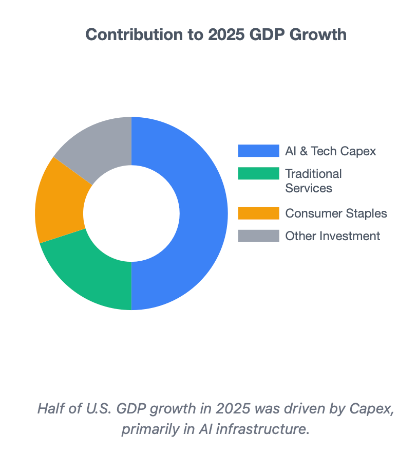
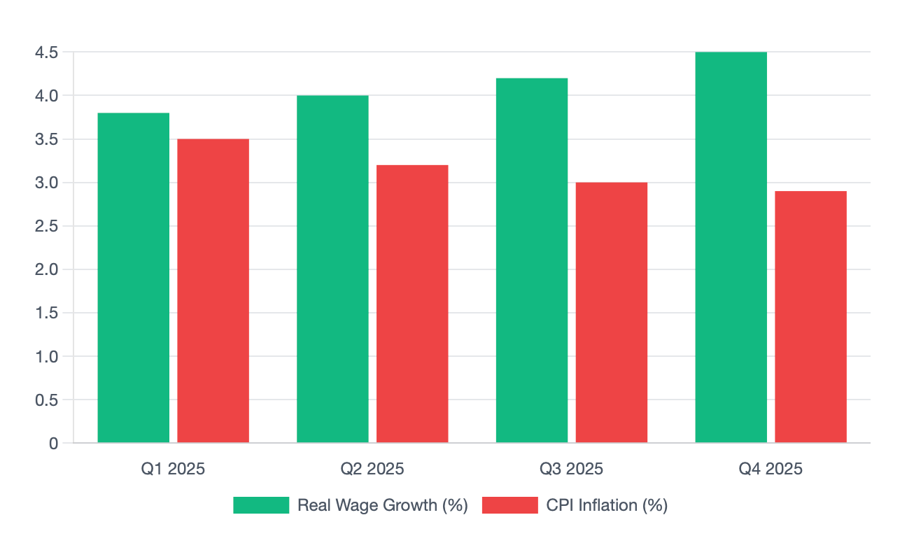
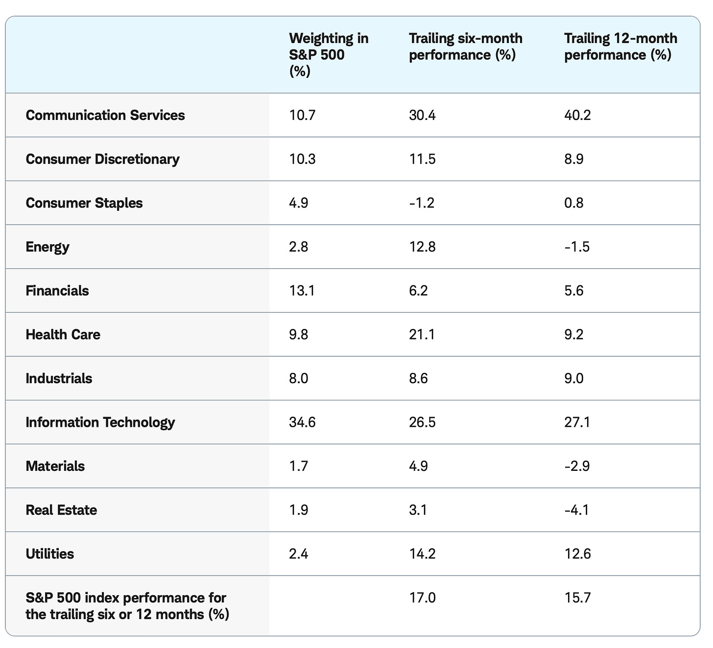

# Silver is Headed Higher. 

*Weekly Plan 12.28.25*
*Tic Toc Trading — Dec 28, 2025*

**A Bull Market That Refuses to Die**

Despite fears of a “*Liberation Day*” tariff crash and concerns over an AI bubble, the stock market in 2025 has remained in a bull cycle. As of late December 2025 at time of this post, the S&P 500 has gained approximately 17% for the year, marking its third consecutive year of double-digit returns.

In this post, I would like to dig deeper into some of the catalysts that have made this possible, and additionally look at some themes for 2026 that look promising. 

These are the key factors below that have been instrumental in driving flows into the Global stock markets this year: 

**Tariff threat and de-escalation. **

The most significant threat to the market occurred in April 2025, when the administration announced sweeping “Liberation Day” tariffs. The S&P 500 dropped nearly 19% from its peak in early April as trade war fears spiked.

As the days progressed and market carnage took on a life of its own, the Trump administration paused the most restrictive measures to enter negotiations. Markets staged one of their best single-day rallies in history on April 9, 2025.

This was followed up by quick trade deals with the UK and Japan, thereby restoring the investor confidence back in these markets. 

In the latter half of the year, tariffs faded into the background, becoming largely a non-issue. While occasional volatility sparked brief market pullbacks, these dips were quickly bought. The market even coined a term for this dynamic: TACO (“Trump Always Chickens Out”).

**The Booming AI Capital Expenditure Cycle**

Artificial Intelligence transitioned this year from a speculative trend to a fundamental economic driver for the US economy. Half of U.S. GDP growth in 2025 was driven by capital expenditure and investment, much of it concentrated in AI infrastructure. 

See Graph A below. 

NVDA was the winner take all in this segment. Despite a massive volatility spike in late January caused by Chinese competitor DeepSeek, Nvidia’s valuation crossed the $5 trillion mark, serving as a bellwether for the broader tech sector.

I believe we are now ready to see this broaden out to different sectors (not just NVDA), which I will cover in latter half of this post. 

*Graph A: 50% of US GDP came from AI CAPEX. Source: Fidelity.*

**Resilient Consumer Spending & Labor Market**

Trump’s immigration crackdown which led to one of the very rare negative net immigration years in the US had an effect on keeping the unemployment rates from spiking. The unemployment rate remained near historic lows throughout the year.

For the first time in several years, **real wage growth** consistently exceeded inflation in every single quarter, providing a buffer for household spending despite higher prices.

*Wage growth is dominating CPI growth (for now).*

While the immigration crackdown disproportionately affected the lower income segment of the workers, it also had ramifications for the Big Tech where salaries paid to immigrant workers can often exceed 6 figures. Since it is harder to find and employ foreign workers even on legal VISAS now, and it is harder to pursue an advanced STEM degree in the United States at the moment, this has incentivized the internet based companies, many of them in MAG 7 themselves to start hiring outside of the US altogether. This is a trend I predicted several months ago and I think these could continue to gain steam and would definitely have a detrimental impact to the White Collar tech jobs here in the United States. On top of seeing these jobs just vanish, you also have an additional negative factor where you lose spending power of these employees thereby hurting local economies and housing. 

This is an emerging theme which needs to be watched on top of AI related job losses, as this in my opinion will send the unemployment rate closer to 5% by end of next year from 4.6% now, and is absolutely going to be a factor acting on the FED next year.

**A “helpful” FED and Policy Stimulus **

One of the more remarkable thing about this year’s price action was that the rally was broader than that in 2023, as well as in 2024. Financials hit new highs in September, followed by record-breaking performance in Industrials and Utilities in October.

The “One Big Beautiful Bill Act” provided significant business stimulus and deregulation. The act lifted earnings expectations for small- and mid-cap stocks, which had trailed the market in 2023 and 2024.

In addition to the deregulatory boost, the Fed demonstrated flexibility in the face of volatility and uncertainty. While the question about “Neutral rate”, whether it is 2% or 3% next year remains open, the FED has cumulatively cut rates by 175 Basis Points since last September. 

*Broad Base Rally in 2025. Source: Charles Schwab.*

** Looking Ahead **

As we enter into 2026, my base case is continuation of this rally but with significant volatility ahead. A lot of folks have used AI job losses as a pretext of some sort of sell off in the stocks. In my view, these job losses may not materialize in 2026 as companies usually take one year or even more to onboard these AI agents and test/validate their business processes before laying off workers. If there are significant job losses, I think these come in 2027, not in 2026. This is why there will be dips but these dips could remain supported. 

Valuations in some stocks remain a concern, but at the same time, the US stock market at the moment is acting like a “Store of Value”. Folks from all over the world are parking their cash into the US stocks, and this could mean dips remain supported. 

Here are a few major ***knowable*** risks headed into 2026: 

1. Mega cap earnings flop: As the PE ratios again approach 30+ zone, the market has very little margin for error. Any earnings miss from mega-cap tech could trigger a significant selloff.
2. Debt: Treasury Secretary has pushed for Government borrowing using shorter term instruments rather than longer maturity bonds. So in 2026 alone, 9 trillion dollars in short term debt matures that needs to be “rolled over” to next year. Now note that this is about a third of total US outstanding debt. Most of this debt was financed at near 0% rates. The rates are much higher now and by some estimates, by 2026, the U.S. is projected to spend over $1 trillion a year just on interest payments. If unemployment spikes, the US tax revenues could crater, complicating debt picture even further.  The other not so talked about aspect of this equation is insane amount of Money Market funds which by some estimates are about $8 trillion in the US right now. I will not go into all the details how these funds modulate the short term interest rates, but the long story short, if the Money Markets continue to buy into “relatively safer” treasury yields, this could force the private debt issues, mainly corporates to raise their debt interest rates to make them more attractive, thereby increasing their debt servicing costs, leading to more defaults and bankruptcies in the corporate sector. If the stock markets rally here, these money market funds will have to chase stocks higher, and as a bonus could provide relief to the bond yields from spiking.
3. Inflation resurgence: While 2025 managed inflation well, the late-year “One Big Beautiful Bill” stimulus and remaining tariff pressures could force the Fed to pause or reverse rate cuts in 2026. In fact, there are many pundits who believe the FED is closer to end of the rate cutting cycle, than start of some new Quantitative Easing. If we see core CPI begin to inch higher above 3% again this year, despite a pro Trump FED Chair, many FED Governors could vote to either pause, or worst, hike interest rates.
4. Geopolitics: Lower energy prices have been a lifeline for lower inflation in 2025. Wars and conflicts in energy-sensitive areas remain a “black swan” risk for global Energy supply chains.

Now while we can talk ad-nauseam about dangers and risks to the stock market, not investing altogether can be even riskier. Primarily I see 3 types of opportunities in 2026 within the US at-least— 

1. The “Second Wave” of AI: If 2025 was the year of infrastructure (chips and data centers), 2026 is expected to be the year of software and application integration, potentially unlocking massive productivity in laggard sectors like Healthcare and Financials.
2. Energy 2.0: With pro-business deregulation, traditional energy sectors and nuclear power are seeing a renaissance to meet the surging electricity demands of AI data centers.
3. Small-Cap Resurgence: If interest rates remain stable, the valuation gap between small-cap stocks (Russell 2000) and large-cap tech offers a compelling catch-up trade.

**Without much further ado, let us dive into some names and themes which I like.** 

Let us first begin with a couple things about Precious Metals and Crypto. 

When it comes to Gold or Silver, these aren’t your typical “investments” per se. When I am “investing”,  I am usually referring to assets that represent a claim on future cash flows (like a company’s profits in the case of stocks) or a promise of repayment with interest (like bonds). Gold and silver do neither. They are better understood as monetary insurance and industrial commodities rather than growth multipliers. 

Now crypto is neither insurance, nor it is an industrial commodity, but we will talk about what crypto is in a bit. No rush. 

Vis-a-Vis Gold and Silver, if you are my regular reader, or atleast if you started reading this publication back at start of 2024, you are no stranger to my strong bullish views on both Gold and Silver. At the time, these were $1600 and around $17 an ounce respectively. 

Gold and Silver at time of this post are trading $4500 and $80 respectively. Now by the time this post gets published, there will be significant drama unfolding in these markets. Silver, to be specific, is having delivery issues in futures markets. A fraction of futures traders choose to take physical delivery of Silver and the short sellers have had some issues in recent past meeting this demand. 

To compound the situation further, China, which produces about two thirds of all Silver in the world, decided to curb exports of the metal, requiring exporters in the country to get a license from the Central government in order to export. Now this is obviously bullish for Silver but you have to be cognizant of price versus value. 

When I first share an idea, I have devoted significant effort to find assets which are in some sort of value. Value simply means the inherent economic or financial supply and demand quotient— think of your home as an easiest example to explain. If you were to build a brand new home, you need to buy land, buy lumber, copper, steel, and hire labor to build the house. The cost incurred by you to build your house is its value. Now the value of your house today may be a million bucks, but the market is willing to buy it at $1.5 million— that is price. A 50% premium to the value. 

As a rule, if I am buying for the first time, I do not like to pay a premium, I like to buy value. 

With something like Silver, or even a Gold, the price for sure has risen, and risen a lot, but the value takes time to rise, sometimes it can take years. This value for Silver today is perhaps closer to $40 or $50 than a $90 or a $100! Yes, we could see a $100 print on Silver, but if the value does not support this price, these prints will be short lived. 

Also, understand that there are millions of households and individuals who own physical silver at $5 and $10 and $17, yours truly included. 

What do you think a person who owns Silver at $5 does when it opens at $100 in January? They will either sell it or take a loan against it (effectively selling it), which increases total supply of the metal. 

Now these supply build ups can take a few weeks to manifest, in meanwhile, this could keep a bid on silver prices. I think we are headed into 90-100 on Silver but I will be very wary to holding Silver as it approaches 100 in the short term. Lemme know if you currently hold Silver or are planning to buy for the first time? 

Let’s wrap up the Dollar debasement trade ideas with my current thinking on all things crypto. 

**2025 delivered every single catalyst that a Crypto Bull wanted:**  A Crypto President, spot ETFs, Stablecoin legislation,  tokenization of assets across the board, but prices still dropped by over 30%. 

When you see a $2000, a $5000 move in Bitcoin within a matter of minutes to hours, you think to yourself how are such moves even possible? 

It is possible because these markets are not your regulated markets with proper market makers and liquidity providers (LP). 

Well meaning retail traders buy into crypto tokens as they think this is a legitimate market with a legitimate purpose. 

Ask yourself— what purpose does crypto exactly solves. The unfortunate truth is that it primarily serves scammers, and fraudsters. 

Crypto’s primary use case, which I have covered in much detail in past is speculation,  ransomware, money laundering, sanctions evasion, and other forms of financial grift, there remains no compelling use case that cannot be handled more cheaply, safely, and efficiently by existing systems. 

Now, here is an even more interesting tidbit— electricity prices have been making new highs every year, this is no secret. Did you know that Bitcoin miners, as a whole, pay about a billion dollars every single month, just to operate? This is their electricity and equipment cost alone. 

This represents half a percent of total value of Bitcoin a year, just in order for it to stay afloat and functioning. If Bitcoin continues to drop, this number could soon be 1%. You are now paying 1% of the total value of a token every year just to keep the lights on! 

Meanwhile, the real hard assets, Silver and Gold continue to make new highs every single day. 

These crypto markets are dominated by wash trading, artificial & fake liquidity, offshore dark pools, and levels of leverage that would never be tolerated in regulated financial markets like the NYSE, CME or CBOE. Prices are almost always highly manipulated, exchanges often trade against their own customers, these crypto markets are designed in a way to transfer wealth from retail traders to the big crypto insiders. 

Now trading crypto, as a speculation is totally fine with me. However I would never be under any sort of disillusion that this is the next frontier of technology or some trillion dollar industry — from my point of view most crypto coins are going to 0. 

One of the biggest red flags when it comes to Crypto markets is that 1% of wallets hold in excess of 80-90% of all tokens. This breeds collusion and schemes to defraud smaller retails. 

Now if prices are low enough, this could be good too as whales act as a support wall, however most recently in last few months what we have seen instead is wallets which were dormant for several years became active, hinting that the original whales may already have taken profits on Bitcoin when it was trading above $100K. 

Now for what it is worth, Bitcoin has an extreme level of fear at the moment which could mean a short term relief rally. I would say 84-87K on Bitcoin could act as some sort of support, and I could see it retrace back into 100K as a short term setup. 

**With this out of the way, let’s dive deeper into the emini S&P500 weekly levels, as well as some of the stocks I like heading into 2026. **

**Emini S&P500 Levels **

Friday was a little lukewarm session after a recent monstrous run which could be thought of as this market taking some rest here at these levels. 

We closed at 6970 on the emini S&P500 (March Contract) for Friday. 

For the week, I will lean on dips as being supported. I think a little bit of dip here is not a bad thing. 

> **Scenario 1:** If we dip into 6880, I will like to see this supported for a move back into recent highs near 6970-6980.

> **Scenario 2: **My bearish scenario on the week is a market that gets below 6880 and refuses to go above it.

**Other themes **

**SOFI**

This is a stock I first shared here when it was $8 back when. I did a detailed DD on why I liked SOFI back then but in short, SOFI is the ultimate financial destination for HENRYS (High Earners who are Not Rich Yet). 

Headed into 2026, I like the financial sector as a whole— pick any big bank, I think the auctions look robust. While SOFI is not a traditional New York Manhattan Big Bank, it brings best of both worlds— the technology ethos from the West Coast and Banking from the East. 

I think SOFI is showing relative strength even here at $27 and I believe this is probably going to retest its recent highs at $33, a break of which I believe takes us to $50 and beyond. 

**BX**

BlackStone first shared here by me around $80 remains my favorite asset manager. I think this could remain supported on dips into $130 and could retest 190-200 area. It is about 154 at the moment. 

**HDB**

In regional banks, take a look at    and let me know what y’all think. I like these kind of regional banks as an anti-AI hedge. On top of that these have been magnets for attracting foreign capital to finance infrastructure and other development projects. 

It is now trading at $36 but I think this could head higher into $50 and beyond. 

Folks— these posts take an insane amount of time for me to prep. If you find them helpful, share, like and subscribe. A subscription insures you against any future price hikes or discontinuation altogether. 

**DIS and TGT **

Disney and Target in the same bucket? WTH! 

Hear me out… 

Disney is truly a wildcard for 2026. I know a lot of folks are calling for destruction of retail spending power but I think there are a few tailwinds for the likes of Disney. 

First off, a crackdown on crime is a major plus for the likes of Disney which encourage more Americans to travel to these theme parks. Their streaming service also can win big in 2026. In fact a reduction in crime across the board in the US in 2025 has been a major plus for the likes of Disney, and even some retailers like TGT. 

If you are a regular reader of this publication, again you know I have shared both Disney and Target here as bullish plays at $80 and $80 respectively. 

These are now pushing $114 and $100 respectively — and looking good. I think there is room to run. Disney if able to close above 130, I believe can be headed much higher into 200s. 

**BA**

I was bullish on BA last year at 150 and here once again in 2026, I am reiterating my strong bullish bias for Boeing. 

This is another anti AI trade, if anything AI helps them, does not hurt them. I think we are headed into 250+ on Boeing. 

**NRG**

All that AI needs power. NRG supplies the power. 

Though I will be careful of chasing this here at 160. I think if it were to slip a little here into 138-144, this could be a better entry for NRG and can potentially set the stage to test $200. 

**Oil**

Believe it or not, I think Oil here remains an attractive play. Oil demand is growing and is poised to grow. Since Oil can be such a political topic, may be producers like XOM and OXY are better proxies for oil. 

I think OXY and XOM look good here at 39 and 115 respectively. 

**QCOM**

On the tech side, QCOM looks a nice setup. I see support come in at 150 and 130, if there were to be a dip. I think this is headed higher into 200. 

**MRK**

On the healthcare side, with an aging populace, the whole Western system is built around serving the Boomer generation. This, coupled with Merck’s Alzheimers pipeline could mean support for the stock on any dips. 

Now, this is trading at 106 dollars. I first shared it here in 70s. The stock has a very low beta, so if the market drops 12% tomorrow, you are probably looking at MRK trading down into 100 or so. I still think this remains supported on dips but this is not going to double or triple any time soon. With a line in sand around 95-99, I see MRK retrace back to 120-130 area. 

Happy New Year! 

~ tic 

**Disclaimer:** This newsletter is not intended to provide trading or investment advice but solely for general informational & educational purposes. It represents the personal opinions of the author, shared publicly with you as a personal blog. Engaging in futures, stocks, or bonds trading involves significant risk, and there is no guarantee of profit. In fact, there is a possibility of losing one’s entire investment. Utmost caution is advised. Your account can go to zero. The author does not guarantee any profit whatsoever, and the reader assumes the entire cost and risk of any trading or investing activities undertaken. The reader is solely responsible for making informed investment decisions. The owners/authors of this newsletter, its representatives, principals, moderators, and members are not registered as securities broker-dealers or investment advisors with the U.S. Securities and Exchange Commission, CFTC, or any other securities/regulatory authority. Consultation with a registered investment advisor, broker-dealer, and/or financial advisor is recommended. By accessing and utilizing this newsletter or any of its publications, the reader agrees to the terms set forth herein. Any screenshots used are courtesy of Ninja Trader, FinViz, Think or Swim, and/or Jigsaw, with whom the author has no affiliations. The information and quotes shared in this blog may contain inaccuracies, as markets are inherently risky and subject to unpredictable fluctuations. Additionally, the content of this blog is the intellectual property of the author, and its sharing or copying is strictly prohibited. By reading this blog, the reader accepts these terms and conditions and acknowledges that it is intended solely as a personal trading journal and nothing more.