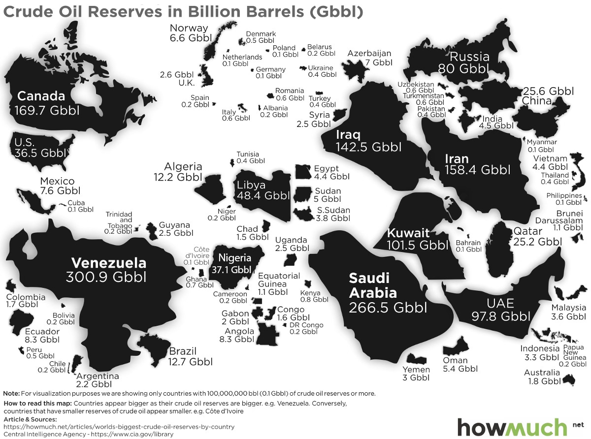
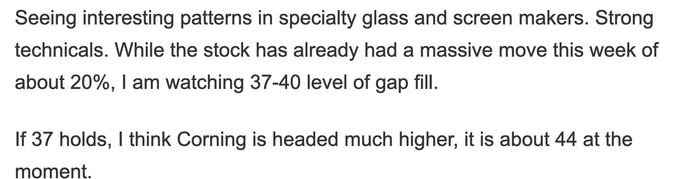

# The Only Venezuela Post You Need. 

*Weekly Plan 1.5.26*
*Tic Toc Trading — Jan 04, 2026*

On January 3, 2026, the US launched a large-scale military operation involving over 150 aircraft and the ultra elite Delta fighting forces. This wasn't just a "strike" but a "capture" mission. President Nicolás Maduro and his wife, Cilia Flores, were captured by US special forces and flown out of the country to be indicted in the US. 

President Trump has stated with confidence that the US will now "run" Venezuela until a "judicious and proper transition" can take place. Rumor mills are abuzz about making Venezuela a US territory like Puerto Rico. And odds are rising about a similar operation in Panama Canal, Cuba and Greenland. 

Let us dive deeper into the nuances of the military operation **“Absolute Resolve”** and what this means for markets and our money. 

There are 3 main aspects of this— reasons or motivation behind this strike, consequences of this in the short term, and long term outcomes.

*Source is unknown.*

The US intervention was framed not as a standard regime change war, but as a law enforcement and resource recovery mission. The primary legal justification used by Attorney General Pam Bondi is a superseding indictment from the Southern District of New York. It labels the Maduro administration as the “Cartel de los Soles” (Cartel of the Suns), accusing them of using cocaine trafficking as a weapon to flood the United States and destabilize its social fabric, hooking its youth on killer drugs.

A major stated motivation is the return of stolen assets. The US argues that the nationalization of oil infrastructure decades ago was a theft from American companies. The administration intends to use Venezuelan oil revenues to pay for the cost of the operation and reimburse US interests (read Big Oil).

Now the question on everyone’s mind is whether this leads to a **Chevron Era **where Venezuela folds back to the US influence, allows its  very large oil companies to enter the oilfields, and rebuild the oil field infrastructure.  Or it leads to a quagmire of war and strife in a country of 30 million people. 

While these are all the official explanations and rationales for this attack by the US, the real reasons could be far more complicated and not so obvious. There is room for a Chinese Geopolitics context.  

**The Grand Bargain Angle. **

In my opinion, the main motivation for this attack is to expel Chinese influence from South America. Just 6 hours before the strike, Maduro was on state television with a high-level Chinese delegation led by Special Envoy Qiu Xiaoqi. The fact that the US launched the operation while these officials were likely still in the city (or even the Presidential palace) is seen by many as a calculated diplomatic insult. Chinese cultural sensibilities have been extremely hurt by this, and while their reaction so far has been muted, make no mistake that they are calculating their next move extremely carefully. The Chinese will never forget this. 

Furthermore, I personally think the timing was meant to smoke out China and forcing them to either defend a failing client state or watch as their $60+ billion in investments are effectively seized or renegotiated by a US-backed puppet administration.

The flip side of this view is that the US made a deal with the Chinese behind closed doors. Under this speculative deal, China may have allowed the US to clean up its backyard (Venezuela) in exchange for the US reducing its footprint in the South China Sea. If true, this raises the risk of an imminent move by China on **Taiwan**, as Washington may have signaled a strategic pivot away from the Pacific to secure its own hemisphere.

A less discussed but vital aspect of the intervention is the protection of the US dollar’s status as the global reserve currency. Under Chavez and later Maduro, Venezuela had become a testing ground for oil trade denominated in Chinese Yuan and digital assets (stablecoins like USDT) to circumvent the SWIFT system. By placing the oil fields under the management of US firms (Chevron and XOM), the US ensures that 100% of future Venezuelan oil exports—the world’s largest proven reserves will be traded exclusively in US Dollars.

This is an enforcement of the Petrodollar system. This move signals a warning to other BRICS nations that the US is willing to use military force to prevent major commodity hubs from exiting the dollar-based financial order.

**At this point in time, Venezuelan regime has fallen. **It is firmly controlled by the US. Now many are asking how will the US logistically control this vast, resource rich country of 30 million people without boots on ground. In my view, there is highly unlikely to be any sort of major civil unrest in Venezuela and furthermore, I think it is highly unlikely that the US will get involved militarily in the country either. 

Control over the Venezuelan supply allows the US to manipulate global oil prices more effectively, providing a tool to manage domestic inflation and stabilize the $DXY  against competing baskets of currencies. To the extent the US is successful at managing this takeover of Venezuela, the US dollar can breathe a sigh of relief for atleast few more years and can enjoy its status as World’s reserve currency for the foreseeable future. 

**Blocked Accounts **

The US will use what is known as Blocked Accounts concept and framework designed by the US Treasury to economically govern and extract value out of Venezuela. 

The **Blocked Accounts** strategy is essentially a financial siege. It keeps the country alive just enough to prevent a total humanitarian collapse that would lead to a massive refugee wave toward the Columbia, Darien Pass and then the US border, while ensuring that not a single cent can be used to fund resistance or pay back Chinese debts without US sign-off. By diverting all oil revenue into New York-based escrow accounts, the US has essentially turned the Venezuelan government into a subsidiary with a strictly controlled allowance, paid only if it meets certain deliverables. 

This also gives the US a geopolitical edge over China as by blocking the accounts, the US is effectively holding China’s $80B debt hostage. Beijing cannot collect on its*** oil-for-loans*** deals and the US treasury must approve any such payments. 

Now lets say Iran regime also falls in next weeks to months, this is code red alert for Russians and the Chinese. If Iran falls, China loses its primary energy partner in the Middle East and Russia loses its most critical military supplier for the Ukraine conflict. If the Iranian regime falls in the coming weeks, it would represent a complete and total victory for the Trump Style New Interventionism (many are calling it New Imperialism). These are arguably major wins for the US strategic interests in the short term; not a single shot was fired, no boots on grounds, and yet it cements the US control over Global energy production hubs and gives it an absolute control over setting the Global oil prices. 

**The key thing here is a smooth transition.** 

That is there is no quagmire of social unrest & militancy in these countries which will effectively neuter any attempts by the US large corporations to kickstart the oil production. Their goal is to increase the output from a paltry 1 million barrels per day to 3 million barrels per day. Some estimate that this could take as much as a 100 billion dollars in CAPEX and a few years to achieve this. This is only possible if the country does not descend into outright civil war. This is why the US will need an effective vassal state leadership to implement their designs.

*Source: Visual Capitalist*

**The final aspect I want to address before moving on is more hypothetical—the realm of “what ifs.”**

What the United States did on Friday night, effectively a hostile seizure of a far smaller and weaker neighbor, is not unique to the U.S. in terms of capability. The same could be done by Russia or China. While both have been comparatively restrained in recent years, especially when contrasted with a U.S. foreign policy that has increasingly leaned into displays of force and unilateral action, restraint should not be mistaken for incapacity. 

What makes this episode especially consequential is the near-total silence surrounding it. International watchdogs like the UN have been mute. U.S. media coverage has been minimal. Domestic public reaction has ranged from indifference to meme-driven trivialization. Yes, Maduro was deeply unpopular— few dispute that. But he was still the leader of a sovereign state, and the idea that a head of state and his wife can be kidnapped in his sleep without meaningful international backlash sets a dangerous precedent.

Now if China were to move on Taiwan, then usual barometers of economy like oil markets, petrodollar dynamics, even regional power balances—would instantly become secondary. Trust between traditional allies has evaporated. We would be facing a genuine black swan event. Taiwan produces roughly 60–70% of the world’s advanced semiconductors. Disruption at that scale would effectively stall the global economy. Modern industrial systems, logistics, defense, finance, and consumer technology all depend on those chips. Remove them, and the machinery of the modern world grinds to a halt.

In that context, silence today did not show neutrality, it was heard and seen as permission. 

**Effects on markets **

In the near term, there are obvious winners in this situation— you have Venezuelan debt trading at 10-15 cents on the dollar. As the US treasury gets involved in country’s finances, this could bring some degree of legitimacy to this debt and could see these bonds spike higher to 40-50 cents on the dollar. You have the local prime real estate basically being given away for free— this could see a resurgence. 

Now for those of us who are not planning on buying a single family home or an apartment complex in Caracas, areas of interest could be both Oil related stocks as well as the Precious metals. 

I will be upfront about Gold and Silver. Long term I think Gold and Silver still are headed higher. Much higher. 

But the issue I have with Gold and Silver at the moment is relentless bullishness by the retail traders on both of these. As a reader of this substack, you first had my detailed bullish analysis on these when they were trading some 70-80% cheaper. I just do not like FOMO as a rule. So while I am not bearish long term on Gold and Silver, I do think this is a very crowded trade. 

Now in what scenario does Gold goes to 6000 in the short term? My China-Taiwan fears, as illustrated above, if they come to fruition, we get to 6000 Gold pronto. 

This whole Venezuela seizure by the US is one step closer to a bipolar world, not a unipolar one. This by itself is bullish for gold. But since the trade is so crowded, I will like to see lower prices near 3950-4000 as more “fair” prices. 

Now as far as tech stocks go, if you believe events of last 2-3 days are pro-globalization, then by all means be bullish on these tech stocks. I will submit that these events are actually anti-globalization. Big tech stocks, even bitcoin, is a product of globalization. 

**Pro-globalization events = bullish for tech stocks.** 

On the flip side, if you think the events of last few days are anti-globalization, I will avoid too much exposure to the tech stocks. 

When you see a world move away from globalization, what do you think such a world favors? It favors Gold and Silver. It wants oil reserves— energy independence and insure itself from a financial system built by the US. 

It is one thing seizing Russian assets, many argue Russia is actually a third world country with defense arsenal of a first world country. However, now when the US gets in business of seizing the assets of China, a 20 trillion dollar economy rivaling its own, this is a different ball game. 

Now as far as the oil stocks go, whether you look at XOM, or it is an OXY or even an ETF like VDE, can see some short term tailwinds here. 

Between these big oil stocks, Chevron is the only mainstream US producer that still has a footprint in Venezuela. 

If you recall, I have a significant bullish bias on these stocks, even when it made no sense. So these June XOM calls now are trading at $6. OXY is up about 10% from my most recent weekly post. 

A key tailwind for these type of stocks is that they may be paid some sort of ***“compensation”*** from the Blocked Accounts, for being expelled from Venezuela decades ago when the country nationalized the oil fields. This compensation can run into billions. These companies could also be asked by the Trump admin to set up shop again in Venezuela which could further ensure a well oiled source of revenue going out decades. However, the CAPEX will be significant. 

This is a fine example of orderflow able to sense these moves, weeks and months before they happen. Even as Crude oil was under bearish attack, these stocks were showing signs of vigor and accumulation and results are for all to see now! 

If the US succeeds in stabilizing Venezuelan oil fields, and can increase the output, the US now directly or indirectly controls the largest oil reserves between oil sands of Canadian Alberta, Central Texas Midland, and now Venezuela. This can permanently end the dominance of OPEC when it comes to setting oil prices and over the years, this smooths out the volatility in crude oil prices. The US does not want to hurt domestic US producers either, most of who are Trump voters. 

I think we can see a permanent base under Oil prices here at 50-60 dollars a barrel. This could be a long term bullish conditioning for the oil companies, as the US dominates these oil markets, and rolls back much of the environmental protections put in place since last decade. While I am not a huge fan of dividend paying stocks, as I think they come at expense of growth, these oil stocks, VDE in particular is an attractive cash flow cow for someone more inclined towards dividend payers. They are a different breed of dividend payers. 

Let me know what y’all think about this conclusion. 

**Emini levels for the week **

On the S&P500 side, we were unable to break my weekly support levels during the holiday shortened week. Related risk on markets were supportive of continuation of rallies into next week. For instance, Bitcoin is now up about 4000 dollars from my support level shared last week. 

This could be construed as a sign of strength but with a very important caveat. 

We briefly dipped below the weekly support level and then rallied to close the week at 6903. 

I am worried about overhead resistance at 6940-6950. 

We are seeing strength in industrials and dividend payers, and at the same time it appears there is some weakness in tech stocks. Between a tug of war between strong industrial stocks, and weaker tech stocks, the bigger tech stocks will win and can take this market down with them. 

This is why I want to lean against this 6950 or so level the week ahead. 

> **Scenario 1: **As long as we are unable to clear 6950 and close above it in daily/weekly time frames, this could be resistance which could push us lower into 6850s.

> **Scenario 2: **6850 is a key level, that if broken will most likely usher in some volatility to trade down into 6720s.

We last traded 6903 at time of this post. 

On a side note, you will hear a lot of pundits and analysts make huge but baseless calls, for instance calling for a collapse in stocks or a huge rally some 1000 points higher. 

**In reality, markets do not work that way. **These are very thick markets, and they do not breakout or breakdown easily without some sort of catalyst. When a bear market shows up, there will be very tell tale signs of this bear market. I guess my point is you cannot predict a bear market, but you can perceive one and react accordingly. So, when certain conditions are met, this could indicate even more volatility (sell off ahead). 

Minus this sort of an indicator, I want to be levered and long. If I am wrong, I get stopped out or get out, and I can get back in again when right conditions present themselves. It is like an ON or an OFF switch— but to keep anticipating a major crash or some sort of insane rally without any sort of confirmation or understanding of the game is not my thing. 

**Other ideas **

Short term 

Now with options, for newer readers, please note that I do not just share options for sake of it. There are services which charge 200-300 dollars a month and most of their options plays expire worthless. 

When I share an option, I like to look at the edge. If the edge is there, I will put on a trade. If the edge is not there, there could be days and even weeks when I do not put on a trade. 

Now in Silver, while I think long term trend is up, I think it is a crowded trade. I like to see lower prices in Silver at 47-50 as more favorable levels. 

In the short term, if we get a rally in silver, these $60 FEB 20 PUTS if had for 1-1.5 dollars could make sense from a risk to reward as short term lotto. 

**GLW**

This was shared about a year ago at $37 and is now pushing past 90 bucks. See below. 

The thing with these type of stocks is they are benefitting from a doubt about the US multinational big tech stocks. 

With these recent actions by the Trump admin, it is hard to project how these actions play out over next several years— are foreign buyers still interested in buying these stocks at these valuations, are they actively selling them. Being so large and pretty much being active in every country also makes them an easy target for a hostile actor. With the likes of these big tech stocks, these foreign governments also view them suspiciously whether it is surveillance or even infringing on freedom of speech or turning popular sentiment against the governments. 

On top of that, you add geopolitics to the mix and it makes sense why some of these stocks shared recently here by me, whether a Disney, or an APH, or a Boeing, and in this instance, GLW look so strong. 

They can continue to do well. 

**SARO**

Small defense industry player. I like when analysts start covering a stock for the first time ever. It has been flying under the radar and should get some time under the sun now. 

I favor pullbacks into mid 20s and if supported, could push higher into 40s. 

These July month $30 calls, if had for a dollar or less look nice. 

**Can BABA go to 300? **

This is yet another star orderflow stock which I shared here in this Substack back when it was 70 bucks. 

If you think it can go to 300, you also have to be cognizant that it can go to 0? 

But which one is more likely? As an investor in China, or India, you have to understand your risk and how likely those risks are. 

With BABA, the biggest risk is Taiwan question. You need to model what happens if China takes Taiwan? 

In my view, it will not be a full scale war with the US but the stock can get delisted. 

If it gets delisted here in the US, it will have to be listed on some other exchange outside of the US. This does not mean it goes to 0, but the risk that it can dip back to 100 is present and real. 

At the same time, I think these Chinese stocks look attractive purely from a valuation POV. I place BABA in same league as a MSFT or an AMZN or a GOOG. Yet it sells at a fraction of valuations— suggesting lots of fear is baked in. 

Lemme know what you think? 

~ tic 

**Disclaimer:** This newsletter is not intended to provide trading or investment advice but solely for general informational & educational purposes. It represents the personal opinions of the author, shared publicly with you as a personal blog. Engaging in futures, stocks, or bonds trading involves significant risk, and there is no guarantee of profit. In fact, there is a possibility of losing one’s entire investment. Utmost caution is advised. Your account can go to zero. The author does not guarantee any profit whatsoever, and the reader assumes the entire cost and risk of any trading or investing activities undertaken. The reader is solely responsible for making informed investment decisions. The owners/authors of this newsletter, its representatives, principals, moderators, and members are not registered as securities broker-dealers or investment advisors with the U.S. Securities and Exchange Commission, CFTC, or any other securities/regulatory authority. Consultation with a registered investment advisor, broker-dealer, and/or financial advisor is recommended. By accessing and utilizing this newsletter or any of its publications, the reader agrees to the terms set forth herein. Any screenshots used are courtesy of Ninja Trader, FinViz, Think or Swim, and/or Jigsaw, with whom the author has no affiliations. The information and quotes shared in this blog may contain inaccuracies, as markets are inherently risky and subject to unpredictable fluctuations. Additionally, the content of this blog is the intellectual property of the author, and its sharing or copying is strictly prohibited. By reading this blog, the reader accepts these terms and conditions and acknowledges that it is intended solely as a personal trading journal and nothing more.