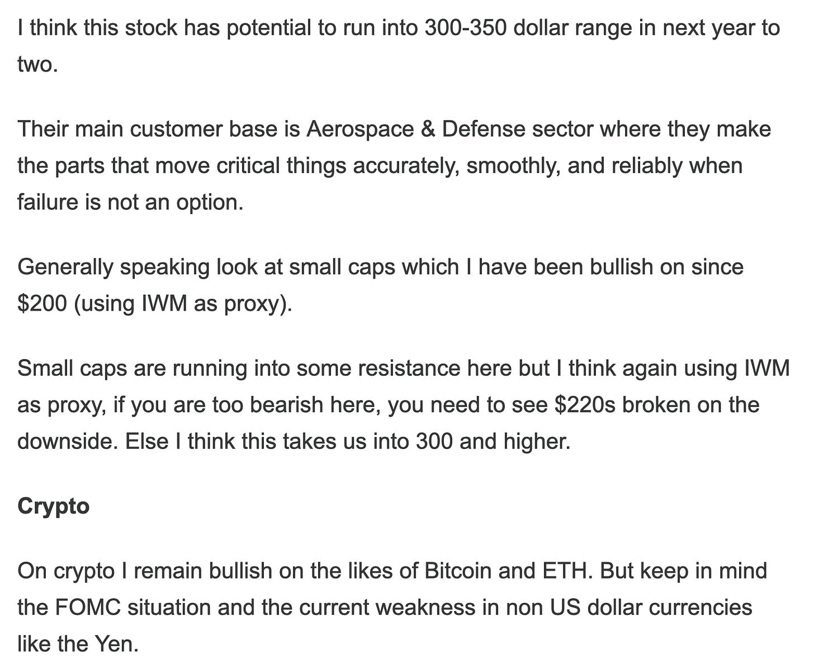

# I will buy at 6700. 

*Weekly Plan 1.18.26*
*Tic Toc Trading — Jan 18, 2026*

Folks— 

One of the most important goal here is to share asymmetric ideas which have not shown on anyone’s radar yet BEFORE they make explosive moves higher. A secondary goal is to try and avoid crowded spaces which are overvalued. Intraday lows and highs, as well as options which can go up anywhere from 100% to 2000% sprinkled through the year are just an icing on the cake. 

So for instance, if you look at any of the major winners in recent weeks, MP, BABA, Boeing just to name a few out of dozens of names, have all exploded much higher. 

Here is a name unheard by most folks which was shared earlier in November. MOG.A. 

Most still do not know anything about it and it is up big. 

**Emini levels for the week **

What you have at the moment is that the American tech bro Oligrachs are firmly in charge of the Government. This is an ongoing battle between the “Old WallStreet Money” and then the new born “Crypto and tech bro” money. 

They are at odds with each other. 

If you look at some of the events from last week, in particular  Trump’s newly aroused interest in taking Greenland or for that matter the DOJ subpoena on FED Chair Powell, this has fingerprints of Tech bros all over it. 

In minds of the New Money, traditional banking systems, like SWIFT are not needed. A FED is not needed at all— whether independent or not. They think that the US dollar can be privatized and technology can be leveraged to keep it afloat and they very much want to shift the US debt financing thru long term bond sales to short term notes and other treasury instruments. 

The rationale being fed to the President is that the US growth is set to take off with AI and Crypto, and if the US is set to grow at 5-6% or more year over year, debt does not really matter as we will outgrow this. We will not have to repay the debt, so just help us pump our stocks and we will deliver you 6% growth in perpetuity. 

This is why the initial sell off due to Powell news was really very muted. The thing is that the market really does not care about whether Powell stays or goes. The market right now is focussed on next 3 to 6 months, and in next 3 to 6 months, it sees more rate cuts, with or without Powell. 

Now over the weekend you will probably have more drama and more geopolitics news — a key test of resilience of these markets will be if we hold 6900 this week. 

On the week, I will lean on this 6882-6900 zone as potentially important. 

> **Scenario 1:** If we can hold 6882, we could probably remain supported here and balance some more between 6880 and 7000.

> **Scenario 2:** My edge case for the week will remain a break of 6882. I think if we are able to break it and close below it, we are looking at good size selling into 6750.

I do want to go back to my earlier point about ascendancy of tech bros in the US government and the reason being I think it is important to understand the current and future trajectory of these markets. 

So even within the elite tech bros, all is not well. 

Musk has sued Sam Altman of Open AI. He holds this grievances with Sam that Open AI was meant to be non profit and here it is selling itself to the highest bidders. 

How dare they make profit! 

Musk comes from an angle of someone who wants AI to be de-regulated and be allowed to do anything and everything it wants. Altman on the other hand, along with more established AI players like Google, want AI to be highly regulated and their AI is somewhat more controlling and feels like a walled garden in contrast to Grok for instance.  

In my mind, this is all really noise and I will ignore it. They all are the same with their own little petty agenda which is spurred on by a need of control and dominance over free societies and people. 

I will submit that in a year or two there will be no major differentiator between one AI to an another AI. They all really are going to be the same. 

Furthermore, it is extremely costly to run AI. Right now we are in a place where these companies are spending billions and billions dollars to run and train their AI, they need compute power, they need energy, data centers etc. The end user meanwhile is using the fruits of this for free. For now. But it won’t last long. 

In just a few more years, there will be much more consolidation in this space and I will reckon may be a couple of dominant players end up absorbing everyone else. It will really come down to who can run AI, and extract most profit out of it, at the lowest cost. 

And I think it is going to be neither OpenAI nor xAI. If I were to pick a dog in this fight, I will say Google wins big in all this. I am really skeptical of these tech bros and their intentions, I personally think Google remains the most focussed company in this space and if I am going to want to own a slice of AI, instead of owning 20 different things, I just own Google. 

Here in this Substack, I shared GOOG as my top pick back when it was 80 dollars which was reiterated at 160 and recently at 300. 

I am bullish on GOOG on any pullbacks. Deeper the better. I think Google is poised to win big from AI. 

Could Google be a 5-6 trillion dollar company? 

Yes. 

Could Google pullback to 250-270? 

Yes. 

Look, a big reason why this market is the most expensive market in the history of stock market is also due to what these tech CEOs tell the public. So these buzzwords like “sustainable abundance”, ‘you will not have to ever work’, or ‘we can push global GDP from 100 trillion dollars to 200 trillion dollars’, is not because these guys believe in all this. It is simply because they want to pump their stock so the reckless CAPEX can be justified. With Trump admin, there is also not much consequences for making these wild statements. They can get away with all this.  In this kind of backdrop, filter out the noise, and focus on companies which can achieve profitability without a ton of CAPEX. 

Now let us take an example of this one guy who thinks none of us have to ever work again, and sustainable abundance is just around the corner for all of us. If I really believe that, then why would I spend almost all of my day whining about petty things all day on twitter? 

The reason is simple. I do not really believe in all this. It is just a charade. 

Now a stock like TSLA has a lot of catalysts— it could be thought of as a national security stock, it is an underrated energy play, it is a car company, it is an AI and robotics company, the part about its share in SpaceX and xAI is not clear, but there is supposedly a share in that pie too. 

But at the same time,  I also think almost all of this is priced in this stock at 500. If this was not true, then consider the fact that AI companies now represent about 30% of all global stock market cap— atleast in the short run it suggests these stocks could be very overvalued and a lot of upside could be priced in.

Now will I put on a trade if it were 340-350 for a 10-15% run? Could be. But I think it has peaked long term at 500 and it should head down much lower once the general market bear market starts. 

My point is— fundamentally I do not believe any of them so I won’t put a trade due to fundamentals alone. And if there is a trade due momentum, perhaps it will show up on my radar before anyone else’s. And if there is no fundamental reason and there is no momentum, then there is no reason for me to put on a trade at all. 

The market also sees thru this charade. 

So since Trump inauguration, the moment it became clear that the tech bros are in charge— it stopped rewarding crypto like it did in years before, it has kept pressure on the bonds, the tech bros want to change the traditional SWIFT and monetary systems? Ok, so then the market must make sure gold and silver go parabolic. Oil and defense stocks are going to the moon! This is unlikely to change until and unless this power structure dismantles in Washington. These trends like the ones I mentioned, I think will persist for years if not more. 

Don’t get me wrong— I am all for sustainable abundance for all too, I also don’t want any of my folks to work a single day and want them all to be rich, but I also understand, if we are all rich, then none of us are rich. 

~ tic 

**Disclaimer:** This newsletter is not intended to provide trading or investment advice but solely for general informational & educational purposes. It represents the personal opinions of the author, shared publicly with you as a personal blog. Engaging in futures, stocks, or bonds trading involves significant risk, and there is no guarantee of profit. In fact, there is a possibility of losing one’s entire investment. Utmost caution is advised. Your account can go to zero. The author does not guarantee any profit whatsoever, and the reader assumes the entire cost and risk of any trading or investing activities undertaken. The reader is solely responsible for making informed investment decisions. The owners/authors of this newsletter, its representatives, principals, moderators, and members are not registered as securities broker-dealers or investment advisors with the U.S. Securities and Exchange Commission, CFTC, or any other securities/regulatory authority. Consultation with a registered investment advisor, broker-dealer, and/or financial advisor is recommended. By accessing and utilizing this newsletter or any of its publications, the reader agrees to the terms set forth herein. Any screenshots used are courtesy of Ninja Trader, FinViz, Think or Swim, and/or Jigsaw, with whom the author has no affiliations. The information and quotes shared in this blog may contain inaccuracies, as markets are inherently risky and subject to unpredictable fluctuations. Additionally, the content of this blog is the intellectual property of the author, and its sharing or copying is strictly prohibited. By reading this blog, the reader accepts these terms and conditions and acknowledges that it is intended solely as a personal trading journal and nothing more.