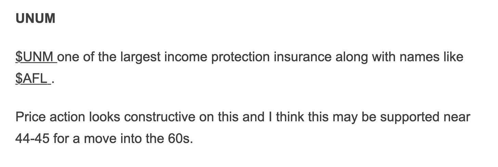

# Epstein is Bullish for Silver. 

*Weekly Plan 2.1.26*
*Tic Toc Trading — Feb 01, 2026*

What you’re seeing here in recent days and weeks folks is what I have been calling a vacuum of sorts when it comes to the quantity and quality of trading opportunities. 

It is a blackhole where unfairly priced assets go to die.

If you are not a short term reader, and if you have taken a long term view, you know all about me beating the drum nonstop for many months now that there just are not very attractive looking setups here. 

Take the most liquid of markets here— S&P500. Really has not gone anywhere for over 4 months now. 

Eventually the other market participants catch on to what the orderflow often sees weeks and months in advance— the markets stop ticking the way they should. Opportunities dry up. It still appears that the demand is strong, that the music is still playing and uninformed traders dance on delusively, oblivious to the fact that the music has stopped. 

We have countless examples. Silver, Gold and bitcoin are just the more stunning ones. 

This is why I was so hesitant to chase these names at the highs seen from days to months ago. 

Now, this phenomenon is not necessarily a bug in the markets but rather a feature. If everyone makes the right trades, if everyone is winning at all the times, then there will not be any winners. Volatility and sell offs are equally important for the markets, for no market can forever go up and if the markets were to forever go up (or forever go down), there will be no one left to buy. Or sell. 

Now if you want to look at something like a Bitcoin or a TSLA, it is very much possible that there is extreme fear in these markets and they may even be near a meaningful bottom. But is making a trading call from a sentiment alone enough? 

**I don’t think so. **

Look there are contextual problems with something like Bitcoin and TSLA which sentiment alone may not be able to fix. 

So, for instance, you by now know all about the Epstein files dumped over the weekend — I am not going to rehash all that, but there are credible enough suspicions about Epstein’s foundational role in conceiving of Bitcoin. If we keep hearing more of it, this may keep pressure on Bitcoin. You also have to understand that the current global push for securing natural resources — whether it is the rare earths, or oils, or gold or even silver, these trends are motivated by a fundamental sovereign suspicion of a US influenced banking & financial system — which for several decades de-facto means a trifecta of Petro Dollars, Dollars, and the SWIFT system. So all of a sudden I do not see world appetite return to embrace something like Bitcoin which has the US establishment written all over it. This also highlights that the surge in Silver and Gold is less to do with geopolitics but mostly due to the sovereign nations wanting to unplug from an exclusively US controlled payments system. If this was not the case, Bitcoin would also be rallying. 

Now, if we cannot use sentimental reasons alone to be buying something and we do not have a contextual thesis to buy one, then may be we can lean on other more objective constructs- **like orderflow, and price action**. 

In this instance, what you are looking at is some sort of a confirmation. You’re not impulsively jumping into a trade just because Bitcoin price feels “low” right now but you want to wait for orderflow or price action to firm up. In this case, often times it means you miss out on the bottom 20-25% of the move but atleast you have a technical framework where you can place a stop or a line in sand. 

Now when someone super new to trading hears me say this, and they contrast it with someone on the internet claiming “bottom is in here at 74K or an 80K”, and Bitcoin rallies to 100K, they will obviously think the guy who bought at 74K to be some sort a genius and a trading savant. 

I want to assure you that no one, and absolutely no one knows. We can all guess based on some sort of pattern recognition and in case of orderflow we can see actual trades in form of distribution or accumulation, but there is simply no way, using any screen based method whatsoever to accurately predict the lows and highs of any market— let alone something as opaque and illiquid as crypto on a Friday night. 

With something like Bitcoin, what makes it even more opaque to analyze is that inherently Bitcoin does not have any value per se. If you compare it with a stock, the stocks are backed by companies with sales and earnings. Stocks can pay dividends also and companies have tangible assets like cash, and factories and receivables. Bonds have yields. Gold and silver can be used in industrial processes, real estate can be rented— bottomline is that crypto runs on primarily liquidity and momentum. 

Bitcoin action also highlights the plight of those who like to chase these assets due to FOMO. In my view, Bitcoin has worked as a hedge against FIAT devaluation already. Remember it used to be a few pennies in not so distant past. From a penny priced asset, it rallied a billions times to an all time highs of 125000 US dollars. At that point, when it was a few cents, no one talked about the scarcity. The marketers now love to talk about scarcity when it is trading near a 100K. They love to say that while Bitcoin is down 35% from its all time highs, it is still up a 17000% from its inception. 

Well, that means nothing really for some one who just went all in at 125K! They do not care that it is still up 170000%, all they care is that it is now down 40% from their purchase price. 

From my perspective, if I really believe in something like Bitcoin, I will DCA into something like this rather than go all in at one big bang price level— with the caveat that there are people who are holding billions in bitcoin, purchased when it was half a cent and they actively offload it to the newcomers while at the same time telling them it is the new digital gold. 

**Let us now talk briefly about our other momentum darling— TSLA**. Now to be super clear, I am not going thru this exercise to throw a shade at anyone who purchased TSLA at 500 or Bitcoin at 125K. I want to share this as an educational note on how I view the futility of predicting these markets, how insidious FOMO can be and how we can use these examples to uncover other under appreciated opportunities on a relative basis. 

Folks, due to the volatility of last week, I am offering one of the largest discounts of this publication. I almost never do it but anything to help in volatile times. Also make sure you join the chat room for mission critical real time updates. 

Tesla is a stock that this week went from being backed by a company making about 7 billion in profit to half of that. This is an almost 2 trillion dollar company making 250 million dollars in profit a month. 

**Come on now. **

As a comparison, Apple is slightly more than 2 times the market cap of TSLA and makes 40 times as much money compared to TSLA! 

With stocks, we have references like this available to us which are lacking in crypto. 

One of the more egregious things about TSLA earnings was the company discontinuing its top end Model S and X sales altogether and deciding that the Fremont factory will focus on making the humanoid robot. 

This news somehow was taken very positively by the market and the stock jumped 9% but then later in the day, the reality set in and most of these gains were given back. 

Like why would Elon not stop producing the Cyber truck, arguably the biggest automobile flop since the Edsel back in the 1980s? I would think a Model S is a (much) nicer looking car and certainly makes more money than the Cyber truck? 

Then on top of all this, you have to ask, how much will a humanoid robot cost the company? I mean these things are not cheap— I would think it should be atleast a 50 grand to make such a robot. And at the very least, they will charge a 20% markup, selling the robot for 60K. 

Like what is the total market for a 60K robot in the US?  Will folks pay cash or take out a bank note to pay for the robot ? What all services will the Robot provide to the household? 

Is the Robot even ready to start delivering anytime soon?

These are key questions that no one chasing this stock here seems to be bothered about.  I don’t get it. So you have to understand, this is a very highly expensive stock to start with and with these management decisions, they are not helping the company make more money. 

**Back in 2019-2020, fully autonomous driving was supposed to be the big money maker. **Buying any other car was financial ruin (per Musk) and a Tesla car will make money while you sleep by hauling passengers. If I recall, about a 100% return on capital a year was hinted at during that infamous earnings call in 2020 or 2021. 

Then we were to going to the Mars and that was the only way to save the civilization. 

Now it all about the Robot. This is the new thing. 

I don’t know. We can go and make some assumptions — let us say the car business is dead. The energy business is robust and will grow. Robot line of business I will park in vaporware category. Then with the FSD, other major automakers have been reluctant to license it, they are all wanting to develop their own version in-house (I do not blame them), but it remains to be seen if they go anywhere with that. So licensing line of business, where eventually TSLA sells the FSD licenses to other big automakers is definitely a possibility. 

But with the stock at 400 PE, it is hard to imagine that any (or all) of these positive catalysts are not already baked into the price. Now I may be very wrong but if I am wrong, we will see this show up as a bounce in TSLA earnings in near future. We will see these earnings surge  20-30% year over year and TSLA stock will moon, it will trade 1000, 2000, 3000. Until then, I am from Missouri. 

If I am right though, I think we should continue to see rallies sold and once this stock takes some real action below 380-400, things get real. Fast. On the downside. 

**In my personal view, the reason TSLA is trading 430-450 today is the same reason Bitcoin was trading 120K only a few months ago — folks believe in it**. 

There is no other reason from the stock to be this high. Like I cannot go and share my perspective with tens of millions of small investors who buy TSLA every day because they believe in it. No one believes me. But you have to believe the math — this is a company that made 15 billion in profit 5 years ago, and today makes 80% less a year. Yet, its valuation today is twice that of when it made 500% more profits. 

These are things that take time to set in. And once realization sets in, the moves are fast and vicious. 

Two very stark examples emerge here that help shed some light on how insanely expensive this stock is. 

Look at JD and Aflac for instance. 

Both of these companies churn out a billion more in earnings every year compared to TSLA. 

Yet, both of these companies sell at valuations which are 95% less than that of TSLA! Admitted, these are not growth stocks. Aflac is never in our lifetimes going to start selling a humanoid robot anytime soon— but in an era where inflation may remain elevated, where globalization could remain perilous, the markets I think will reward (continue to reward) companies that make a buck today, rather than those that promote 5 bucks but 10 years from now. 

In case of JD, the downward momentum remains solid. 

There are fears of geopolitics and China itself may be on shaky grounds economically. 

However, as this stock draws down closer to 25-26, look at these CALLS of 30 strike with almost 2 years to expiry. 

So these $30 CALLS of January 2028 expiry are selling at 5 bucks. May be 5 bucks for an option with a 50 DELTA is a tough pill to swallow, how about if this CALL was 3 bucks with 18-20 months to expiry and a 40 DELTA? I like the odds. I think the risk to reward is there. 

In case of Aflac, this is nothing exciting, this is not a sexy stock. I park it in line with the SCHDs and the XOMs of the world. Well run company, pays dividends on time, and looking solid technically. Companies like AFL are the ones I like to hold forever. Yes it is 110 now, it was first shared by me here when it was 60. But just because it has almost doubled, does not mean it cannot go even higher. See below. 

**My views on SLV **

So I see a lot of guys drawing parallels between the sell off in Bitcoin and something like GLD and SLV. 

Many are claiming that the Silver bull profits will now go to buy Bitcoin. 

Well, I beg to differ. 

First off I think it is too soon to call the GLD and SLV rally dead. I think Trump in the White House is very good for the metals. 

Second off, the Bitcoin and SLV/GLD sell off are not the same. 

Arguably, the bitcoin sell off is due to a genuine bear market which god alone knows how long could last. 

The SLV/GLD sell off is due to a profit taking and you probably have these same profit takers waiting to get back in. 

I think 60-67 is an excellent level if trades on SLV to find buyers and move back to 100. 

**My views on PLTR **

Let us use our relative valuation model again and contrast PLTR with TSLA. 

We see PLTR makes one third the money of TSLA, but the profits are actually growing rather than shrink. 

PLTR is also in my view one of rare breeds of companies that does AI “right”. 

I think the stock appears cheap even here at 146 and due to the earnings if the stock slips another 10%, I am a buyer of Palantir. I think this is probably a 500 billion to a trillion dollar company if not more. Lemme know what y’all think. 

**PFE **

I like it. I think it has bottomed. 

I first shared this here at 24 it is 26 now. 

I think once the earnings go, these Monthly September $29 calls once the premiums die out near 50-70 cents could be good call from risk to reward point of view. 

**My views on SNDK **

I like it, I think more it sells more I will like it. 

It is 576 now, I think if it sells into 520, it could look great for move into 700. 

**Emini levels for the week **

So, emini has been in such a weird spot now for weeks and weeks and weeks. 

It appears it wants to breakout but is not getting any traction here. The dips do get bought. 

So I guess we can lean on what has been working — which is to say dips get supported and rips get sold. 

> **Scenario 1: **I think any dips into 6903-6911 could be supported for a move back into 7000 this week.

> **Scenario 2:** Bear case in the weekly time frame, will be a daily close below 6903 which could target 6772 but I think there could be limited supply below 6772 and these dips could be supported.

~ tic toc 

**Disclaimer:** This newsletter is not intended to provide trading or investment advice but solely for general informational & educational purposes. It represents the personal opinions of the author, shared publicly with you as a personal blog. Engaging in futures, stocks, or bonds trading involves significant risk, and there is no guarantee of profit. In fact, there is a possibility of losing one’s entire investment. Utmost caution is advised. Your account can go to zero. The author does not guarantee any profit whatsoever, and the reader assumes the entire cost and risk of any trading or investing activities undertaken. The reader is solely responsible for making informed investment decisions. The owners/authors of this newsletter, its representatives, principals, moderators, and members are not registered as securities broker-dealers or investment advisors with the U.S. Securities and Exchange Commission, CFTC, or any other securities/regulatory authority. Consultation with a registered investment advisor, broker-dealer, and/or financial advisor is recommended. By accessing and utilizing this newsletter or any of its publications, the reader agrees to the terms set forth herein. Any screenshots used are courtesy of Ninja Trader, FinViz, Think or Swim, and/or Jigsaw, with whom the author has no affiliations. The information and quotes shared in this blog may contain inaccuracies, as markets are inherently risky and subject to unpredictable fluctuations. Additionally, the content of this blog is the intellectual property of the author, and its sharing or copying is strictly prohibited. By reading this blog, the reader accepts these terms and conditions and acknowledges that it is intended solely as a personal trading journal and nothing more.