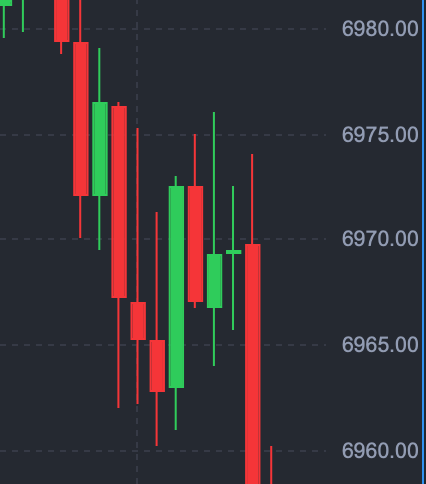

# Strong sell off.

*Daily Plan 2.13.26*
*Tic Toc Trading — Feb 12, 2026*

Pretty vicious sell off, seeing barely any traction today.

A key thing to keep in mind in these intraday  sessions is that you will have trades on either side of the range in your time frames— whether it is 1 minute, or 10 minutes or an hour. As long as these zones hold, we can lean on either long or shorts with tight stops. But if a zone is going to break, especially early on in the session, unless it is recaptured, it will become a resistance if it was a support. And support if it was a prior resistance as you can see in chart above. 

There are hardly any post mortem in trading— the reason being cited for the sell off today is the “AI Scare”. 

One aspect of this trade is that you just do not know who will do well in a world overpowered by AI in a few months. This wave of uncertainty extends to diverse industries like software, brokerages, real estate houses, exchanges, various other service providers. And then the second aspect is the mega caps themselves which are spending billions in AI build up, with no clear path to profitability for any of these. 

I covered this in my post a few days ago that the AI built up will erode away profitability of most tech type companies— on top of that billions in AI spend, and the fact that AI may just end up being a commodity with various models all competing for the same revenue, with no special differentiator. So for an average user, what really is the difference between Gemini, Claude, Grok or Chat GPT? 

None for most people. 

Outside of this, what we have is a giant range. We have really not gone anywhere in over several months now. Per my weekly post, any one who is short, these resistance levels at 7000-7050 remain fairly good risk to reward short. This zone has rejected price advances since October. This type of volume that we are seeing in this tight zone, this is not your typical day traders— so this is institutional money. When a stock like AAPL falls 5% on the session, this is not mom and pop taking profit. 

Once this range breaks, this will lead to a spectacular move within a very brief span of time. 

For the session tomorrow, if you want to see bearish continuation here, I think an open right here under 6859-6870 is good. 

> Scenario 1: The bulls will very much like to take out 6885-6890 on the upside, stay above it, to target 6930 which could be next resistance.

> Scenario 2: If we stay perched here below 6890, this could target 6850-6865.

Outside of intraday levels, right underneath 6800 you have the prior weekly GLOBEX lows near 6750 which we did not get a chance to trade during the cash session this week. This could be logical target **as long as we remain below 6930** for next few days.

Look, these markets have been extremely choppy, not only in day to day, but swing time frames as well,  and this has been going on for a few months now. Eventually, this will resolve itself— a clear trend will be borne out of this. Until then— this phenomenon of up 2% one day and then down 2% next day— extreme chop is here to stay. 

Essentially what you have is an extreme level of uncertainty— else you will not be seeing these type of moves of 5-10% on an almost daily basis even amongst the largest of stocks. At some point this will spread to the main index, but so far, these mutes in the S&P500 have been fairly muted. 

~ tic 

**Disclaimer:** This newsletter is not intended to provide trading or investment advice but solely for general informational & educational purposes. It represents the personal opinions of the author, shared publicly with you as a personal blog. Engaging in futures, stocks, or bonds trading involves significant risk, and there is no guarantee of profit. In fact, there is a possibility of losing one’s entire investment. Utmost caution is advised. Your account can go to zero. The author does not guarantee any profit whatsoever, and the reader assumes the entire cost and risk of any trading or investing activities undertaken. The reader is solely responsible for making informed investment decisions. The owners/authors of this newsletter, its representatives, principals, moderators, and members are not registered as securities broker-dealers or investment advisors with the U.S. Securities and Exchange Commission, CFTC, or any other securities/regulatory authority. Consultation with a registered investment advisor, broker-dealer, and/or financial advisor is recommended. By accessing and utilizing this newsletter or any of its publications, the reader agrees to the terms set forth herein. Any screenshots used are courtesy of Ninja Trader, FinViz, Think or Swim, and/or Jigsaw, with whom the author has no affiliations. The information and quotes shared in this blog may contain inaccuracies, as markets are inherently risky and subject to unpredictable fluctuations. Additionally, the content of this blog is the intellectual property of the author, and its sharing or copying is strictly prohibited. By reading this blog, the reader accepts these terms and conditions and acknowledges that it is intended solely as a personal trading journal and nothing more.